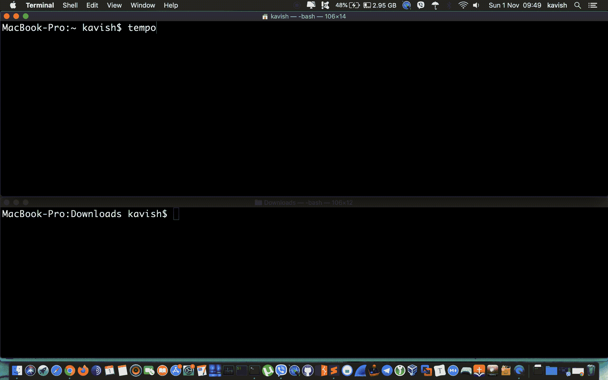

# Tempomail:在 1 秒钟内生成自定义电子邮件地址并接收电子邮件

> 原文：<https://kalilinuxtutorials.com/tempomail/>

**Tempomail** 是一个独立的二进制程序，允许你在 **1 秒**内创建一个临时的`email address`并接收电子邮件。它使用 1secmail 的 [API](https://www.1secmail.com/api/) 。不需要依赖！

**安装**

**来自二进制**

从[发布版](https://github.com/kavishgr/tempomail/releases/)页面下载不同平台的预编译二进制文件。用焦油提取它们，移动到你的`$PATH`上，你就可以开始了。

**#**https://github.com/kavishgr/tempomail/releases/
**#**tar-xzvf Linux-amd64-tempo mail . tgz
**#**mv tempo mail/usr/local/bin/
**#**tempo mail-h

**出发地:Github**

git 克隆 https://github.com/kavishgr/tempomail.git
CD tempo mail
去构建。
mv tempo mail/usr/local/bin/#或$HOME/go/bin
tempomail -h

**用途**

默认情况下，所有邮件都保存在**/tmp/1 sec mail/**中。它只有一个标志`--path`来指定一个目录来存储您的电子邮件:

**tempo mail 的用法:**
-路径字符串
指定存放邮件的目录(默认"/tmp/1 sec mail/")

按`CTRL+c`或`SIGTERM`退出并删除所有收到的邮件。

[**Download**](https://github.com/kavishgr/tempomail)