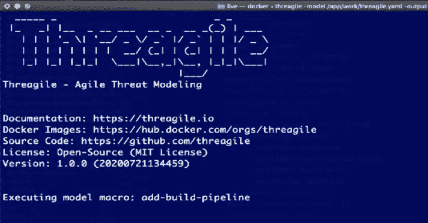

# 威胁建模工具包

> 原文：<https://kalilinuxtutorials.com/threagile/>

**Threagile** (详见 [https://threagile.io](https://threagile.io) )是一个用于敏捷威胁建模的开源工具包:

它允许以敏捷的方式将架构及其资产建模为 ide 中的 YAML 文件。在执行 Threagile toolkit 时，所有标准风险规则(以及个别自定义规则，如果存在的话)都会根据架构模型进行检查。

**通过 Docker 容器执行**

在命令行上执行 Threagile 最简单的方法是通过它的 Docker 容器:

**docker 运行–RM-it thre agile/thre agile**

**文档:https://threagile.io
Docker 图片:https://hub.docker.com/r/threagile
Source code:https://github.com/threagile
License:开源(MIT License)

用法:threagile【选项】

选项:**
-后台字符串
后台 pdf 文件(默认为“background . pdf”)
-创建-编辑-支持
只是在输出目录中创建一些编辑支持的东西
-创建-示例-模型
只是创建一个 so 共享对象)文件名用自定义风险规则加载
-diagram-dpi int
DPI 用于渲染:最大值为 240(默认为 120)
-Execute-model-macro string
执行模型宏(按 ID)
-generate-data-asset-diagram
生成数据资产图(默认为真)
-generate-data-flow-diagram
生成数据流图(默认为真)
-generate-report-pdf
包括图表(默认为真)
-生成-风险-excel
生成风险 excel(默认为真)
-生成-风险-json
生成风险 json(默认为真)
-生成-统计-json
生成统计 json(默认为真)
-生成-标签-excel
生成标签 excel(默认为真)
-生成-技术-资产-json
生成技术资产 json(默认为真)
-忽略 不匹配具体风险
-列表-模型-宏
打印模型宏
-列表-风险-规则
打印风险规则
-列表-类型
打印类型信息(将在模型中使用的枚举值)
-模型字符串
输入模型 yaml 文件(默认为“thre agile . YAML”)
-输出字符串
输出目录(默认)。” )
-打印-第三方-许可证
打印第三方许可证信息
-打印-许可证
打印许可证信息
-raa-插件字符串
RAA 计算插件(。so 共享对象)文件名(默认为“raa . so”)
-server int
在给定端口上启动服务器(而不是命令行执行)
-skip-risk-rules 字符串
逗号分隔的风险规则列表(按其 ID)跳过
-verbose
verbose 输出
-version
打印版本

**例题**

如果您想创建一个示例模型(通过 docker)作为了解 Threagile 的起点，只需运行:
**docker run–RM-it-v " $(pwd)":/app/work thre agile/thre agile-create-example-model-output/app/work**

如果您想创建一个最小的存根模型(通过 docker) 作为您自己模型的起点，只需运行:
**docker run–RM-it-v " $(pwd)":/app/work threagile/thre agile-create-stub-model-output/app/work**

如果您想对模型 yaml 文件执行 thre agile(通过 docker):
**docker run–RM-it-v " $(pwd)":/app/work thre agile/thre agile-verbose-model/app/work/thre agile . YAML 在某个端口上(此处为 8080):
**docker run–RM-it–shm-size = 256m-p 8080:8080–name thre agile-server–mount ' type = volume，src=threagile-storage，dst=/data，readonly = false ' thre agile/thre agile-server 8080**

如果您想了解模型 yaml 文件中可用的不同枚举值:
**docker run–在 和实时模板):
**docker run–RM-it-v " $(pwd)":/app/work thre agile/thre agile-create-editing-support-output/app/work**

如果您想要列出所有可用的模型宏(这些宏能够读取模型 yaml 文件，以向导方式向您提问，然后相应地更新模型 yaml 文件):
**docker run–RM-it thre agile/thre agile-list-model******