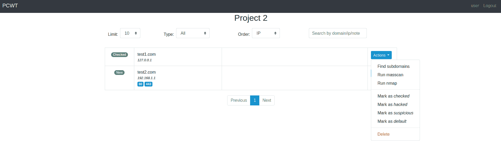
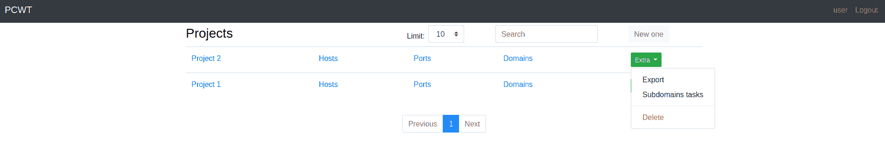
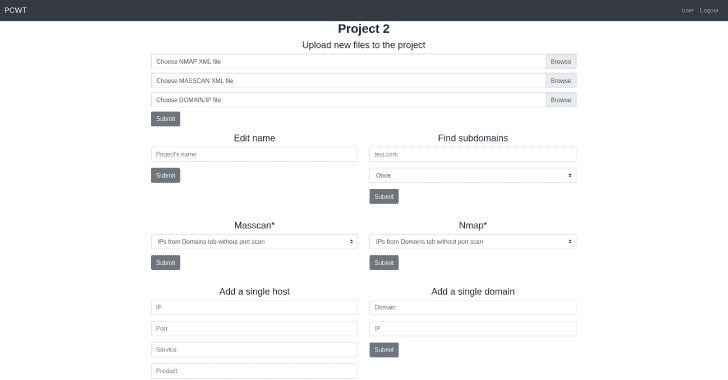

# PCWT:一个 Web 应用程序，使运行 Pentest & Bug Bounty 项目变得容易

> 原文：<https://kalilinuxtutorials.com/pcwt/>

PCWT 是一个网络应用程序，可以让你轻松运行 pentest 和 bug bounty 项目。该应用程序提供了一个方便的网络界面，用于处理 pentest 期间使用的各种类型的文件，自动端口扫描和子域搜索。

**端口扫描**

您可以使用 nmap 或 masscan 扫描端口。nmap 使用以下参数启动:

**nmap–顶级端口 10000-sV-Pn–最小速率 300–最大重试次数 2 [ip]**

masscan 通过以下参数启动:

**mass can-P1-65535–2000 年费率**

**子域搜索**

[Amass](https://github.com/OWASP/Amass) 和[find domain](https://github.com/Edu4rdSHL/findomain)用于查找子域。

**特性**

*   给主机、端口或域留言。
*   用标签标记主机或域。
*   通过与主机、端口或域(包括标签和注释)相关的任何字段进行搜索。Regexp 可用。
*   几乎所有仪表板上都有不同类型的排序。
*   对所有主机、没有端口扫描的主机或自定义列表运行端口扫描。
*   为子域搜索创建任务(每 2 小时，每 5 小时，每天或每周)。您也可以使用`Subdomain tasks`仪表板按需禁用和启用它们。
*   有不同类型的导出可用。
*   可以向 Telegram 发送关于扫描开始和结束的通知，以及关于新发现的域的通知。用您的聊天 id 和令牌更新`config.py`。

**从源安装**

注 1:运行命令前，更改`config.py`中的 amass、findomain、nmap 和 masscan 的路径。注 2:如果您希望 masscan 正常工作，应用程序必须以 root 用户身份启动。

**apt 安装 python 3 python-venv python 3-pip
git 克隆 https://github.com/ascr0b/PCWT
CD PCWT

python 3-m venv env
source env/bin/activate
pip 3 install-r requirements . txt

FLASK init-db
FLASK crontab add

export FLASK _ APP = APP
FLASK run**

该应用可在 [http://127.0.0.1:5000](http://127.0.0.1:5000) 获得

[**Download**](https://github.com/ascr0b/PCWT)