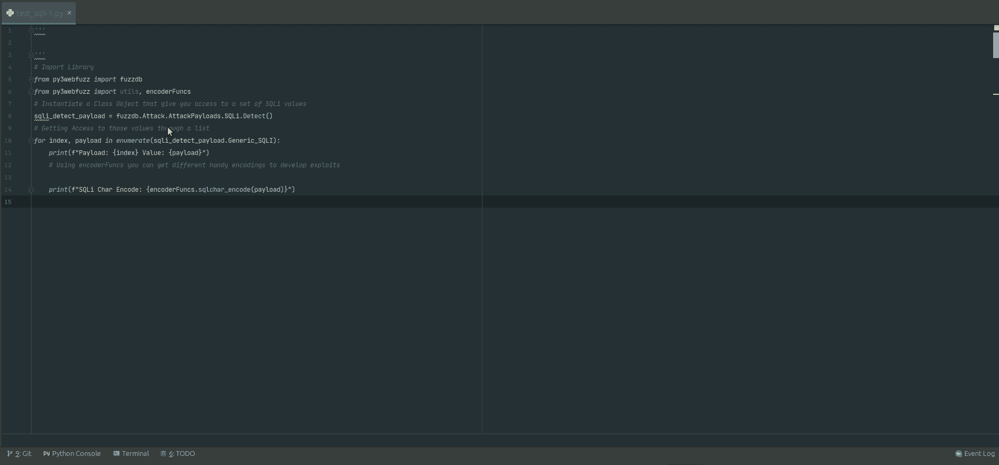
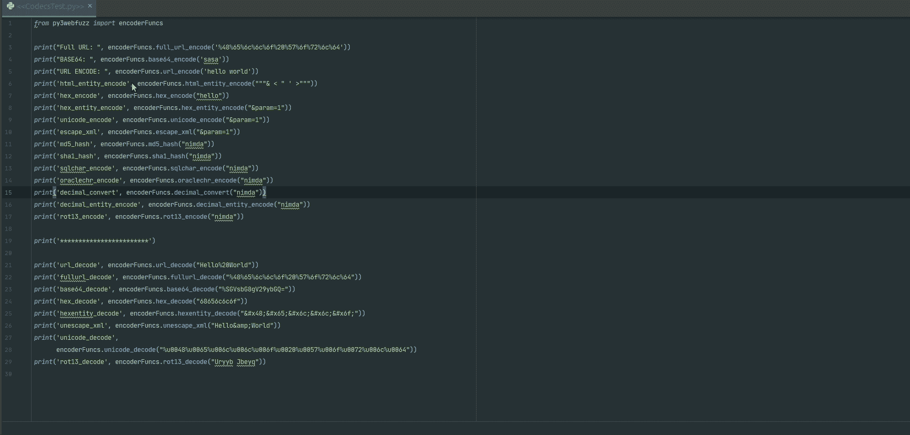

# Py3webfuzz:一个 Python3 模块，帮助模糊化 Web 应用程序

> 原文：<https://kalilinuxtutorials.com/py3webfuzz/>

基于 pywebfuzz， **Py3webfuzz** 是一个 Python3 模块，通过暴力破解、模糊化和分析，辅助识别 web 应用、Web 服务中的[漏洞](https://www.kitploit.com/search/label/vulnerabilities)。该模块通过提供通用测试值、生成器和其他实用工具来实现这一点，这些工具在模糊化 web 应用程序、API [端点](https://www.kitploit.com/search/label/Endpoints)和开发 web 漏洞时会很有帮助。

为了便于使用，它有 fuzzdb 和其他一些用 Python 类、方法和函数实现的杂项源代码。fuzzdb 项目只是用于测试的值的集合。重点是从 fuzzdb 项目和其他一些资源中提供一个很好的值选择，通过 Python3 类、方法和名称空间进行清理并可用。这使得在您自己的[利用](https://www.kitploit.com/search/label/Exploits)和 PoC 中使用这些值变得更加容易和方便。

我们努力将名称与最新 fuzzdb 项目中的文件夹和值匹配起来。这种努力有时会导致一些难看的名称空间。这种平衡被打破了，因此对 fuzzdb 项目的熟悉将跨越到 Python 代码中。例外是用下划线代替连字符。

**安装**

有几种方法可以完成安装。如果你想使用虚拟环境

**使用 Python 设置工具**

[http://pypi.python.org/pypi/setuptools](http://pypi.python.org/pypi/setuptools)

**$ git 克隆 https://github.com/jangelesg/py3webfuzz.git
$ CD py3 web fuzz/**

您可以使用 install 命令运行提供的 setup.py

**$ python setup.py 安装**

你也可以使用 easy_install 来管理你安装的软件包

**$ easy _ install py3 web fuzz _ version . tar . gz**

你也可以在网上指出 tar.gz 居住的位置

**$ easy_install 网址 _ 软件包**

你应该可以去。

**在你的代码中使用**

*   一些测试用例可以在 info 子文件夹中找到

#访问 SQLi 值并对其进行编码以供进一步使用
#从 py3webfuzz 导入 fuzzdb
从 py3webfuzz 导入 utils，encoder funcs
#实例化一个类对象，该对象允许您访问一组 SQLi 值
sqli_detect_payload = fuzzdb。attack payloads . sqli . detect()
#通过枚举(sqli_detect_payload)中索引、有效负载的列表
访问这些值。generic _ SQLI):
print(f " Payload:{ index } Value:{ Payload } "
#使用 encoderFuncs 您可以获得不同的便捷编码来开发漏洞利用
print(f " SQLi Char Encode:{ encoder funcs . sqlchar _ Encode(Payload)} "

#向您的目标发送 HTTP 请求
# Import Library
from py3 web fuzz Import utils
# custom your target and Headers
location = " HTTP://127MSIE 4.01AOL 4.0Mac_68K)，
" Content-Type ":" application/x-www-form-urlencoded " }
#此时，您拥有了一个 dic 对象，其中包含了 pentest 的所有元素
# " headers ":response . headers，" content": response.content，" status _ code ":response . status _ code，
#'json': response.json，" text": response.text，" time ":f " Total in seconds:{ time } "
RES = utils . make _ request(location，headers =)

**演示**

**未来**

*   将此模块上传到 Python 包索引。
*   为 Mobile Pentest 集成特性、类、方法和值
*   增强 XSS，XXE，技术扔一些新的功能(任何想法都是受欢迎的)
*   服务器端模板注入特性