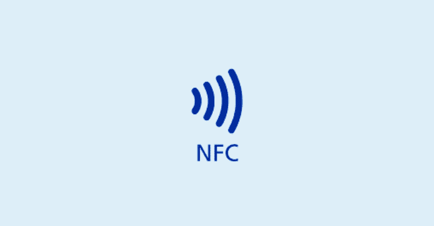

# NFCGate:适用于 Android 的 NFC 研究工具包应用程序

> 原文：<https://kalilinuxtutorials.com/nfcgate/>

[](https://1.bp.blogspot.com/-0LW777zyJEo/X6_mqkgzS8I/AAAAAAAAH_Q/xxRvwA3Me-E7mGtZ7vhA9QEi7z-6A9LDwCLcBGAsYHQ/s728/NFC%25281%2529.png)

**NFCGate** 是一款 Android 应用，旨在捕获、分析或修改 NFC 流量。它可以用作逆向工程协议或评估协议对流量修改的安全性的研究工具。

**特性**

*   **设备上捕获**:捕获设备上运行的其他应用程序发送和接收的 NFC 流量。
*   **中继**:使用[服务器](https://github.com/nfcgate/server)中继两个设备之间的 NFC 流量。一个设备作为读取 NFC 标签的“读取器”工作，另一个设备使用主机卡仿真(HCE)来仿真 NFC 标签。
*   **重放**:以“阅读器”或“标签”模式重放先前捕获的 NFC 流量。
*   **克隆**:克隆初始标签信息(如 ID)。
*   [pcapng](https://github.com/pcapng/pcapng) 导出捕获的 NFC 流量，Wireshark 可读。

**特定模式的要求**

*   NFC 支持
*   Android 4.4+ (API 级别 19+)
*   [曝光](https://github.com/ElderDrivers/EdXposed)或[曝光](https://repo.xposed.info/):设备上捕获、中继标签模式、重放标签模式、克隆模式。
*   ARMv8-A、ARMv7:中继标签模式、重放标签模式、克隆模式。
*   [HCE](https://developer.android.com/guide/topics/connectivity/nfc/hce) :中继标签模式，重放标签模式，克隆模式。

**用途**

**大楼**

*   初始化子模块:`**git submodule update --init**`
*   使用 Android Studio 或 Gradle 构建

**运行模式**

由于每种模式的说明不同，每种模式都在各自的文档中详细描述，见`doc/mode/`:

*   [](https://github.com/nfcgate/nfcgate/blob/v2/doc/mode/OnDevice.md)
*   **[**接力**](https://github.com/nfcgate/nfcgate/blob/v2/doc/mode/Relay.md)**
*   **[**重播**](https://github.com/nfcgate/nfcgate/blob/v2/doc/mode/Replay.md)**
*   **[**克隆**](https://github.com/nfcgate/nfcgate/blob/v2/doc/mode/Clone.md)**

 ****Pcapng 输出**

捕获的流量可以以 [pcapng](https://github.com/pcapng/pcapng) 文件格式导出或导入。例如，Wireshark 可用于进一步分析 NFC 流量。关于导入和导出功能的详细描述记录在 [doc/pcapng.md](https://github.com/nfcgate/nfcgate/blob/v2/doc/pcapng.md) 中。

**兼容性**

NFCGate 提供应用内状态检查。有关兼容性的更多说明，请参见[兼容性文档](https://github.com/nfcgate/nfcgate/blob/v2/doc/Compatibility.md)。

**已知问题&警告**

在使用应用程序之前，请考虑以下问题和注意事项(尤其是在提交错误报告之前)。

**NFC 堆栈**

当使用利用 HCE 的模式时，手机必须实现 [NFC 控制器接口(NCI)](https://nfc-forum.org/our-work/specifications-and-application-documents/specifications/nfc-controller-interface-nci-specification/) 规范。当提供 HCE 支持时，大多数电话应该实现这个规范。

**数据通道的保密性(中继)**

现在，中继模式下的所有数据都是以不加密的方式通过网络发送的。我们可能会或可能不会实现加密保护，但现在，考虑你通过网络发送的任何东西都可以被任何感兴趣的人读取，除非你使用额外的保护，如 VPN。在执行您自己的测试时，请记住这一点。

**与卡的兼容性(中继、重放、克隆)**

我们只能代理 Android 支持的标签。例如，Android 不再提供对 MiFare classic 芯片的支持，因此不支持这些卡。如有疑问，请使用 NFC Tag info 等应用程序来确定您的标签是否兼容。此外，目前，Android HCE 支持的每种标签技术都受到支持(A，B，F)，但 NFC-B 和 NFC-F 仍未经测试。NFC-A 标签是最常见的标签(例如，MiFare DESFire 和电子护照中的专用芯片都使用 NFC-A)，但如果您使用其他标签，可能会遇到问题。

**与阅读器的兼容性(中继)**

此应用程序仅适用于未实施额外安全措施的读卡器。防止我们的应用程序在中继模式下工作的一个安全措施是，当读卡器检查卡响应所需的时间时(或者，更一般的情况是，如果读卡器实现了“距离限制”)。网络传输给任何交易增加了明显的延迟，因此任何安全阅读器都不会接受我们的代理回复。这不影响其他操作模式。

**Android NFC 限制(中继、重播)**

Android 不支持 NFC 的某些功能，因此无法用于我们的应用程序。我们遇到过手机产生的 NFC 场不够强，无法为一些 NFC 芯片的更高级功能(如加密操作)提供动力的情况。如果你正在测试我们没有试验过的芯片，请记住这一点。

**出版物&媒体**

该应用[在第 14 届 USENIX 进攻性技术研讨会(WOOT '20)](https://www.usenix.org/conference/woot20/presentation/klee) 上展示。一个 [arXiv 预印本可以在这里找到](https://arxiv.org/abs/2008.03913)。

该应用的早期版本在 WiSec 2015 上展示。[延伸摘要](https://blog.velcommuta.de/wp-content/uploads/2015/07/nfcgate-extended-abstract.pdf)和[海报](https://blog.velcommuta.de/wp-content/uploads/2015/07/NFCGate-Poster.pdf)可以在其中一位作者的[网站](https://blog.velcommuta.de/publications/)上找到。在 2015 年[混沌交流营](https://events.ccc.de/camp/2015/wiki/Main_Page)的一个简短的[闪电演讲](https://media.ccc.de/browse/conferences/camp2015/camp2015-6862-lightning_talks_day_2.html#video&t=300)中也有介绍。

**参考我们的项目**

本项目的任何使用导致学术出版物或其他包含参考书目的出版物应包含对 NFCGate 的引用:

```
@inproceedings {257188,
    author = {Steffen Klee and Alexandros Roussos and Max Maass and Matthias Hollick},
    title = {NFCGate: Opening the Door for {NFC} Security Research with a Smartphone-Based Toolkit},
    booktitle = {14th {USENIX} Workshop on Offensive Technologies ({WOOT} 20)},
    year = {2020},
    url = {https://www.usenix.org/conference/woot20/presentation/klee},
    publisher = {{USENIX} Association},
    month = aug,
}

```

[**Download**](https://github.com/nfcgate/nfcgate)**