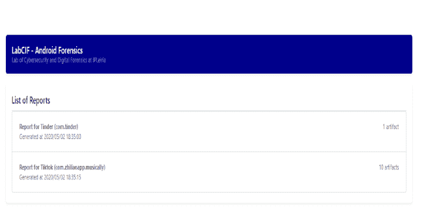
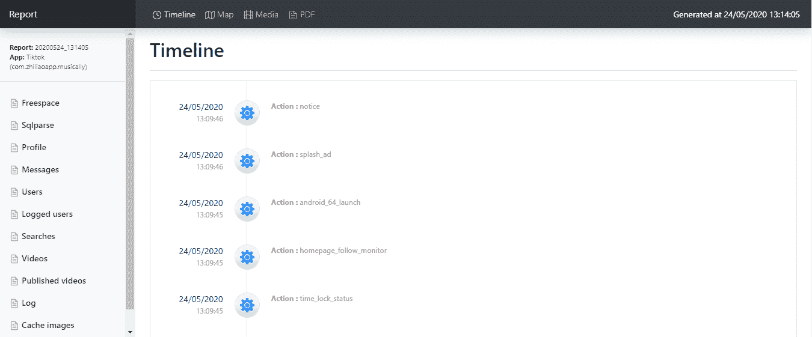

# Fama:移动应用的取证分析

> 原文：<https://kalilinuxtutorials.com/fama/>

[](https://1.bp.blogspot.com/-i62xinR3CzU/X7LkGvArkdI/AAAAAAAAH_0/2kqO_bUVnqs9SKgSaQ1XFnpeCbPW-aFywCLcBGAsYHQ/s728/Screenshots--1%25281%2529.png)

**Fama** 是一个 android 提取和分析框架的工具，集成了尸检模块。从设备中轻松转储用户数据，并为尸检或外部应用生成强大的报告。

**功能**

*   使用 ADB 从 Android 设备提取用户应用程序数据(需要 root 和 ADB)。
*   从 android 映像或挂载路径转储用户数据。
*   轻松构建特定 Android 应用的模块。
*   生成清晰易读的 JSON 报告。
*   完全集成的尸检兼容性(数据源处理器模块、摄取模块、报告模块、地理定位、通信和时间线支持)。
*   基于当前案例导出 HTML 报告。

**举报截图**



**先决条件**

*   [Python](https://www.python.org/downloads/) (2.7+)
*   [尸检](https://www.sleuthkit.org/autopsy/)(可选)

**如何使用？**

该脚本可以直接在终端中使用，也可以作为尸检模块使用。

**从终端**运行

```
usage: start.py [-h] [-d DUMP [DUMP ...]] [-p PATH] [-o OUTPUT] [-a] app

Forensics Artefacts Analyzer

positional arguments:
  app                                            Application or package to be analyzed <tiktok> or <com.zhiliaoapp.musically>

optional arguments:
  -h, --help                                     show this help message and exit
  -d DUMP [DUMP ...], --dump DUMP [DUMP ...]     Analyze specific(s) dump(s) <20200307_215555 ...>
  -p PATH, --path PATH                           Dump app data in path (mount or folder structure)
  -o OUTPUT, --output OUTPUT                     Report output path folder
  -a, --adb                                      Dump app data directly from device with ADB
  -H, --html                                     Generate HTML report
```

**逃离尸检**

*   下载存储库内容( [zip](https://github.com/labcif/FAMA/archive/master.zip) )。
*   打开尸检->工具-> Python 插件
*   将之前下载的 zip 文件解压到`python_modules`文件夹中。
*   重启尸检，创建病例，选择模块。
*   在摄取模块窗口选择器中选择您的模块选项。
*   单击“生成报告”以生成该案例的 HTML 报告。

**构建应用模块**

是否需要针对特定 Android 应用的取证模块？按照这里的说明[自己搭建一个模块。](https://github.com/labcif/FAMA/blob/master/modules/README.md)

[**Download**](https://github.com/labcif/FAMA)