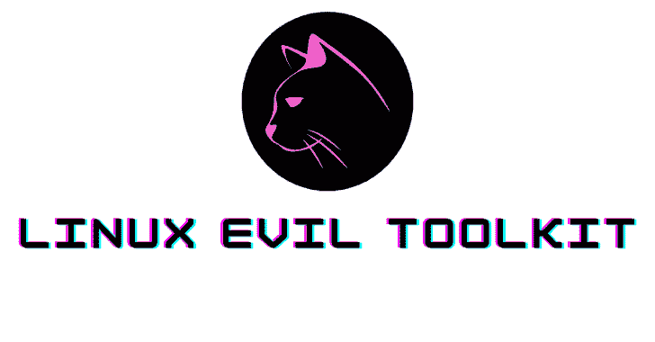

# 面向 Pentest 专业人员的 Linux Evil 工具包

> 原文：<https://kalilinuxtutorials.com/linux-evil-toolkit/>

**Linux evil toolkit** 是一个框架，旨在为 pentest 专业人员集中、标准化和简化各种安全工具的使用。LETK (Linux evil toolkit)有几个简单的命令，其中之一是 INIT，它允许您定义一个目标，从而使用所有的工具，而无需键入任何其他内容。

LETK 比 setoolkit 好吗？是也不是，有两个以不同的方式服务于同一事物，Linux Evil Toolkit 和自动化攻击信息自动化脚本。

**注意事项**

*   **关于使用**
    *   这个脚本用于自动收集关于 web 目标、用户滥用和责任的信息，报告 bug 或建议在 github 上打开报告。
*   **关于简单 _ 扫描**
    *   Automap 被 simple_scan 取代，它更轻更快，除了可以被 ess 检测到，现在它有不同的执行模式，使得从快速简单的执行到更复杂的模式成为可能。
*   **关于控制台**
    *   脚本的输出可能非常长，所以看看你的控制台(gnome-terminal，cmd，konsole)是否配置为显示 1000 行(我特别推荐 10，000 行)，出于专业目的，它允许文档，它记录命令，退出并格式化文本。

**用途**

**注意:**当您开始一个 pentest 时，键入 INIT 命令并定义目标，或者在 Linux-evil-toolkit/config/letk . Rb 中写入值

**基础知识**

|退出|关闭此脚本
|清除|清除终端
|更新|更新 Linux evil toolkit
|train |显示终端中的 train，tutuu
| INIT |设置全局变量
|reset |清除终端并重置全局变量
|cover |覆盖您计算机上的轨迹
|simple_map |此命令执行 automap (auto namap)
|search |搜索电子邮件、whois 和 banner grep
|status |显示机器状态
|dnsscanner | Scan MX '，' NS '，' PTR '，' SOA'
|dirscanner |扫描文件和文件夹
|横幅|在终端中显示 linux evil Toolkit 横幅
|webdns |显示 dns 扫描器的网站
|linuxfiles |显示重要的 linux 文件
|linuxfolders |显示重要的 Linux 文件夹
|windowsfolders |显示重要的 windows 文件夹
|linuxutil |显示 Linux 中有用的命令
|测试|仅用于开发

**简单 _ 扫描选项**

**单独**
"-sL "“>"列表扫描–仅列出要扫描的目标"
"-sP "“>" Ping 扫描–仅确定主机是否在线"

**默认**
"-sS-sV "“>" TCP SYN "
"-sU-sV "“>" UDP 扫描"

**ICMP _ echo**
-sS-sV-sS
"-sA-sV-PE "“>" ACK+ICMP echo discovery probes "

**port _ list**
"-sS "“>" TCP SYN+[port list]:TCP SYN discovery probes 到给定端口"
"-sA "“>" ACK+[port list]:TCP ACK discovery probes 到给定端口"
"-sU ">" UDP Scan+[port list]:TCP UDP discovery probes 到给定端口 –>“Maimon 扫描”
“-sN-sV”“>“TCP Null”
“-sF-sV”“>“FIN”
“-sX-sV”“>“圣诞扫描”

**深度链接**

**DeepLink 是一个 deepweb (tor onion domain)数据库，供您测试和探索“deepweb”时使用**
 **用法:**键入 DeepLink 和 type option
–site | Cat 了解 deepweb 的最佳网站
–dark links |显示暗网链接
–onion links |显示 500 多个 deep web 链接
–onion links-active |显示更多链接，但仅显示活动链接
–search links |显示 tor 搜索(类似谷歌)【关键词】

**后端功能**

**来自发动机模块**

引擎。INIT() |设置变量
Engine.sys("ls") |测试函数
Engine。R() |重置变量
engine . Cover()| Cover bash history
engine . Compress()|压缩文件
engine . port _ scanner()| replaced by automap
engine . Search()|搜索 whois，emails，banner grep
Engine.status() |显示机器状态
Engine.dns_scanner() |扫描' A '，' AAAA '，' CNAME '，' MX '，' ns '，' PTR '，' SOA '【T8]em gine . dir _ scanner()|搜索文件和文件夹的蛮力
引擎。

**来自视觉模块**

Visual.banner() |显示文本的函数
Visual.web_dns() |显示文本的函数
Visual.linux_files() |显示文本的函数
Visual.linux_folders() |显示文本的函数
Visual.linux_util() |显示文本的函数

**来自解释器模块**

Interpreter.interpreter() |后端函数
Interpreter.main() |后端函数

**错误代码&颜色**

prGreen() |成功
prRed() |错误
其他[青色、黄色] |执行错误

**警告**

我不对第三方使用本软件的方式负责。这个软件的目的只是教育。