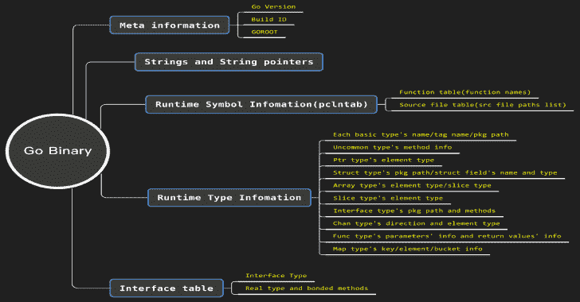
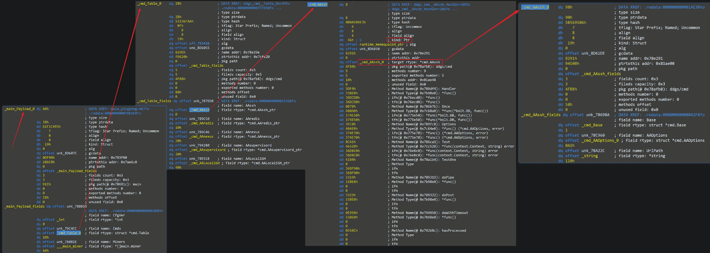
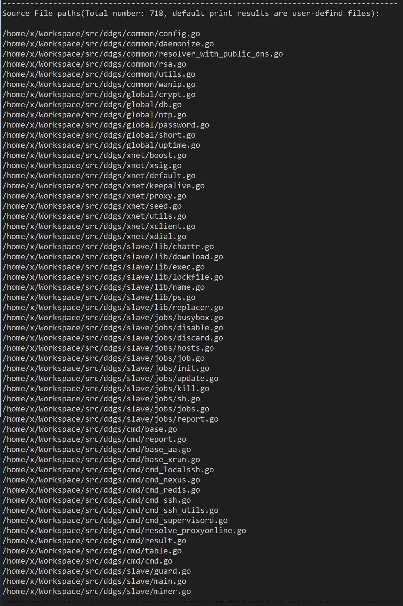

# go _ Parser:IDA pro 的另一个 Golang 二进制解析器

> 原文：<https://kalilinuxtutorials.com/go_parser/>

这个**主**分支是用 Python2 为 IDAPython 编写的，只在 IDA7.2/IDA7.0 上测试，如果你用 Python3 和更高版本的 IDAPro 使用 IDAPython，请用 **[Python3 分支](https://github.com/0xjiayu/go_parser/tree/py3)** 为 **Go_Parser** 。

受 [golang_loader_assist](https://github.com/strazzere/golang_loader_assist) 和 [jeb-golang-analyzer](https://github.com/pnfsoftware/jeb-golang-analyzer) 的启发，我为 IDAPro 编写了一个更完整的 Go 二进制解析工具。

**主要特点**

*   定位并解析 Go 二进制文件中的 **firstmoduledata** 结构，并对每个字段进行注释；
*   根据 **firstmoduledata** 定位**pcntab**(PC 线路表)并解析。然后在 pclntab 中查找、解析并恢复函数名和源文件路径。源文件路径将打印在 IDAPro 的输出窗口中；
*   解析字符串和字符串指针，为每个字符串做注释，为每个字符串指针做**dref**；
*   根据 firstmoduledata，找到每个**类型**并解析，为**类型**的每个属性做注释，这将非常方便恶意软件研究者分析一个复杂的类型或数据结构定义；
*   解析 **itab** (接口表)。

为 Go 二进制文件重新工作的有用信息:

在 **go_parser** 中有两个有用特性:

*   对于带有格式错误文件头信息，尤其是格式错误的节头信息的二进制文件，它也能很好地工作；
*   以上所有这些特性对用 **buildmode=pie** 构建的二进制文件都有效。

DDGMiner v 5029(MD5:95199 E8 f1 ab 987 CD 8179 a 60834644663)中的一个配置数据结构解析结果如下:

和用户定义的源文件路径列表:

**项目文件**

*   **go_parser.py** :录入文件，按**【Alt+F7】**，选择并执行该文件；
*   **common.py** :常用变量和函数定义；
*   **pcntbl . py**:解析**pcntab**(PC 行表)；
*   **strings.py** :解析字符串和字符串指针；
*   **moduledata . py**:解析**firstmoduledata**；
*   **types_builder.py** :解析**类型**；
*   **itab.py** :解析 **itab** (接口表)。

另外， **str_ptr.py** 将通过手动指定**字符串指针**的起始地址和结束地址来解析**字符串指针**。

**注**

1.  这个分支是用 Python2 for IDAPython 写的，只在 IDA7.2/IDA7.0 上测试；
2.  字符串解析模块是从 [golang_loader_assist](https://github.com/strazzere/golang_loader_assist) 移植过来的，我添加了字符串指针解析的特性。目前只支持 x86(32 位&64 位)架构。