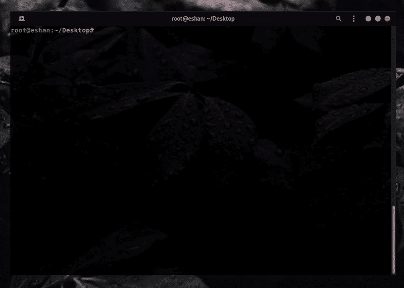

# Garud:扫描子域的自动化工具

> 原文：<https://kalilinuxtutorials.com/garud/>

**Garud** 是一个自动化工具，扫描子域，子域接管然后过滤掉 xss，ssti，ssrf 等更多的注入点参数。

*   **要求:** Go 语言，Python 2.7 或 Python 3。
*   **系统要求:**建议在配有 1 个 VCPU 和 2GB ram 的 vps 上运行。
*   **使用的工具——你必须安装这些工具才能使用这个脚本**

    *   [子查找器](https://github.com/projectdiscovery/subfinder)
    *   [子列表 3r](https://github.com/aboul3la/Sublist3r)
    *   [GF 模式](https://github.com/1ndianl33t/Gf-Patterns)
    *   [高](https://github.com/lc/gau)
    *   [Subzy](https://github.com/LukaSikic/subzy)
    *   [Subjack](https://github.com/haccer/subjack) :将 [fingerprints.json](https://github.com/haccer/subjack/blob/master/fingerprints.json) 文件保存到~/tools/目录下。
    *   [资产发现者](https://github.com/tomnomnom/assetfinder)
    *   [HTTPX](https://github.com/projectdiscovery/httpx)
    *   [Waybackurls](https://github.com/tomnomnom/waybackurls)
*   **安装**

**git 克隆 https://github . com/r0x 4r/garud . git&&CD garud/&【chmod+x garud】&&mv garud/usr/local/bin/**

*   **用途**

**加鲁德-d target.com-f 文件名**

**关于 Garud**

我做了这个工具来自动化我的侦查，节省我的时间。总是键入这样的命令，然后等待完成一个命令，我再键入另一个命令，这真的让我头疼。所以我收集了一些在 bugbounty 领域广泛使用的工具。

在这个脚本中，我使用了 Assetfinder、get-titles、httprobe、subjack、subzy、sublister、gau 和 gf 模式。该脚本首先使用 assetfinder 和 sublister 枚举给定目标域的所有子域，然后从整个子域列表中过滤所有活域，然后使用 get-title 提取子域标题，然后使用 subjack 和 subzy 扫描子域接管。

然后使用 gau 提取给定子区域的参数，然后使用 gf 模式从给定子区域中过滤 xss、ssti、ssrf、sqli 参数。然后，它会将所有输出保存在一个文本文件中，如 target-xss.txt。

[**Download**](https://github.com/R0X4R/Garud)