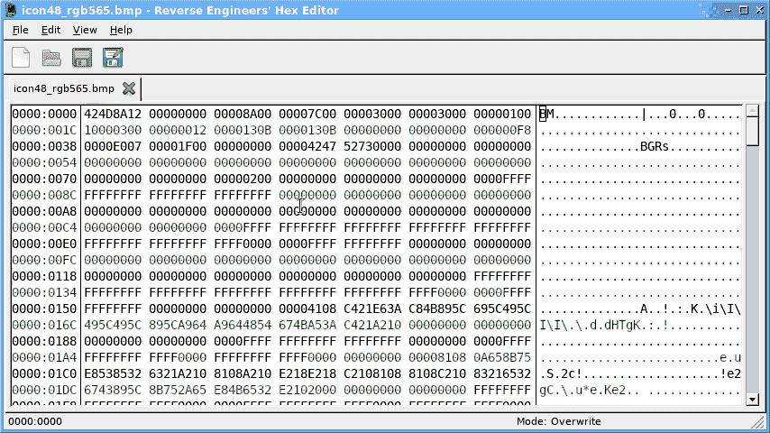
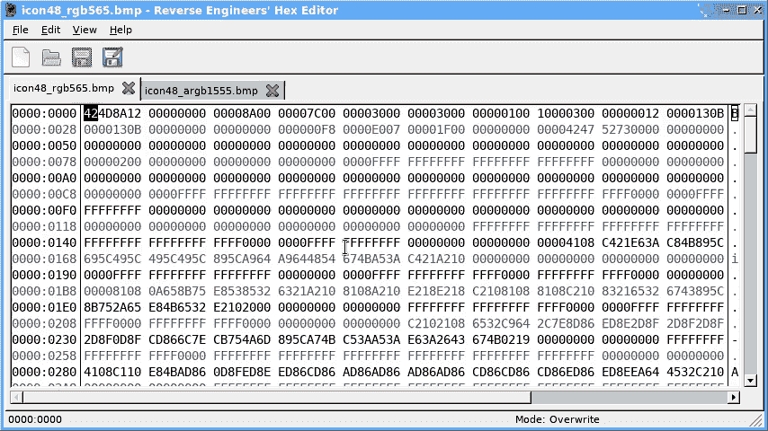

# Rehex:逆向工程十六进制编辑器

> 原文：<https://kalilinuxtutorials.com/rehex/>

Rehex 是一个跨平台(Windows，Linux，Mac)的 hex 编辑器，用于逆向工程和其他一切。

**特性**

*   大(1TB 以上)文件支持
*   整数/浮点值类型的解码
*   机器代码的反汇编
*   字节范围的突出显示和注释
*   并排比较选择

**安装**

[Releases](https://github.com/solemnwarning/rehex/releases) 页面有适用于 Windows 和 Mac 的独立软件包，也有适用于流行的 Linux 发行版的可安装包，或者您可以从如下所述的发行版软件包库中安装它们。

如果您想尝试开发/未发布版本，也可以为 Git 提交生成相同的包。

Debian

首先，您需要将我的 APT 签名密钥添加到您的系统中:

**wget-qO–https://repos.solemnwarning.net/debian-key.gpg | sudo apt-key add-**

将以下几行添加到您的`/etc/apt/sources.list`文件中:

**deb http://repos.solemnwarning.net/debian/代号总管
deb-src http://repos.solemnwarning.net/debian/代号总管**

用您正在运行的版本**替换`**CODENAME**`(例如`buster`或`stretch`)。**

最后，您可以安装软件包:

**$ sudo apt-get 更新
$ sudo apt-get 安装 rehex**

**Ubuntu**

首先，您需要将我的 APT 签名密钥添加到您的系统中:

**wget-qO–https://repos.solemnwarning.net/ubuntu-key.gpg | sudo apt-key add-**

将以下几行添加到您的`/etc/apt/sources.list`文件中:

**deb http://repos.solemnwarning.net/ubuntu/代号总管
deb-src http://repos.solemnwarning.net/ubuntu/代号总管**

用您正在运行的版本替换`**CODENAME**`(例如，20.10 版的`groovy`或 20.04 版的`focal`)。

最后，您可以安装软件包:

**$ sudo apt-get 更新
$ sudo apt-get 安装 rehex**

**注意:** Ubuntu 用户必须启用“Universe”软件包库才能安装一些依赖项。

**软呢帽**

**$ sudo dnf copr enable solem warning/re hex
$ sudo dnf install re hex**

**厘斯**

**$ sudo dnf install epel-release
$ sudo dnf copr enable solemn warning/re hex
$ sudo dnf install re hex**

**openSUSE**

**$ sudo zypper ar OBS://editors editors
$ sudo zypper ref
$ sudo zypper in rehex**

**大楼**

如果你想在 Linux 上编译，只需检查源代码并运行`make`。你需要安装扬松、wxWidgets 和 capstone，以及它们的开发包(在 Ubuntu 上安装 **`build-essential`、`git`、`libwxgtk3.0-dev`、`libjansson-dev`** 和 **`libcapstone-dev`** )。

生成的构建可以使用`make install`来安装，它接受所有的标准环境变量。

有关 Windows 或 Mac 构建说明，请参见相关的自述文件:[自述文件。Windows.md](https://github.com/solemnwarning/rehex/blob/master/README.Windows.md) [自述。OSX.md](https://github.com/solemnwarning/rehex/blob/master/README.OSX.md)

[**Download**](https://github.com/solemnwarning/rehex)