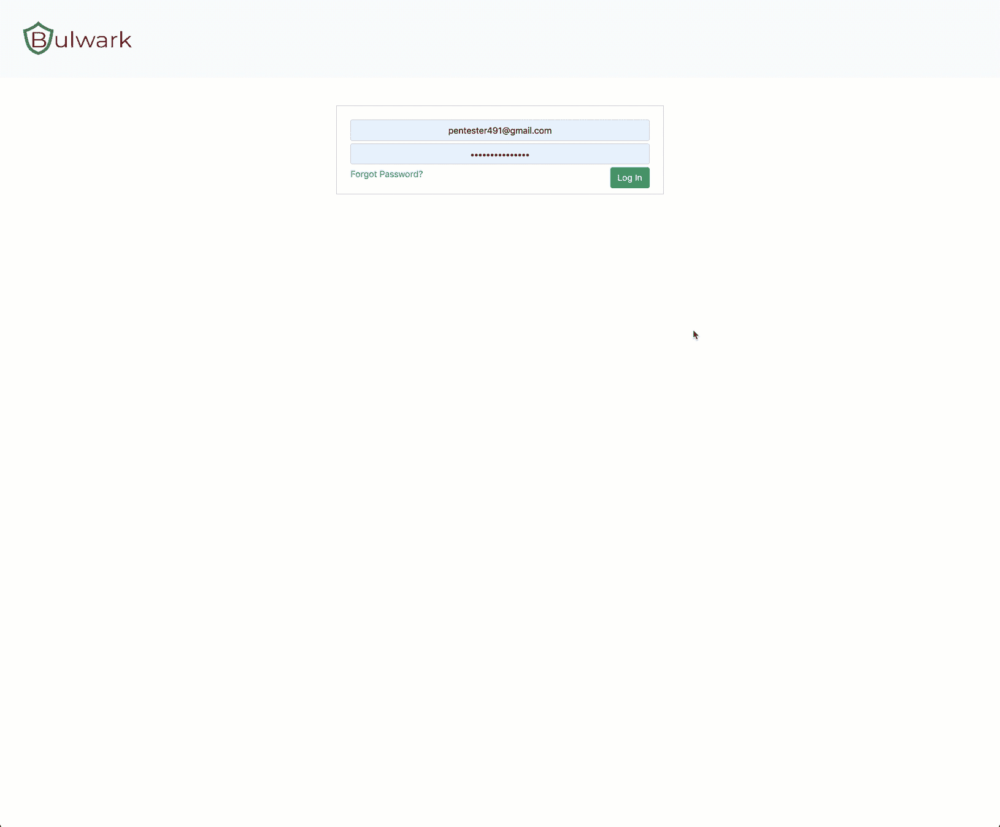
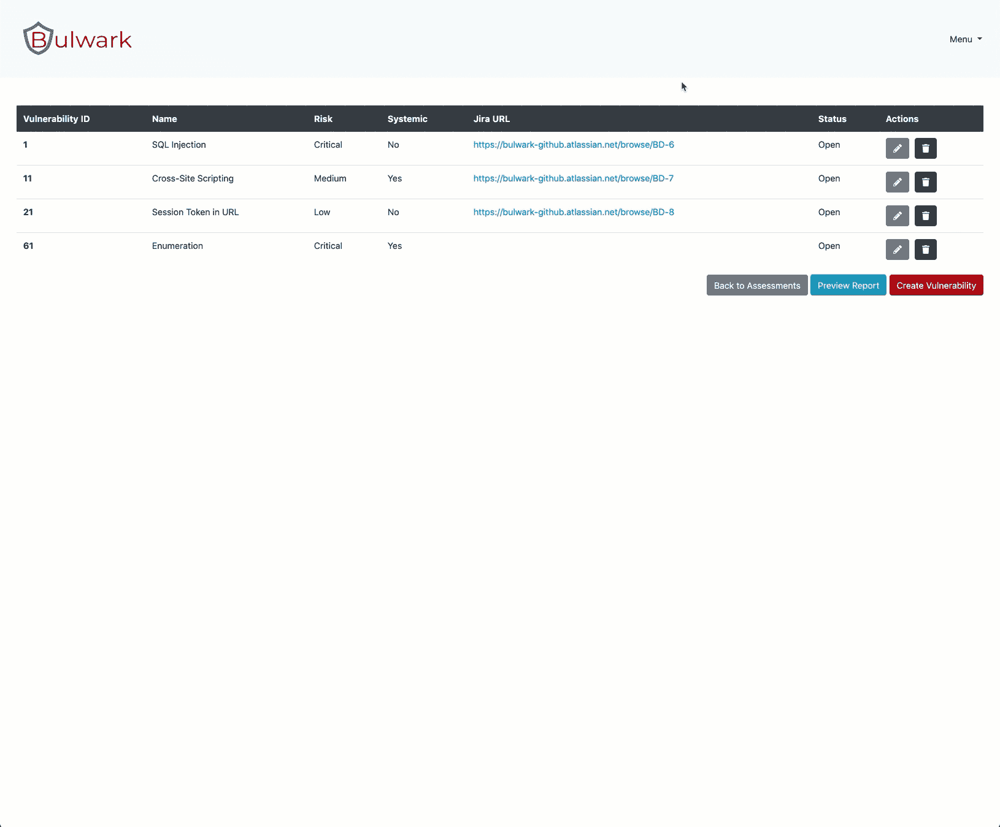

# 堡垒:一个组织资产和漏洞管理工具

> 原文：<https://kalilinuxtutorials.com/bulwark/>

**Bulwark** 是一个组织资产和漏洞管理工具，具有吉拉集成，旨在生成应用程序安全报告。

**吉拉整合**

**注**:请记住，这个项目处于早期开发阶段。

**用 Docker 启动**

1.  安装[对接器](https://www.docker.com/)
2.  创建一个`.env`文件，并提供以下属性:

MYSQL _ DATABASE = " bulwark "
MYSQL _ PASSWORD = " bulwark "
MYSQL _ ROOT _ PASSWORD = " bulwark "
MYSQL _ USER = " ROOT "
MYSQL _ DB _ CHECK = " MYSQL "
DB _ PASSWORD = " bulwark "
DB _ URL = " 172 . 16 . 16 . 3 "
DB _ ROOT = " ROOT "
DB _ USERNAME = " bulwark "【T8

构建并启动堡垒容器:

**坞站-合成 up -d**

启动/停止舷墙容器:

**对接器-复合启动
对接器-复合停止**

移除舷墙容器:

**坞站-复合下行**

堡垒将会出现在[本地主机:5000](http://localhost:5000)

**本地安装**

**$ git 克隆(url)
$ cd 壁垒
$ npm 安装**

以开发模式运行:

**$ npm 运行开始:开发**

在生产模式下运行:

**$ npm 开始**

**环境变量**

在根目录下创建一个`.env`文件。这将由应用程序使用 [dotenv](https://www.npmjs.com/package/dotenv) 进行解析。

*   `**DB_PASSWORD**`

`**DB_PASSWORD="somePassword"**`

将此变量设置为数据库密码

*   `**DB_USERNAME**`

`**DB_USERNAME="foobar"**`

将此变量设置为数据库用户名

*   `**DB_URL**`

`**DB_URL=something-foo-bar.dbnet**`

将此变量设置为数据库 URL

*   `**DB_PORT**`

`**DB_PORT=3306**`

将此变量设置为数据库端口

*   `**DB_NAME**`

`**DB_NAME="foobar"**`

将此变量设置为数据库连接名

*   `**DB_TYPE**`

`**DB_TYPE="mysql"**`

该应用程序是使用 MySQL 数据库开发的。更多数据库选项见 [typeorm](https://github.com/typeorm/typeorm/blob/master/docs/connection-options.md#common-connection-options) 文档。

*   `**NODE_ENV**`

`**NODE_ENV=production**`

设置此变量以确定节点环境

*   `**DEV_URL="http://localhost:4200"**`

仅在需要不同端口时更新

*   `**PROD_URL="http://localhost:5000"**`

仅在需要不同端口时更新

*   `**JWT_KEY**`

`**JWT_KEY="changeMe"**`

将此变量设置为 JWT 秘密

*   `**JWT_REFRESH_KEY**`

`**JWT_REFRESH_KEY="changeMe"**`

将此变量设置为刷新 JWT 密码

*   `**CRYPTO_SECRET**`

`**CRYPTO_SECRET="randomValue"**`

将该变量设置为 [Scrypt](https://nodejs.org/api/crypto.html#crypto_crypto_scryptsync_password_salt_keylen_options) 密码。

*   `**CRYPTO_SALT**`

`**CRYPTO_SECRET="randomValue"**`

将此变量设置为 [Scrypt](https://nodejs.org/api/crypto.html#crypto_crypto_scryptsync_password_salt_keylen_options) salt。

*   **清空`.env`文件模板**

DB _ PASSWORD = " "
DB _ URL = " "
DB _ USERNAME = " "
DB _ PORT = 3306
DB _ NAME = " "
DB _ TYPE = " "
NODE _ ENV = " "
DEV _ URL = " http://localhost:4200"
PROD _ URL = " http://localhost:5000"
JWT _ KEY = " "
JWT _ REFRESH _ KEY = " "
CRYPTO _ SECRET = "。

**创建初始数据库迁移**

*   创建初始数据库迁移

**$ npm 运行迁移:初始化**

*   运行初始数据库迁移

**$ npm 运行迁移:运行**

**默认凭证**

初次启动时，会使用以下凭据创建一个用户帐户:

*   电子邮件:`admin@example.com`
*   密码:`changeMe`

首次登录时，更新配置文件部分下的默认用户密码。

[**Download**](https://github.com/softrams/bulwark)