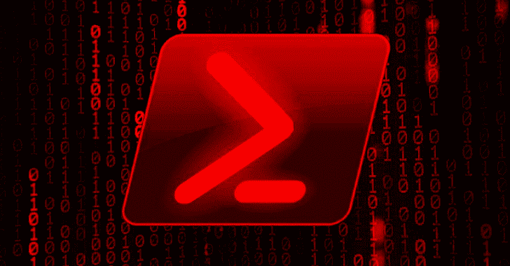

# Invoke-Antivm:用于 vm 规避的 Powershell 工具

> 原文：<https://kalilinuxtutorials.com/invoke-antivm/>

Invoke-antivim 是一组通过 Powershell 执行虚拟机检测和指纹识别的模块。

**兼容性**

运行 check-compatibility.ps1 脚本，检查哪些模块或功能与 powershell 版本兼容。我们的目标是从 2.0 开始实现兼容性，但是我们还没有实现。请运行 check-compability.ps1 来查看当前的兼容性问题。

**背景**

我们编写这个工具是为了统一几种技术来识别虚拟机或沙盒技术。它依靠签名和行为信号来识别主机是否是虚拟机。这些模块被分成逻辑组:CPU、执行、网络和程序。用户还可以决定提取目标主机的指纹，以便能够确定哪些功能可用于识别沙盒或虚拟机解决方案。

**目的**

invoke-antivim exists 的开发是为了理解在 powershell 有效负载中使用混淆和反 VM 技巧的含义。我们希望这将有助于红队避免分析他们的有效载荷，蓝队了解如何用规避技术去模糊脚本。如果你想减小大小，你可以使用主模块文件 Invoke-antim . PS D1 或者使用单一的 ps1 脚本文件。

**用途**

以下脚本中提供了使用示例:

*   ps1:这显示了一个如何调用不同测试的示例脚本
*   usage.ps1:这显示了基本用法
*   usage_more.ps1:这显示了更高级的功能
*   usage_exfil.ps1:这展示了如何通过 pastebin、web 或 email 将主机信息作为 json 文档进行过滤
*   usage_fingerprint_file.ps1:这显示了渗漏模块和以 json 文档形式生成的数据
*   ps1:这显示了用于在线沙箱的指纹模块
*   output/poc.docm:这显示了一个示例 MS Word 攻击，它使用一个宏来调用指纹模块(之前已上传到服务器)

文件夹 pastebin 包含一个 python 脚本:

*   下载所有粘贴的 full_fingerprints.py
*   decode_pastebins.ps1 来解压缩和解码指纹文档

你必须确保你使用的加密密钥与你在渗透步骤中使用的相同。文件夹包展示了如何将所有脚本打包到一个文件中，以获得更好的可移植性。文件夹 pastebin 显示了如何从 pastebin 中自动提取和解码渗出的文档。

**安装**

Invoke-CradleCrafter 的源代码托管在 Github，你可以从这个库([https://github.com/robomotic/invoke-antivm](https://github.com/robomotic/invoke-antivm))下载、派生和查看它。请通过 Github 的错误跟踪器报告与此项目相关的问题或功能请求。

要安装:运行脚本 install_module.ps1