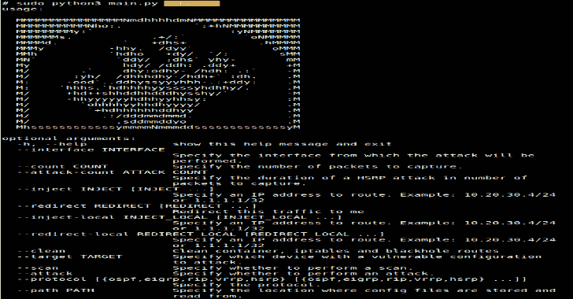

# Routopsy:攻击网络协议的工具包

> 原文：<https://kalilinuxtutorials.com/routopsy/>

Routopsy 是一个用来攻击经常被忽视的网络协议的工具包。Routopsy 目前支持针对动态路由协议(DRP)和第一跳冗余协议(FHRP)的攻击。

目前实施的大多数攻击利用武器化的“虚拟路由器”，而不是从头开始实施协议。

该工具不仅限于虚拟路由器，还允许在 python3 中或通过添加额外的容器来实施进一步的攻击。

**先决条件**

1.  [码头工人](https://www.docker.com/get-started)
2.  [蟒蛇 3](https://www.python.org/downloads/)
3.  [pip](https://pip.pypa.io/en/stable/installing/)
4.  [virtualenv](https://virtualenv.pypa.io/en/latest/installation.html)–可选

**安装&设置**

我们建议您在虚拟环境中安装 routopsy，这样任何当前安装的包都不会与 routopsy 使用的包冲突。

**与虚拟环境**

【T4`git clone https://github.com/sensepost/routopsy`
`virtualenv -p python3 env`
`source env/bin/activate`
`pip install -r requirements.txt`

**没有虚拟环境**

【T2`git clone https://github.com/sensepost/routopsy`
`pip install -r requirements.txt`

**用途**

当有疑问时，`**--help**`

*   有关动态路由协议(DRP)的相关用法，请参阅 [DRP 特定用法](https://github.com/sensepost/routopsy/wiki/DRP-Usage)。
*   关于第一跳冗余协议(FHRP)的相关用法，请参阅 [FHRP 特定用法](https://github.com/sensepost/routopsy/wiki/FHRP-Usage)。