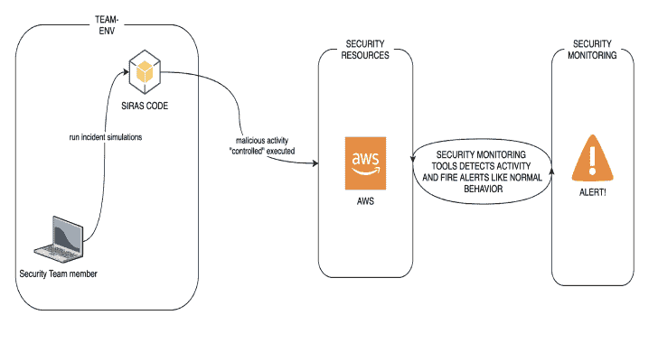

# Siras:安全事件响应自动化模拟

> 原文：<https://kalilinuxtutorials.com/siras/>

**安全事故响应自动模拟(SIRAS)** 是内部/受控行动，提供在现实场景中练习事故响应计划和程序的结构化机会。SIRAS 的主要思想是创建一个代码检测测试场景，以促进 blueteam/tabletops 场景。siras 的所有吸烟者在你的 AWS 中做真实的动作，然后在同一个执行中删除那些动作。

当你需要测试你的控制/警报时，SIRAS 就是`**incident response friend**`；

如何运作？

为什么是 SIRAS？

目前，事件检测和响应团队正在开发不同的机制来预防/检测几种类型的事件，不考虑测试阶段。尽管每个警报/自动化在实施之前都经过测试，并且没有持续监控。为此，SIRAS 提出了一个自动化测试模型，期望它以受控的方式触发警报，以模拟安全事件。

**怎么跑？**

**激活 VIRTUALENV**
VIRTUALENV siras&&信号源。/siras/bin/activate
**获取帮助**
python3 siras.py -s 测试

**运行选项(需要)**

-s 代表“吸烟者”

| 构成名词复数 | 描述 |
| --- | --- |
| **全部** | 运行所有吸烟者。 |
| **测试** | 测试 siras 是否工作。 |
| **sg** | 创建一个开放的 sg 到 AWS，然后用核武器攻击它。 |
| **pa** | 多个身份验证无法进入 vpn paloalto 门户(请将“pano_url”配置到 smoker/PanAuthSmoker.py 中) |
| au | 在 AWS 中创建管理员用户。 |
| **aca** | 多重身份验证无法进入 AWS 控制台门户(请将“account_id”配置到 smoker/awsConsoleAuthSmoker.py 中) |
| **ctr** | 创建和删除 cloudtrail 跟踪登录。 |
| **s3p** | 创建一个 s3 公共存储桶。 |
| **esb** | 创建 esb 公共快照(请将您的快照 ID 配置到 smoker/EBSPublicSmoker line27 中) |

**运行选项(可选)**

| -b(运行) | 描述 |
| --- | --- |
| **真** | 将结果保存到 s3-bucket。 |
| **假** | 这是默认设置，只需将输出打印到控制台中 |

**要求**

*   计算机编程语言
*   VirtualEnv(虚拟环境)
*   AWS 凭据
*   ENV name 'BUCKETS3 ',如果为“true ”,则将日志保存到该存储桶中。
*   (如果您不想使用 virtualenv) pip 来安装 requeriments.txt

**未来整合**

*   库柏人
*   VPC 的变化
*   EC2 感染的吸烟者。
*   卫兵换岗了。

**请求新模块/发布**

请随时发布或请求新模块或用例，在回购中提出问题或制作 PR。