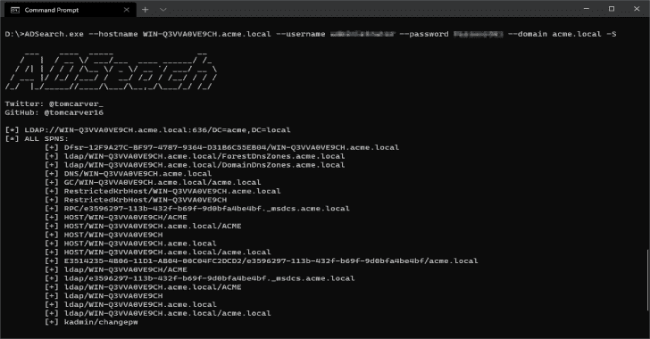
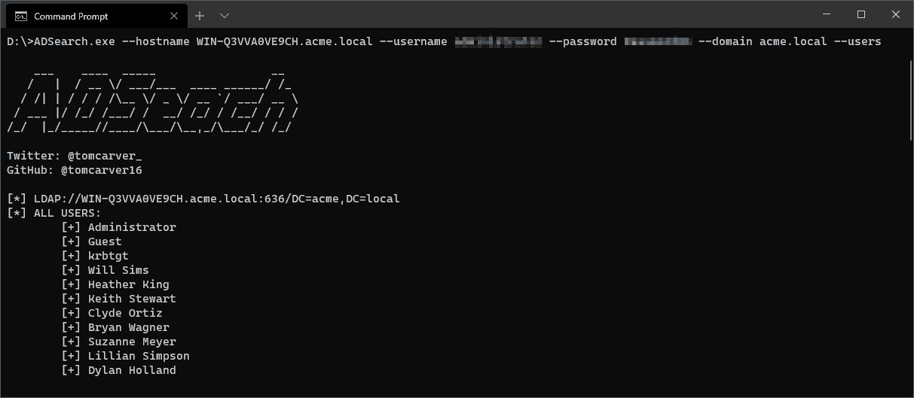
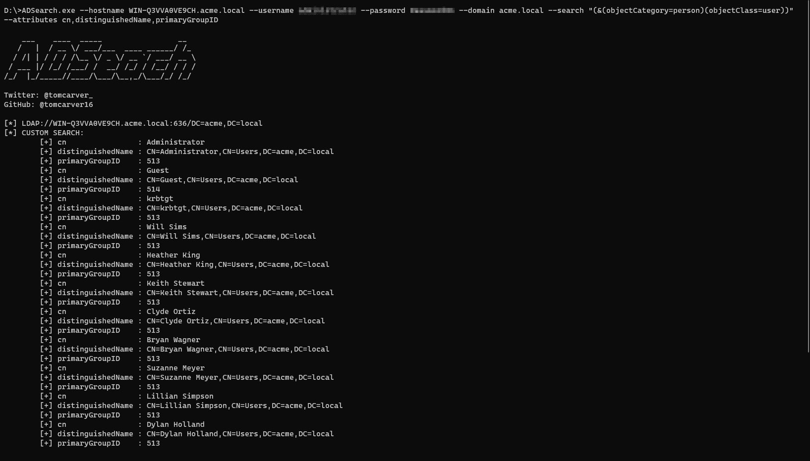

# ADSearch:通过 LDAP 协议帮助查询 AD 的工具

> 原文：<https://kalilinuxtutorials.com/adsearch/>

**ADSearch** 是为 cobalt-strike 的`execute-assembly`命令编写的工具，允许更有效地查询广告。

**主要特征**

*   列出所有域管理员
*   自定义 LDAP 搜索
*   连接到 LDAPS 服务器
*   从 AD 实例输出 JSON 数据
*   从一般查询中检索自定义属性(即所有计算机)

**用途**

**ad search 1 . 0 . 0 . 0
Copyright c 2020
用法:
远程或本地查询 Active Directory:
ad search–域 ldap.example.com–密码 adminpass 1–用户名 admin–用户**

-f，–full 如果设置将显示返回项目的所有属性。
-o，–输出结果的输出文件路径。
–json(默认:false)以 JSON 格式输出结果。
–禁用设置横幅时的 suppress-banner。
-G，–groups 枚举并返回 AD 中的所有组。
-U，–users 枚举并返回 AD 中的所有用户。
-C，–计算机枚举并返回所有加入 AD 的计算机。
-S，–SPN 枚举并返回 AD 中的所有 spns。
–从 csv 格式的结果中返回的属性(默认:cn)。
-s，–search 在广告服务器上执行自定义搜索。
–域管理员试图检索所有域管理员帐户。
-u，–用户名尝试使用给定的用户名向 AD 进行身份验证。
-p，–password 尝试使用给定的密码向 AD 进行身份验证。
-h，–hostname 如果设置，将尝试远程绑定到主机名。此选项要求在主机名上将域选项设置为有效的 DC。也将允许使用 IP 地址。
-p，–port(默认值:636)如果设置，将尝试基于 IP 远程绑定到该端口。
-d，–domain 我们以 FQDN 格式连接到的域控制器。如果留空，则忽略所有其他连接选项，查找在本地完成。
–不安全(默认:假)如果设置将通过端口 389 通信而不使用 SSL
–帮助显示此帮助屏幕。
–版本显示版本信息。

**截图**

*   **显示所有 SPN**

*   **显示所有用户**

*   **从自定义搜索中获取自定义属性**

[**Download**](https://github.com/tomcarver16/ADSearch)