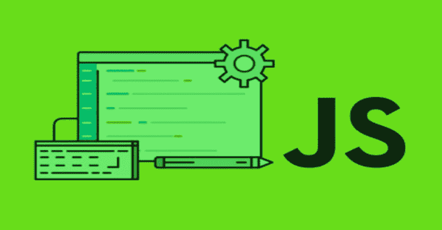

# Js-X-Ray : JavaScript & Node.js 开源 SAST 扫描仪

> 原文：<https://kalilinuxtutorials.com/js-x-ray/>

[](https://1.bp.blogspot.com/-k8u0UQ4I0hY/X9KzAbU4O9I/AAAAAAAAIG0/8WHzvVUDEKIgS-P16GzOY8_1bPXTiKslQCLcBGAsYHQ/s728/javascript.png)

**Js-X-Ray** 是一个 JavaScript AST 分析。创建这个包是为了导出[节点安全](https://github.com/ES-Community/nsecure) AST 分析，以实现更好的代码进化，并允许开发人员和研究人员更好地访问。

目标是为开发人员和安全研究人员快速识别危险的代码和模式。解释这个工具的结果仍然需要您有一套安全概念。

**目标**

该项目的目标是成功检测所有潜在的可疑 JavaScript 代码..目标显然是出于恶意目的添加或注入的代码..

大多数时候，这些黑客会试图尽可能隐藏他们代码的行为，以避免被发现或容易被理解…该库的工作是理解和分析这些模式，这将使我们能够检测恶意代码..

**特色突出**

*   检索 Node.js 所需的依赖项和文件。
*   检测不安全的正则表达式。
*   当 AST 分析出现问题或无法遵循陈述时，会收到警告。
*   强调常见的攻击模式和 API 用法。
*   能够遵循危险 Node.js 全局变量的用法。
*   检测混淆的代码，并在可能的情况下检测已经使用的工具。

**入门**

这个包可以在节点包库中找到，可以很容易地用 [npm](https://docs.npmjs.com/getting-started/what-is-npm) 或者 [yarn](https://yarnpkg.com) 安装。

**$ npm i js-x 射线
或
$ yarn 添加 js-x 射线**

**使用示例**

创建一个包含以下内容的本地`.js`文件:

```
try  {
    require("http");
}
catch (err) {
    // do nothing
}
const lib = "crypto";
require(lib);
require("util");
require(Buffer.from("6673", "hex").toString());
```

然后使用`js-x-ray`运行 JavaScript 代码的分析:

```
const { runASTAnalysis } = require("js-x-ray");
const { readFileSync } = require("fs");

const str = readFileSync("./file.js", "utf-8");
const { warnings, dependencies } = runASTAnalysis(str);

const dependenciesName = [...dependencies];
const inTryDeps = [...dependencies.getDependenciesInTryStatement()];

console.log(dependenciesName);
console.log(inTryDeps);
console.log(warnings);

```

分析将返回:`http`(在试)、`crypto`、`util`和`fs`。

> ⚠️在根案例目录中也有很多可疑的代码示例。请随意对这些文件试用该工具。

**警告图例(v2.0+)**

> 等于或低于 0.7.0 的节点安全版本不再与下面的警告表兼容。

本节描述 JSXRay 返回的所有可能的警告。

| 名字 | 描述 |
| --- | --- |
| 解析错误 | 使用 meriyah 解析 JavaScript 代码时出错。这意味着从字符串到 AST 的转换失败。如果您遇到这样的错误，**请在这里打开问题**。 |
| 不安全-导入 | 无法跟随 import (require，require.resolve)语句/expr。 |
| 不安全正则表达式 | 检测到一个不安全的正则表达式，它可能被用于 ReDoS 攻击。 |
| 不安全-stmt | 使用危险语句，如`eval()`或`Function("")`。 |
| 不安全分配 | 像`process`或`require`这样的受保护全局的赋值。 |
| 编码文字 | 检测到编码文字(它可以是 hexa 值、unicode 序列、base64 字符串等) |
| 短标识符 | 这意味着所有标识符平均长度低于 1.5。仅当文件包含 5 个以上的标识符时才有可能。 |
| 可疑的文字 | 这意味着所有文字的可疑分数之和大于 3。 |
| 混淆代码(**实验**) | 代码被混淆的可能性非常高… |

**API**

*   runas analysis(str:string，options？:运行时间选项):报告
*   generateWarning(种类:字符串，选项？:警告选项):警告< BaseWarning >
*   rootLocation(): SourceLocation

[**Download**](https://github.com/fraxken/js-x-ray)