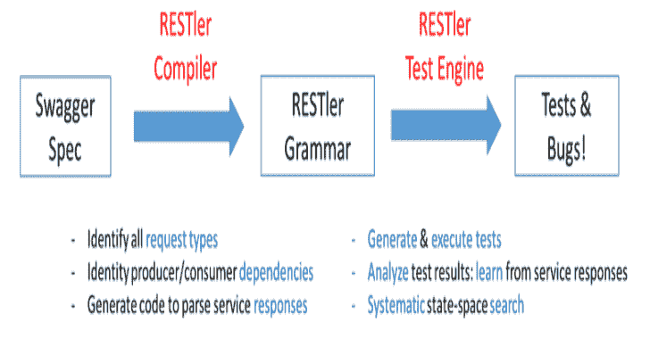
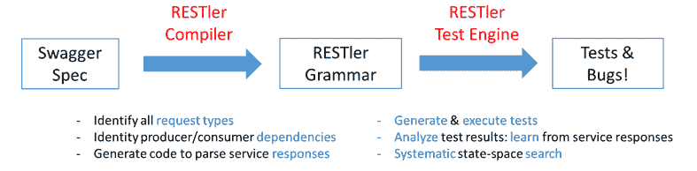

# Restler Fuzzer:用于自动测试云服务的 API Fuzzing 工具

> 原文：<https://kalilinuxtutorials.com/restler-fuzzer/>

RESTler 是第一个有状态 REST API fuzzing 工具，用于通过 REST API 自动测试云服务，并发现这些服务中的安全性和可靠性漏洞。对于给定的具有 OpenAPI/Swagger 规范的云服务，RESTler 分析其整个规范，然后生成并执行测试，通过其 REST API 对服务进行测试。

RESTler 智能地从 Swagger 规范中推断出请求类型之间的生产者-消费者依赖关系。在测试过程中，它会检查特定类别的错误，并根据之前的服务响应动态地了解服务的行为。这种智能允许 RESTler 探索只有通过特定请求序列才能到达的更深层次的服务状态，并发现更多的 bug。

在这些同行评审的研究论文中描述了 RESTler:

1.  RESTler:Stateful REST API Fuzzing(ICSE 2019)
2.  [检查云服务 REST APIs 的安全属性](https://patricegodefroid.github.io/public_psfiles/icst2020.pdf)(ICST 2020)
3.  【REST APIs 的差异回归测试 (ISSTA'2020)
4.  智能 REST API 数据模糊化 (FSE'2020)

如果你在研究中使用 RESTler，请引用(默认)ICSE 2019 年的论文( [BibTeX](https://github.com/microsoft/restler-fuzzer/blob/main/docs/user-guide/icse2019.bib) )。

RESTler 由微软研究院创建，目前仍在积极开发中。

**构建状态**

**设置 RESTler**

RESTler 被设计为在 64 位机器上运行 Windows 或 Linux。

构建说明

先决条件:安装 [Python 3.8.2](https://www.python.org/downloads/) 和[。NET core SDK 3.1](https://dotnet.microsoft.com/download/dotnet-core?utm_source=getdotnetcorecli&utm_medium=referral) ，适合您的操作系统。

创建一个放置 RESTler 二进制文件的目录:

`**mkdir restler_bin**`

切换到 repo 根目录，运行以下 Python 脚本:

`**python ./build-restler.py --dest_dir <full path to restler_bin above>**`

注意:如果您在构建时得到 nuget 错误 NU1403，一个快速的解决方法是用这个命令清除您的缓存

`**dotnet nuget locals all --clear**`

**二进制丢弃指令**

RESTler binary drops 即将推出。

先决条件:安装 [Python 3.8.2](https://www.python.org/downloads/) 和[。适用于您的适当操作系统的 NET core SDK 3.1](https://dotnet.microsoft.com/download/dotnet-core?utm_source=getdotnetcorecli&utm_medium=referral) 或更高版本。

**使用 RESTler**

RESTler 以 4 种主要模式运行(按顺序):

1.  **编译:**根据 Swagger JSON 或 YAML 规范(以及可选的示例)，生成一个 RESTler 语法。参见[编](https://github.com/microsoft/restler-fuzzer/blob/main/docs/user-guide/Compiling.md)。
2.  **Test:** 快速执行编译后的 RESTler 语法中的所有端点+方法，以调试测试设置，并计算 Swagger 规范的哪些部分被覆盖。这种模式也被称为*冒烟测试*。参见[测试](https://github.com/microsoft/restler-fuzzer/blob/main/docs/user-guide/Testing.md)。要使用自定义测试引擎设置，请参见[测试引擎设置](https://github.com/microsoft/restler-fuzzer/blob/main/docs/user-guide/SettingsFile.md)。
3.  **Fuzz-lean:** 在编译好的 RESTler 语法中，每个 endpoint+方法执行一次，使用一组默认的检查器，看看是否可以快速找到 bug。参见[起毛](https://github.com/microsoft/restler-fuzzer/blob/main/docs/user-guide/Fuzzing.md)。
4.  **Fuzz:**bug hunting——在智能广度优先搜索模式(深度搜索模式)下探索 RESTler fuzzing 语法，以找到更多 bug。**警告:**这种类型的模糊更具攻击性，如果服务实现得不好，可能会导致测试中的服务中断(例如，模糊可能会导致资源泄漏、性能下降、后端损坏等)。).参见[起毛](https://github.com/microsoft/restler-fuzzer/blob/main/docs/user-guide/Fuzzing.md)。

**快速启动**

关于简单例子的快速介绍，请参见本[教程](https://github.com/microsoft/restler-fuzzer/blob/main/docs/user-guide/TutorialDemoServer.md)。

要在您的 API 上快速试用 RESTler，请参见[快速入门](https://github.com/microsoft/restler-fuzzer/blob/main/docs/user-guide/QuickStart.md)。

**RESTler 发现的 Bugs】**

RESTler 目前发现了两类 bug。

*   **错误代码**:目前，只要收到状态代码为`500`(“内部服务器错误”)的响应，就会报告一个错误。
*   **检查器**:每个检查器都试图通过在 fuzzing 期间的某些点执行有针对性的附加请求或请求序列来触发特定的 bug，这由上下文决定。一些检查器试图找到额外的 500，而其他检查器试图找到特定的逻辑错误，如资源泄漏或层次结构违规。有关跳棋的完整描述，请参见[跳棋](https://github.com/microsoft/restler-fuzzer/blob/main/docs/user-guide/Checkers.md)。

当发现一个 bug 时，RESTler 报告在 bug 桶中分类的 bug，并提供一个重放日志，该日志可用于重现该 bug(参见[重放](https://github.com/microsoft/restler-fuzzer/blob/main/docs/user-guide/Replay.md))。

**高级主题**

关于有效使用 RESTler 的技巧，请参见[最佳实践](https://github.com/microsoft/restler-fuzzer/blob/main/docs/user-guide/BestPractices.md)和[提高 Swagger 覆盖率](https://github.com/microsoft/restler-fuzzer/blob/main/docs/user-guide/ImprovingCoverage.md)。

另见这些[常见问题](https://github.com/microsoft/restler-fuzzer/blob/main/docs/user-guide/FAQ.md)。

如果您有兴趣将 RESTler 大规模用作 CI/CD 管道的一部分，请查看 [REST API 模糊测试自托管服务](https://github.com/microsoft/rest-api-fuzz-testing)。

[**Download**](https://github.com/microsoft/restler-fuzzer)