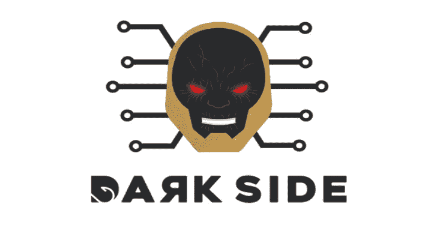
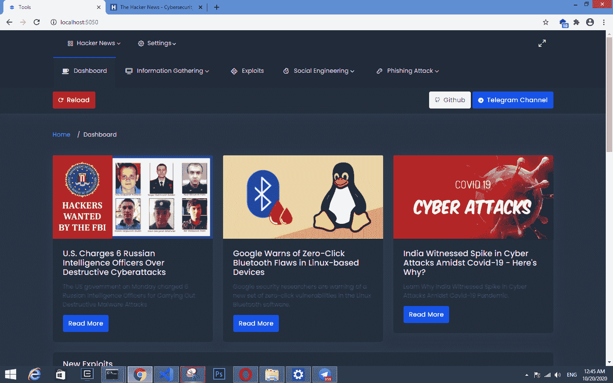
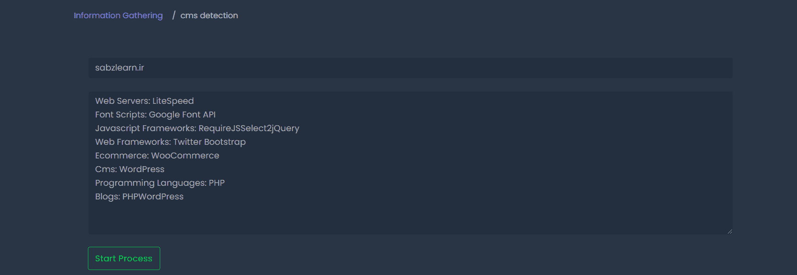
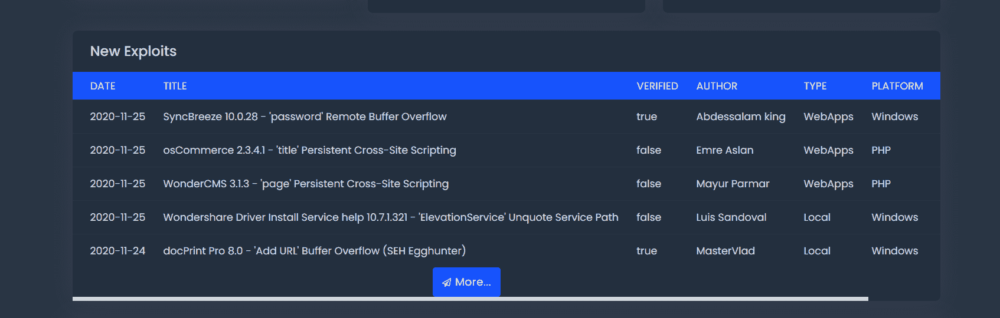
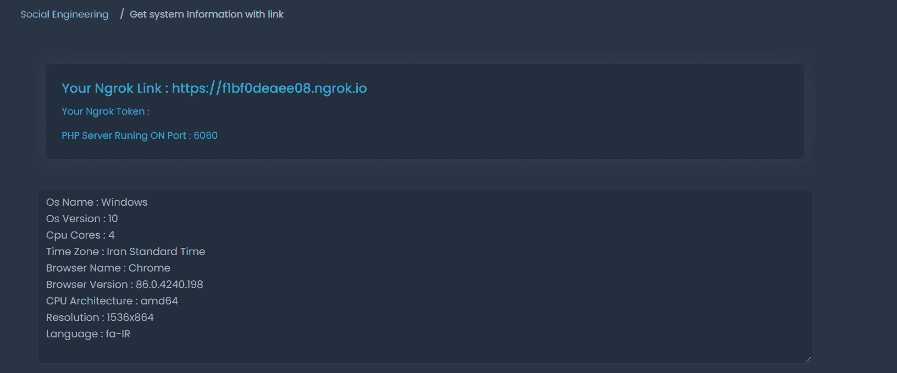

# 黑暗面:工具信息收集和社会工程

> 原文：<https://kalilinuxtutorials.com/darkside/>

DarkSide 是一个拥有令人敬畏的用户界面的工具。

**特性**

**黑客仪表盘**

*   黑客新闻[thehackernews.com/]
*   新战功[Exploit-db.com]
*   黑客教程视频[youtube.com]
*   数字货币的最新价格[里亚尔，美元]

**信息收集**

*   绕过云耀斑
*   Cms 检测
*   跟踪路径
*   反向 IP
*   端口扫描
*   IP 位置查找器
*   显示 HTTP 标题
*   查找共享 DNS
*   Whois
*   DNS 查找

**战功**

*   参考 exploit-db.com

**社会工程**

ngrok 支持]

*   通过链接获取系统信息
*   带链接的屏幕截图
*   用链接播放声音

**在 Windows 上安装**

**$下载 https://github.com/Ultrasecurity/DarkSide
$ CD dark side
$ python-m pip install-r requirements . txt
$在 php.net 下载 PHP V-7 并添加到路径 php.exe
$ python run . py**

[**Download**](https://github.com/ultrasecurity/DarkSide)