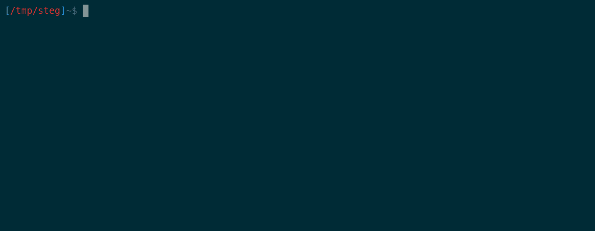
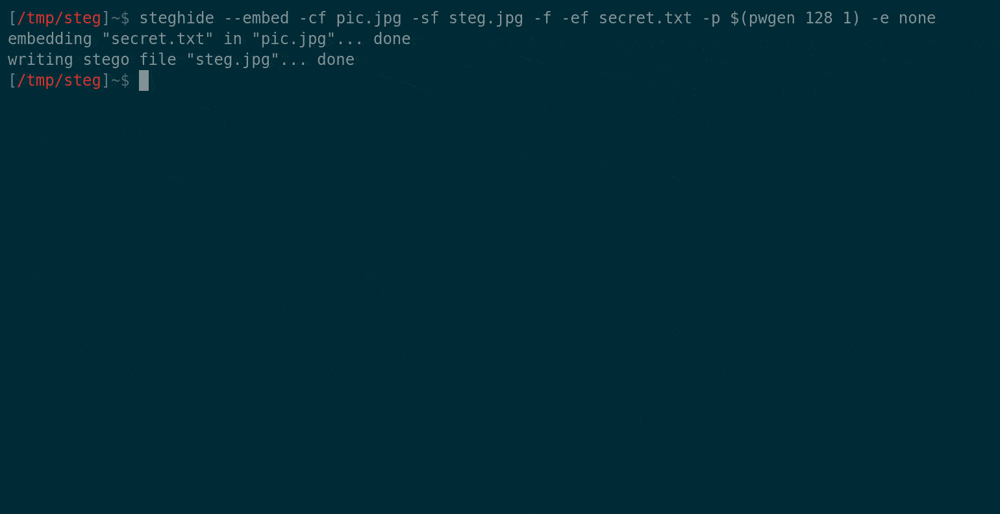

# Stegseek:世界上最快的 Steghide 破解程序，每秒可破解数百万个密码

> 原文：<https://kalilinuxtutorials.com/stegseek/>

[](https://1.bp.blogspot.com/-n0UxLtrziSQ/X9vWV-NFKZI/AAAAAAAAIKg/_Qwrg3JVYoEn9tE6LOCP3dMGezzPEjxVACLcBGAsYHQ/s1540/crack.gif)

Stegseek 是一个闪电般快速的 steghide 破解程序，可用于从文件中提取隐藏数据。它是作为原始 steghide 项目的一个分支而构建的，因此，它比其他破解程序快*几千倍*，并且可以在不到 2 秒的时间内贯穿整个 **`rockyou.txt` *。**

Stegseek 还可用于提取无密码的隐写元数据，可用于测试文件是否包含隐写数据。

**演示:随机 rockyou.txt 密码(实时)**


**安装**

以下说明将引导您完成安装过程。或者，您可以在 Docker 容器中运行 Stegseek。向前跳到 [Docker](https://github.com/RickdeJager/stegseek#whale-docker) 获取说明。

**发布**

**Linux**

在 Ubuntu 和其他基于 Debian 的系统上，您可以使用提供的`.deb`包进行安装:

1.  下载最新的 [Stegseek 版本](https://github.com/RickdeJager/stegseek/releases)
2.  使用`sudo apt install ./stegseek_0.4-1.deb`安装`.deb`文件

在其他系统上，您必须自己构建 Stegseek。更多信息见 [BUILD.md](https://github.com/RickdeJager/stegseek/blob/master/BUILD.md) 。

**窗户**

遗憾的是，不支持将 Stegseek 构建为原生 Windows 应用。相反，您应该使用 [WSL](https://docs.microsoft.com/en-us/windows/wsl/about) 运行 Stegseek。为了获得最佳兼容性，建议使用 Ubuntu WSL 发行版。
一旦配置了 WSL，就可以使用上面的 Linux 指令安装 Stegseek 了。

默认情况下，WSL 在`/mnt/c/`挂载`C:\`驱动器，您可以使用它轻松访问您的文件。

**使用 Stegseek**

**开裂**

stegseek 最重要的功能是单词列表破解:

**stegseek [stegofile.jpg] [wordlist.txt]**

该模式将简单地根据所提供的隐写文件尝试所提供的单词列表中的所有密码。

**检测&无密码提取**

Stegseek 还可用于从 steghide 图像中检测和提取任何未加密的(元)数据。这利用了 steghide 中使用的随机数生成器仅具有 2^32 可能种子的事实，这可以在几分钟内被强行破解。

**steg seek–seed【stegofile.jpg】**

这个命令将告诉您:

*   此文件是否实际包含 steghide 内容。
*   文件包含多少隐藏内容。
*   内容是如何加密的。

如果你(非常)幸运，文件没有加密编码，这种模式甚至可以恢复编码文件！

在这个演示中，我使用了一个非常安全的随机密码来嵌入文件，但是通过将`-e none`参数传递给 steghide 来禁用加密。几分钟之内，Stegseek 就能恢复嵌入的文件。



**可用参数**

使用`stegseek --help`获取可用选项的完整列表:

```
Stegseek version  0.4

=== Stegseek Help ===
To crack a stegofile:
stegseek [stegofile.jpg] [wordlist.txt]

Commands:
 --crack                 Crack a stego file using a wordlist. This is the default mode.
 --seed                  Crack a stego file by attempting all embedding patterns.
                         This mode can be used to detect a file encoded by steghide.
                         In case the file was encoded without encryption, this mode will
                         even recover the embedded file.
Positional arguments:
 --crack [stegofile.jpg] [wordlist.txt] [output.txt]
 --seed  [stegofile.jpg] [output.txt]

Keyword arguments:
 -sf, --stegofile        select stego file
 -wl, --wordlist         select the wordlist file
 -xf, --extractfile      select file name for extracted data
 -t, --threads           set the number of threads. Defaults to the number of cores.
 -f, --force             overwrite existing files
 -v, --verbose           display detailed information
 -q, --quiet             hide performance metrics

Use "stegseek --help -v" to include steghide's help. 
```

**隐写**

Stegseek 几乎包含了 steghide 的所有功能，因此它也可以正常地用于嵌入或提取数据。唯一的问题是命令必须使用`--command`格式。
于是`steghide embed [...]`变成了`stegseek --embed [...]`。

**码头工人**

您也可以将 Stegseek 作为 Docker 容器运行:

**码头运行–RM-it-v " $(pwd):/码头" rickdejar/steadseek[steadprofile . jpg][word list . txt]**

这确实要求单词列表和 stegofile 位于当前工作目录中，因为该文件夹安装在容器内部的`/steg`中。

**性能**

*   这是 Stegseek 真正闪光的地方。如前所述，让我们从**`rockyou.txt`【仅用 2 秒】**的说法开始。
*   所有这些数字都是在一台配备英特尔 i7-7700 HQ CPU(2.80 GHz)和 8 GB 内存的笔记本电脑上测得的。

**RockYou.txt**

*   我挑选了`**rockyou.txt**`中最后一个没有控制字符的密码:**【␣␣␣␣␣␣␣1】**(7 个空格后跟‘1’)。
*   该密码位于第`**14344383**`行，共`**14344391**`行

```
time stegseek 7spaces1.jpg rockyou.txt 
Stegseek version 0.4
[i] Read the entire wordlist (14344391 words), starting cracker
[ 14231679 / 14344391 ]  (99,21%)                 
[i] --> Found passphrase: "       1"

[i] Original filename: "secret.txt"
[i] Extracting to "7spaces1.jpg.out"

real	0m1,912s
user	0m10,355s
sys	0m0,144s 
```

这就是了，不到 2 秒钟就有超过 1400 万个密码😍。

与其他工具相比如何？

为了测试其他工具的性能，我从`rockyou.txt`中用不同的密码创建了几个隐写文件。我用默认设置运行了每一个工具，除了 Stegbrute，为了公平比较，我增加了线程。

| 密码 | 线条 | Stegseek v0.4 | Stegcracker 2.0.9 | Stegbrute v0.1.1 (-t 8) |
| --- | --- | --- | --- | --- |
| 《卡桑德拉》 | 1 000 | 0.9 秒 | 3.1s | 0.7s |
| “圆顶” | ten thousand | 0.9 秒 | 14.4 秒 | 7.1s |
| “萨加尔” | 100 000 | 0.9 秒 | 2m23.0s | 1 米 21.9 秒 |
| "预算 1 " | 1 000 000 | 0.9 秒 | [p] 23m50.0s | 13 米 45.7 秒 |
| “␣␣␣␣␣␣␣1” | 14 344 383 | 1.9s | [p] 5h41m52.5s | [p] 3h17m38.0s |

[p] =基于先前结果的预计时间。

为了比较每个工具的速度，让我们看看表的最后一行(否则 Stegseek 会在所有线程启动之前结束)。

在这个规模上，Stegseek 比 Stegcracker 快 10 000 多倍，比 Stegbrute 快 6000 多倍。

**变更日志**

**v0.4**

2020-12-01
改进:

*   增加了种子破解，允许无密码数据提取
*   彻底修改了解析器，以允许位置参数
*   2 秒钟内出现裂缝`rockyou.txt`

**v0.3**

2020-11-08
改进:

*   实现线程无锁。多线程得到更有效的利用
*   在`--crack`中增加了`-xf`参数，用于指定提取文件的位置
*   做了。与 Debian/Kali 兼容的 deb 包
*   4 秒内出现裂缝`rockyou.txt`

**v0.2**

改进之处:

*   一旦有一点魔法无法破解，就放弃使用密码短语
*   移除昂贵的位串/ EmbData 分配
*   提高了选择器的性能
*   5 秒内出现裂缝`rockyou.txt`。

**v0.1**

2020-11-04
初始发布，功能:

*   不像传统的破解程序，只加载一次隐写文件
*   基于工作池的线程
*   在尝试完全解密之前，先尝试破解前 3 个字节
*   补充道。deb 包和 docker 容器
*   裂缝`rockyou.txt`出现在 41 秒内。

[**Download**](https://github.com/RickdeJager/stegseek)