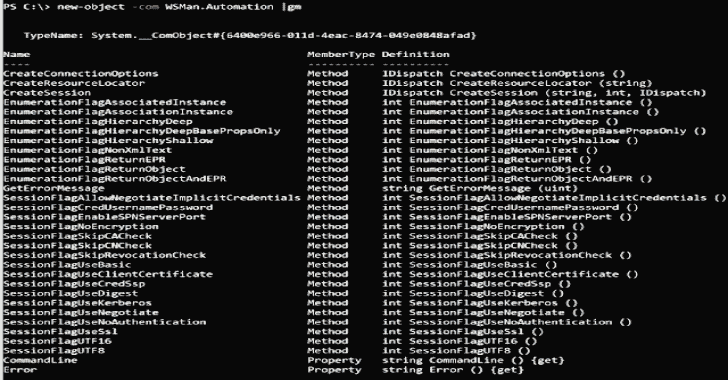

# WSMan-WinRM:使用 WSMan 通过 WinRM 执行远程命令的脚本。自动化 COM 对象

> 原文：<https://kalilinuxtutorials.com/wsman-winrm/>

[](https://1.bp.blogspot.com/-M227TZfnqyg/X9veYDEFdSI/AAAAAAAAIKw/rYTH_hCXlG8DgL5s-3_2FOuMIyxRI1rXQCLcBGAsYHQ/s728/WSMan-WinRM%25281%2529.png)

WSMan-WinRM 是一个概念验证源代码和脚本的集合，用于使用 WSMan 通过 WinRM 执行远程命令。自动化 COM 对象。

**背景**

有关背景信息，请参考以下博客文章:[WS-Management COM:WinRM 横向移动的另一种方法](https://bohops.com/2020/05/12/ws-management-com-another-approach-for-winrm-lateral-movement/)

**注释**

*   SharpWSManWinRM.cs 和 CppWsManWinRM.cpp 在 Visual Studio 2019 中编译。有关所需的导入/引用等，请参考代码注释。
*   所有示例都利用 WMI Win32_Process 类和 WMI Create 方法进行调用。

**用途**

**SharpWSManWinRM.cs**

```
 Usage: SharpWSManWinRM.exe <hostname> <command>
 Usage: SharpWSManWinRM.exe <hostname> <command> <domain\user> <password>

 Example: SharpWSManWinRM.exe host.domain.local notepad.exe
 Example: SharpWSManWinRM.exe host.domain.local "cmd /c notepad.exe" domain\joe.user P@ssw0rd 
```

**WSManWinRM.ps1**

```
 Usage: Invoke-WSManWinRM -hostname <hostname> -command <command>
 Usage: Invoke-WSManWinRM -hostname <hostname> -command <command> -user <domain\user> -password <password>

 Example: import-module .\WSManWinRM.ps1
          Invoke-WSManWinRM -hostname MyServer.domain.local -command calc.exe
 Example: import-module .\WSManWinRM.ps1
          Invoke-WSManWinRM -hostname MyServer.domain.local -command calc.exe -user domain\joe.user -password P@ssw0rd 
```

**WSManWinRM.vbs**

```
 Usage: cscript.exe SharpWSManWinRM.vbs <hostname> <command>
 Usage: cscript.exe SharpWSManWinRM.vbs <hostname> <command> <domain\user> <password>

 Example: cscript.exe SharpWSManWinRM.vbs host.domain.local notepad.exe
 Example: cscript.exe SharpWSManWinRM.vbs host.domain.local "cmd /c notepad.exe" domain\joe.user P@ssw0rd 
```

**WSManWinRM.js**

```
 Usage: cscript.exe SharpWSManWinRM.js <hostname> <command>
 Usage: cscript.exe SharpWSManWinRM.js <hostname> <command> <domain\user> <password>

 Example: cscript.exe SharpWSManWinRM.js host.domain.local notepad.exe
 Example: cscript.exe SharpWSManWinRM.js host.domain.local "cmd /c notepad.exe" domain\joe.user P@ssw0rd 
```

**CppWSManWinRM.cpp**

```
 Usage: CppWSManWinRM.exe <hostname> <command>

 Example: CppWSManWinRM.exe host.domain.local notepad.exe

 Note: Username/password option does not work yet 
```

**道德规范**

WSMan-WinRM 旨在帮助安全专业人员执行道德和法律安全评估和渗透测试。不要用于邪恶的目的。

[**Download**](https://github.com/bohops/WSMan-WinRM)