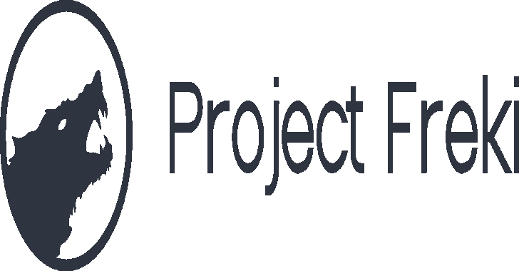

# Freki:恶意软件分析平台

> 原文：<https://kalilinuxtutorials.com/freki/>

Freki 是一个免费的开源恶意软件分析平台。

**目标**

*   促进恶意软件分析和逆向工程；
*   为不同项目提供易用的 REST API
*   易于部署(通过 Docker)；
*   允许社区添加新功能。

**当前特征**

*   哈希提取。
*   病毒总数 API 查询。
*   PE 文件的静态分析(头、节、导入、功能和字符串)。
*   与 Yara 的模式匹配。
*   Web 接口和 REST API。
*   用户管理。
*   社区评论。
*   下载样本。

查看我们的[在线文档](https://crhenr.github.io/freki)了解更多详情。

打开[问题](https://github.com/crhenr/freki/issues)以建议新功能。欢迎所有捐款。

**如何获取源代码？**

`**git clone https://github.com/crhenr/freki.git**`

**演示**

[https://www.youtube.com/embed/AW4afoaogt0?feature=oembed&enablejsapi=1](https://www.youtube.com/embed/AW4afoaogt0?feature=oembed&enablejsapi=1)

**运行中**

最简单的方法:码头工人

1.  安装[坞站](https://docs.docker.com/get-docker/)和[坞站组成](https://docs.docker.com/compose/install/)。
2.  编辑[。env](https://github.com/crhenr/freki/blob/master/.env) 文件。
3.  如果您打算在生产中使用它，请编辑 [freki.conf](https://github.com/crhenr/freki/blob/master/nginx/freki.conf) 来启用 HTTPS。
4.  运行`docker-compose up`或`make`。

**其他方式**

如果您想在本地使用它(例如，用于开发)，请查看我们的[在线文档](https://crhenr.github.io/freki)了解更多细节。

[**Download**](https://github.com/crhenr/freki)