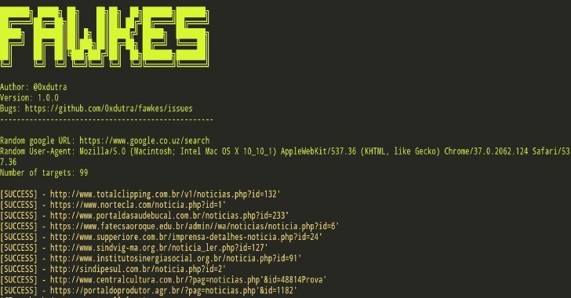

# Fawkes:搜索易受 SQL 注入攻击的目标的工具

> 原文：<https://kalilinuxtutorials.com/fawkes/>

**Fawkes** 是一个搜索易受 SQL 注入攻击的目标的工具。使用谷歌搜索引擎执行搜索。

**选项**

**-q，–query–Dork 将在搜索引擎中使用。
-r，–results–搜索引擎带来的结果数量。
-s，–起始页–搜索结果首页。
-t，–超时–请求超时。
-v，–verbose–启用详细度。**

**例题**

**python 3 Fawkes . py–查询' noticias.php？id = 10 '–超时 3–冗长
python 3 Fawkes . py–查询' admin.php？id = 1 '–超时 3–冗长**

[**Download**](https://github.com/0xdutra/fawkes)