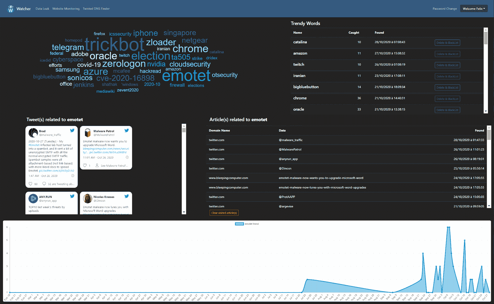
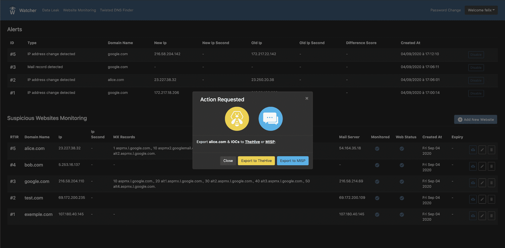
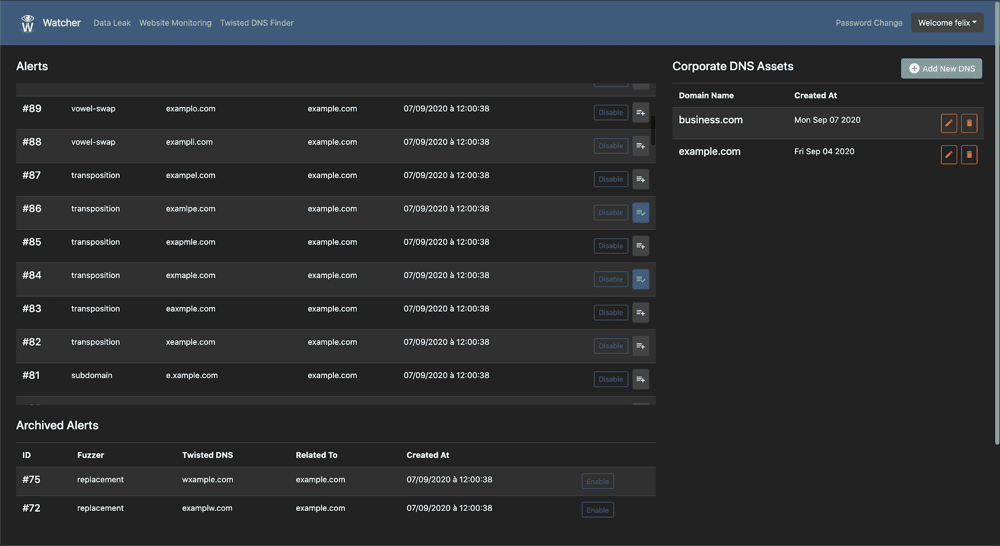
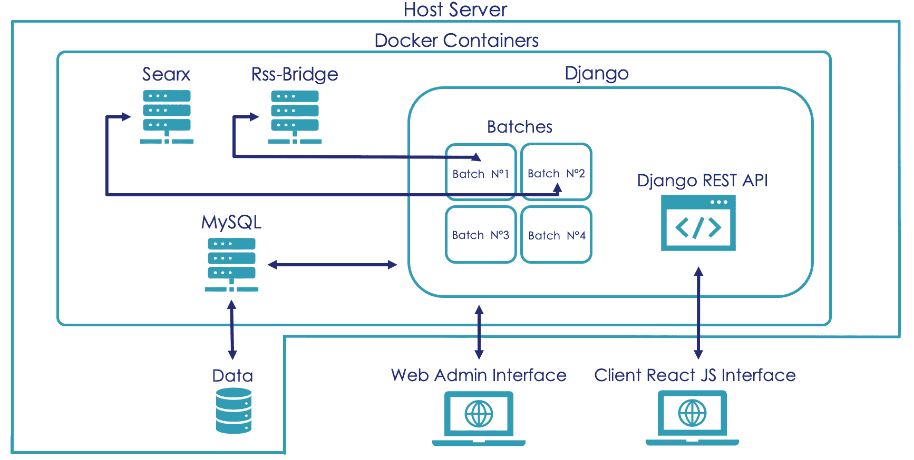

# 观察者:开源网络安全威胁搜索平台

> 原文：<https://kalilinuxtutorials.com/watcher/>

**Watcher** 是 Django & React JS 自动化平台，用于发现针对您组织的新的潜在网络安全威胁。

它应该在 web 服务器上使用，并在 Docker 上可用。

**观察者能力**

*   使用社交网络和其他 RSS 源检测新出现的漏洞和恶意软件( [www.cert.ssi.gouv.fr](http://www.cert.ssi.gouv.fr) 、 [www.cert.europa.eu](http://www.cert.europa.eu) 、【www.us-cert.gov】T5、[www.cyber.gov.au](http://www.cyber.gov.au)……)。
*   检测 pastebin 和其他 IT 内容交换网站(stackoverflow、github、gitlab、bitbucket、apkmirror、npm…)中的关键字。
*   监控恶意域名(IP、邮件/MX 记录、使用 [TLSH](https://github.com/trendmicro/tlsh) 的网页)。
*   使用[DNS list](https://github.com/elceef/dnstwist)检测针对您组织的可疑域名。

有用的捆绑重组威胁狩猎/情报自动化功能。

**附加功能**

*   在[日](https://thehive-project.org/)创建案例，在 [MISP](https://www.misp-project.org/) 创建事件。
*   集成 IOCs 出口到[海湾](https://thehive-project.org/)和 [MISP](https://www.misp-project.org/) 。
*   LDAP 和本地认证。
*   邮件通知。
*   售票系统进料。
*   管理界面。
*   高级用户权限和组。

**涉及的依赖关系**

*   [RSS-桥](https://github.com/RSS-Bridge/rss-bridge)
*   [水务](https://github.com/elceef/dnstwist)
*   [Searx](https://searx.github.io/searx/)
*   [pymisp](https://github.com/MISP/PyMISP)
*   [thehive4py](https://github.com/TheHive-Project/TheHive4py)
*   tlsh
*   [影子用户代理](https://github.com/lobstrio/shadow-useragent)
*   [NLTK](https://www.nltk.org/)

**截图**

Watcher 为数据可视化和分析提供了强大的用户界面。该界面还可以用于管理观察器的使用并监控其状态。

**威胁检测**

**关键词检测**

**恶意域名监控**

**IOCs 出口到海湾& MISP**

**潜在恶意域名检测**

Django 为管理活动提供了一个现成的用户界面。我们都知道管理界面对于一个 web 项目是多么重要:用户管理、用户组管理、观察者配置、使用日志…

**管理界面**

**安装**

使用 Docker 在十分钟内创建一个新的 Watcher 实例(参见[安装指南](https://felix83000.github.io/Watcher/README.html))。

**平台架构**

**参与进来**

参与 Watcher 有多种方式:

*   通过在 GitHub 上打开[问题](https://github.com/Felix83000/Watcher/issues)来报告 bug。
*   请求新功能或提出想法(通过[问题](https://github.com/Felix83000/Watcher/issues))。
*   提出拉取请求。
*   讨论缺陷、特性、想法或问题。
*   将观察者分享到您的社区(Twitter、脸书……)。

[**Download**](https://github.com/felix83000/Watcher)