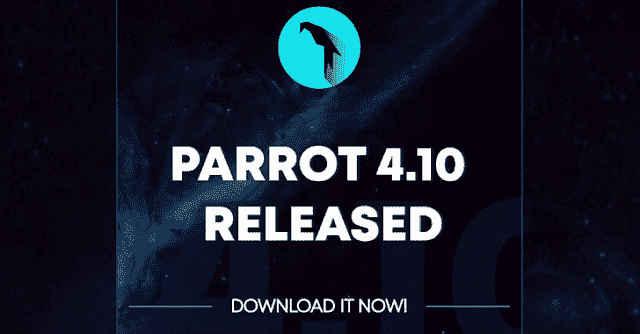
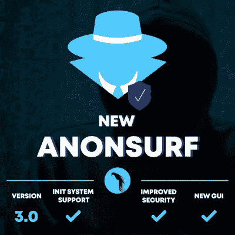
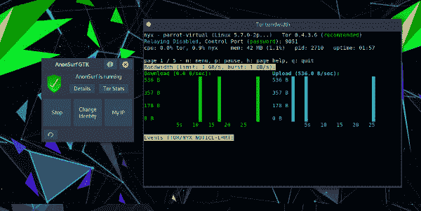
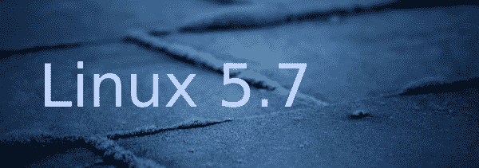
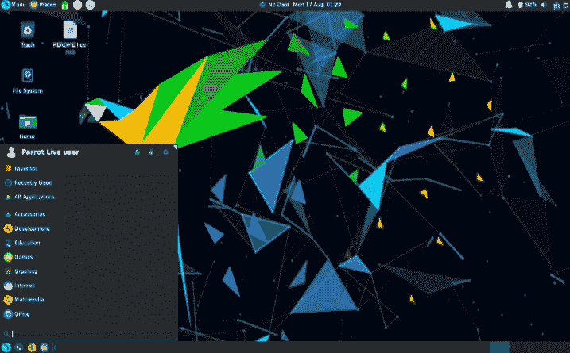
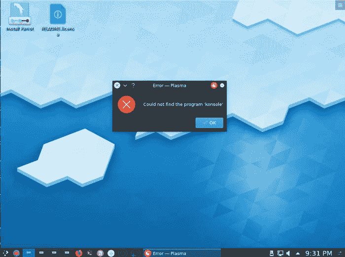

# Parrot 4.10 发布，使分发更加可靠和安全。立即下载！！

> 原文：<https://kalilinuxtutorials.com/parrot-4-10-released/>

我们自豪地宣布 **Parrot OS 4.10** 发布。这个新版本包含了许多重要的改变，使得发行版更加稳定和高效。

您可以从我们的[官方下载页面](https://parrotsec.org/download)下载 Parrot OS，我们邀请您永远不要相信第三方和非官方来源。

我们也有虚拟机的官方种子文件，并准备使用 OVA 映像。

如何从以前的版本升级？

Parrot OS 是一个滚动发行的版本，一旦它们被证明是稳定和可靠的，更新就会流入回购。

版本号(如 4.8 或 4.9)实际上是我们添加到当前项目状态的标签，如果我们认为文件夹中发生了足够多的变化，需要刷新 ISO 文件。事实上，Parrot 的每个版本都代表了我们 ISO 文件的一次更新，将所有积累的部分收集到一起，成为经过测试的可靠的东西。

可以使用以下命令之一通过 APT 升级现有系统:

**须藤鹦鹉-升级
或
须藤 apt 更新&须藤 apt 全面升级**

有什么新消息？

*   **AnonSurf 3.0**
*   **Linux 5.7**
*   **Metasploit 6.0**

AnonSurf 3.0 已经准备好了，并且有许多重要的特性。现在它细分为三个模块:图形用户界面，守护进程和实用程序。

GUI 是用 NIM 编写的，NIM 是一种速度极快的编程语言，用原生 C 代码编译和阅读非常容易。它使用 Gintro GTK 的图形用户界面，它有许多功能，让用户管理的 anonsurf 行为。

您可以启动、停止和重新加载 anonsurf，您可以轻松地将 anonsurf 配置为在引导时自动启动，并且由于它与 NYX 的集成，可以轻松跟踪 tor 状态并查看流量、日志和一些使用统计数据。

当用户关闭启用了 AnonSurf 的计算机时，新的 anonsurf 守护程序会自动关闭该服务，这是以前版本中后来出现连接问题的已知原因，并且 corurse 允许用户告诉 init 系统在启动时为需要的人自动启动 anon surf。

Anon-surf 还附带了一些实用程序，例如 CLI gui:以前流行的 anon-surf 命令，现在是一个守护程序 gui，而不是一个独立的工具。

我们还交付(并更新)了 dnstool，这是一个系统范围的程序，可轻松监控 DNS 解析的操作，允许用户在静态和动态配置之间进行选择，并使用 dhcp 支持的服务器、用户选项服务器或 OpenNIC 项目服务器。

总的来说，AnonSurf 更加可靠和稳定，这是整个项目向前迈出的重要一步，因为我们深深相信隐私以及它在争取自由的斗争中所发挥的作用。

现在 Linux 5.7 自带 Parrot OS。这个最新版本的内核没有重大改进:

*   改进的调度程序。
*   新的 ExFAT 文件系统模块。
*   分离锁检测。
*   userfaultfd()写保护支持。
*   一个基于 BPF 的 Linux 安全模块，称为 bpf-lsm。
*   允许 clone3()将进程派生到 cgroups 中。
*   改进的性能组分析。
*   改进了 btrfs 文件系统支持。

Metasploit 6 的开发终于开始了，它提供了许多以前版本中没有的令人敬畏的特性。

知道这个版本将打破与以前版本的追溯兼容性是很重要的，所以对我们的用户来说，了解这个版本中的变化是很重要的。

最后，这里有一个最想要的功能:meterpreter 后门中的端到端加密，这当然打破了与旧 meterpreter 有效载荷的追溯兼容性。

其他令人振奋的消息包括实现 SMBv3 客户端支持，通过生成多形态负载的例程提高规避能力。

**鹦鹉 XFCE 版**

我们现在正式支持 XFCE 桌面环境。根据用户的意见，我们将在接下来的几个月里开发它，我们希望它能成为 mate 和 KDE 的合法替代品。

你可以从这里下载 https://download.parrot.sh/parrot/iso/4.10 的 XFCE 图片

*   **绿宝 11 和 OpenVAS 7。**

Parrot 4.10 还包括采用最新 Debian 打包设计的 Greenbone Security Manager 11，以及 OpenVAS 7。

[阅读绿宝 11 变更日志](https://community.greenbone.net/t/gvm-11-release/3676)

*   **KDE Konsole bug**

KDE 有一个错误，阻止控制台工具从菜单中启动。该漏洞最终在 KDE 回购中被修复，但 debian 尚未发布补丁版本，因此 Parrot 4.10 仍受此影响。

一个特别的页面会提醒试图下载 KDE 版本的人并解释这个问题，并且会在 Debian 包含修复程序后尽快发布更新的图片。

系统仍然可用，受影响的工具仍然可以从控制台启动，以后的系统更新将自动修复这一问题。

*   **开发人员的显著更新**

VSCodium 是 VSCode 的开源二进制发行版，在源代码级别删除了遥测功能，它仍然是我们的默认开发工具，并已升级到其最新版本(1.47.3)。此外，Geany(带有一些 Parrot 定制)预装在运行的不太强大的硬件上。

默认情况下，Parrot 现在附带了 Python 3.8、go 1.14 和 gcc 10.1 和 9.3，通过添加 nim 支持，我们已经改进了我们的开发元包。

打开一个终端窗口，键入 sudo 以显示 parrot-devel-并按几次 TAB 键以获得 bash 自动完成工具中可用的包列表。

使用您选择的包来完成命令，以了解更多关于已交付特性的信息(即 apt parrot-devel-golang show)。

面向开发者的附加元包将很快推出。

*   **来自上游供应商的其他更新**

像往常一样，这个版本从我们的上游来源(主要是 Debian)提供了所有最新的更新，所以任何新的补丁，增强(或 bug)现在也包括在 Parrot 4.10 中。

在之前的版本之后，来自上游来源的所有酷的更新和安全补丁现在都是 Parrot 资源库的一部分，也是从 firefox 客户端到 mate 桌面环境的最新版本的一部分。

[**Download**](https://parrotsec.org/blog/parrot-4.10-release-notes/)