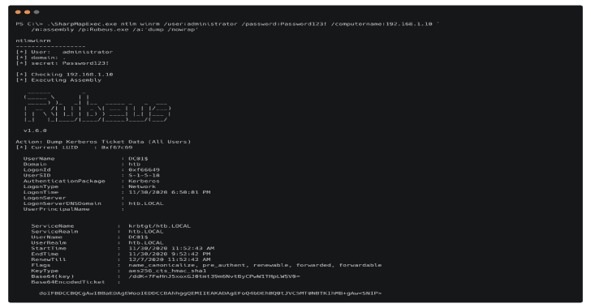
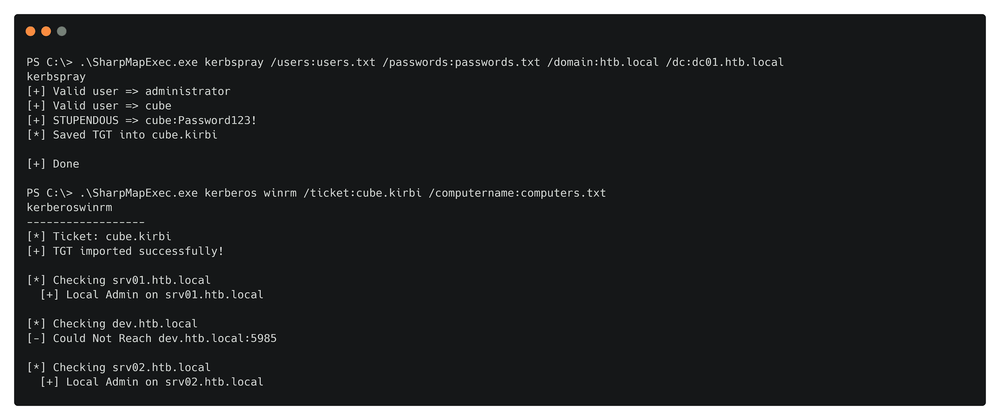
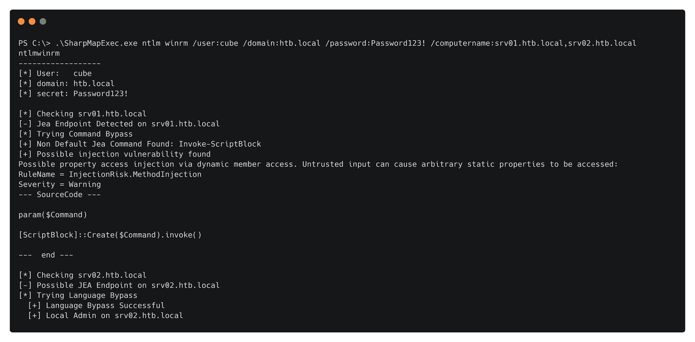
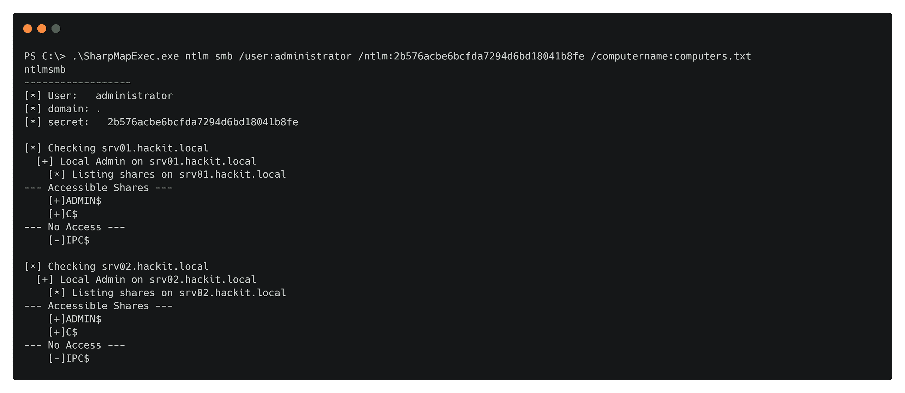
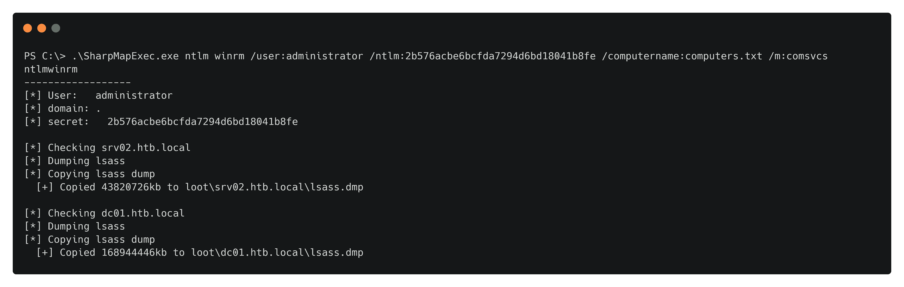

# SharpMapExec:CrackMapExec 的锐化版本

> 原文：<https://kalilinuxtutorials.com/sharpmapexec/>

SharpMapExec 是 [CrackMapExec](https://github.com/byt3bl33d3r/CrackMapExec) 的锐化版本。该工具旨在简化网络渗透测试，并创建一把运行在 Windows 上的瑞士军刀，这通常是内部威胁模拟活动中的一项要求。

除了扫描访问之外，它还可用于识别易受攻击的配置和泄漏数据。数据渗透模块的思想是在远程计算机上执行最少的必要代码。为此，该工具会将所有的秘密下载到 loot 目录，并在本地解析它们。

您可以指定是使用 Kerberos 还是 NTLM 身份验证。如果您选择 Kerberos，该工具将创建一个牺牲令牌，并使用 [Rubeus](https://github.com/GhostPack/Rubeus) 来导入/请求票证。如果指定了 NTLM，it 工具将创建线程并使用 [Sharpish](https://github.com/b4rtik/SharpKatz) 运行 SetThreadToken(如果指定了 NTLM 散列),如果指定了密码，它将使用普通的 c#模拟。

**SharpMapExec.exe
用法:** 
**—Smb—**
SharpMapExec.exe NTLM Smb/USER:USER/NTLM:HASH/DOMAIN:DOMAIN/computer name:TARGET
SharpMapExec.exe Kerberos Smb/computer name:TARGET
可用 Smb 模块
/m:shares

**—WinRm—**
SharpMapExec.exe NTLM WinRm/USER:USER/PASSWORD:PASSWORD/DOMAIN:DOMAIN:DOMAIN/computer name:TARGET
SharpMapExec.exe Kerr 和系统 DP API blobs)
/m:Assembly/p:rube us . exe/a:dump(在内存中执行本地 C#汇编)
/m:Assembly/p:beacon . exe/System(在内存中作为系统执行本地 C#汇编)
/m:Download/path:C:\ File/destination:File(从主机下载文件)

**—Domain—**
SharpMapExec.exe kerb spray/USERS:USERS。 TXT/password:密码。SharpMapExec.exe TXT/DOMAIN:DOMAIN/DC:DC
tgtdeleg

**中小企业**

可用于扫描管理员访问权限和可访问的 Smb 共享。

*   **模块；**

**/m:份额(扫描枚举的份额进行访问)**

**WinRm**

野兽。它有内置的 Amsi 旁路，JEA 语言突破，JEA 功能分析。可用于代码执行、PsRemote 访问扫描、易受攻击的 JEA 端点和数据渗透。

**模块；**

**/m:exec/a:whoami(Invoke-Command)
/m:exec/a:C:\ beacon . exe/System(Invoke-Command as System)
/m:coms VCS(Dump Lsass 进程)
/m:secrets(转储并解析 Sam、Lsa 和系统 DP API blob)
/m:Assembly/p:rube us . exe/a:Dump(在内存中执行本地 C#汇编)
/m:Assembly/p:beacon . exe/System(系统**

**域**

目前支持域密码喷涂，并为当前用户创建一个 TGT，可以与/ticket 参数一起使用来获取当前上下文。

**示例用法**

用于 C#程序集的简单或大量内存执行

Kerberos 密码喷射，然后扫描本地管理员访问

该项目支持扫描 JEA 端点，并将分析非默认命令的源代码，并检查端点是否未配置为`no-language`模式。

使用 NT 哈希发现本地管理员密码重用。

内置微软签名 DLL 的批量转储 Lsass 进程，并将其保存到`loot`文件夹

还有更多！

Kerberos 的一些场景要求您将时钟与 DC 同步，并设置 DNS

net time \ \ dc01 . hackit . local/Set Get-net adapter Ethernet 0 * | Set-DnsClientServerAddress-server addresses @(' 192 . 168 . 1 . 10 ')

**致谢**

该工具中有帮助的或现有的项目

*   [鲁伯](https://github.com/GhostPack/Rubeus) [@Harmj0y](https://twitter.com/harmj0y)
*   [SharpDPAPI](https://github.com/GhostPack/SharpDPAPI)[@ harmj 0y](https://twitter.com/harmj0y)
*   [夏普卡兹](https://github.com/b4rtik/SharpKatz) [@b4rtik](https://twitter.com/b4rtik)
*   [Amsi。失败](https://github.com/Flangvik/AMSI.fail) [@Flangvik](https://twitter.com/Flangvik)
*   [sharpsecdump](https://github.com/G0ldenGunSec/SharpSecDump)[@ G0 身份证秒](https://twitter.com/G0ldenGunSec)
*   [遇着 MapExec](https://github.com/byt3bl33d3r/CrackMapExec) [@byt3bl33d3r](https://twitter.com/byt3bl33d3r)