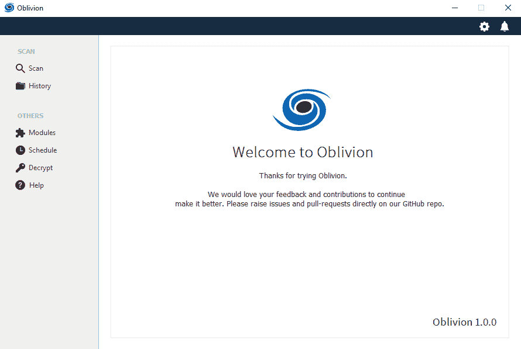
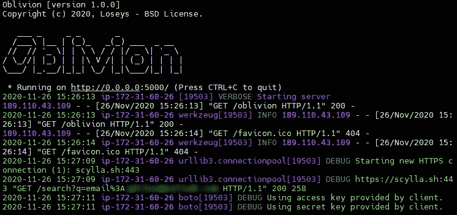

# 遗忘:数据泄漏检查器和 OSINT 工具

> 原文：<https://kalilinuxtutorials.com/oblivion/>

**Oblivion** 是一个专注于实时监控新数据泄露的工具，如果用户的凭证被泄露，它会发出通知。也可以验证用户的任何凭证以前是否被泄露过。遗忘有两种模式:

*   遗忘客户端:图形模式。
*   遗忘服务器:具有 API 功能的模式。

**注**:遗忘客户端和遗忘服务器是独立的。

**遗忘客户端**

**遗忘服务器**

**湮没特性**

*   💪CVEs 扫描
*   ☑️使用强大的 API
*   🔗也适用于谷歌呆子
*   🔎在单词列表中检查您的密码
*   👀检查 Pastebin 中最后的粘贴
*   📄输出到 txt，docx，pdf，xlsx，json，html，xml，db
*   🔒输出到加密文件
*   📦将结果文件发送到多个时段 S3
*   📁将结果文件上传到 Google Drive
*   📡Cab 通过 SSH 发送结果文件(使用 EC2)
*   📢通过电报和电子邮件通知
*   📌包括隐藏演示密码的选项
*   🕒使用调度扫描
*   🔁可以执行循环扫描

**API**

| 服务 | 功能 | 状态 |
| --- | --- | --- |
| [有 ibanewned](https://haveibeenpwned.com/) | 电子邮件和密码 | 有报酬的 |
| [Scylla.sh](https://scylla.sh/) | 明文密码、哈希和盐、用户名、IP、域 | 自由的 |
| [英特尔 io](https://intelx.io/signup) | 明文密码、哈希和盐、用户名、IP、域、比特币钱包、IBAN | 有报酬的 |
| [陆](https://cve.circl.lu/api/) | 检查新 CVE | 自由的 |

**用途&配置**

关于遗忘的配置或使用，请阅读文档。所有的步骤都用图片和例子进行了详细的解释。

**学分**

*   彼得·克莱斯纳和情报 X 小组
*   亚历杭德罗·卡塞雷斯(锡拉)
*   [khast3x](https://github.com/khast3x/h8mail)
*   丹尼尔·米斯勒
*   古斯塔沃·梅尔加索
*   阿尔韦里科·德·卡斯特罗
*   Eliabe Kaique