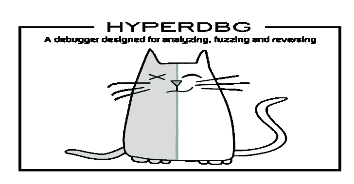

# HyperDbg:HyperDbg 调试器的源代码

> 原文：<https://kalilinuxtutorials.com/hyperdbg/>

**HyperDbg** 旨在利用现代硬件技术为逆向工程领域提供新功能。它通过使用英特尔 VT-x 和英特尔 PT 虚拟化已经运行的系统，在 Windows 之上运行。

这个调试器的目的不是使用任何 API 和软件调试机制，而是广泛使用第二层页表(也称为扩展页表或 EPT)来监控内核和用户执行。

[Tweets by HyperDbg](https://twitter.com/HyperDbg?ref_src=twsrc%5Etfw)