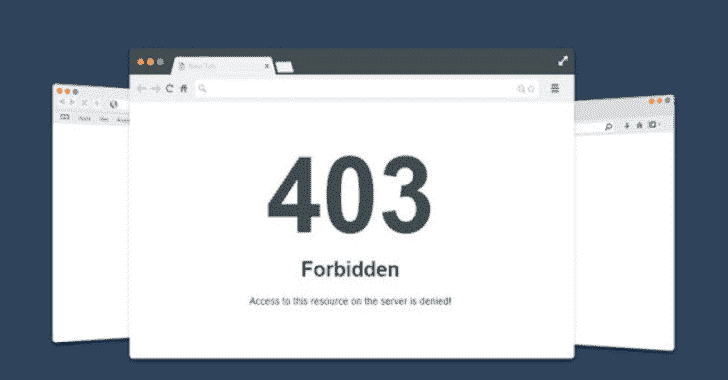

# Byp4Xx:绕过“403 禁止”消息的简单 Bash 脚本

> 原文：<https://kalilinuxtutorials.com/byp4xx/>

Byp4Xx 是一个 bash 脚本，通过# bugbountytips 中讨论的众所周知的方法绕过“403 禁止”响应。

**安装**

**git 克隆 https://github.com/lobuhi/byp4xx.git
CD byp4xx
chmod u+x byp4xx . sh**

**用法:用 http 或 https 启动 URL。**

**。/byp4xx . sh[选项] http(s)://url/path

选项:
-c 如果响应为 200
则返回整个 curl 命令-r 如果响应为 3XX** 则重定向

**举例**:

**。/byp4xx . sh https://www.google.es/test**

**特性:**

*   多个 HTTP 动词/方法
*   #bugbountytips 中提到的多种方法
*   多个头:Referer，X-Custom-IP-Authorization…
*   允许重定向
*   如果响应为 200，则返回整个 curl 命令

**温馨提示:**

*   您可以添加 proxychains 以用于 BurpSuite
*   接口是多线程处理多个 URL 的好选择