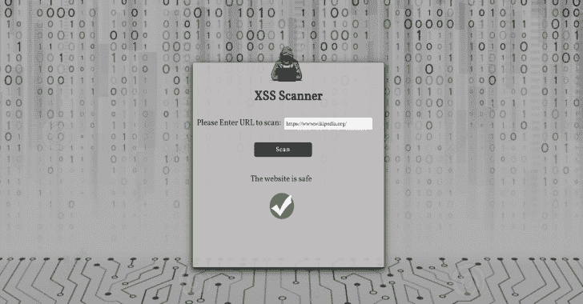

# XSS 扫描器:检测网站跨站脚本漏洞的扫描器

> 原文：<https://kalilinuxtutorials.com/xss-scanner/>

**XSS 扫描器**是一种跨站脚本(XSS)是最广为人知的 web 应用程序漏洞之一。它甚至在 OWASP 十大项目中有一个专门的章节，并且它是 bug bounty 程序中一个备受追逐的漏洞。

扫描器从用户处获得一个链接，并通过在输入处注入恶意脚本来扫描网站的 XSS 漏洞。注射发生在名为 Chromium 的无头浏览器中，由木偶师自动化控制。

*   **它分两步工作:**
    *   **找到目标:**在第一步中，该工具试图识别页面上的所有位置，包括表单、URL、标题等中的可注入参数。
    *   **测试 XSS:** 对于上一步中发现的每个位置，扫描器将尝试检测参数是否易受跨站点脚本攻击。该工具注入一段 JavaScript 代码，包括一些特殊的 HTML 字符(>、<、"、')，它将尝试查看它们是否未经净化就返回到响应页面中。如果该工具检测到至少一个漏洞，它将返回该网站有 XSS 漏洞。

**技术**

*   操纵木偶的人
*   java 描述语言
*   NodeJS
*   表达

**如何安装？**

*   克隆存储库:

**git 克隆 https://github . com/mariagar/XSS 扫描仪. git**

*   输入克隆的文件夹:

**cd XSS 扫描仪**

*   安装依赖项:

**npm 安装**

*   运行应用程序:

**npm 开始**

在[打开浏览器 http://localhost:4000/](http://localhost:4000/)