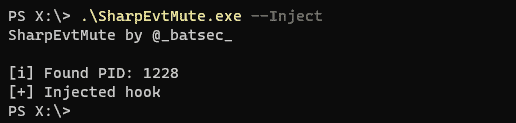
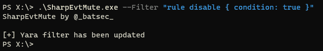
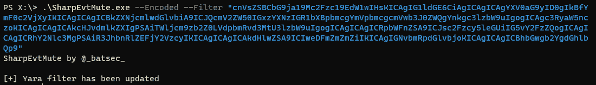

# EvtMute:对 Windows 事件日志报告的事件应用筛选器

> 原文：<https://kalilinuxtutorials.com/evtmute/>

[](https://1.bp.blogspot.com/-fuvSLp8c7Tk/X_WvC4GgaqI/AAAAAAAAISA/iafWa6GPqwo9QpWLmaqW_VdIQBw5tGJzwCLcBGAsYHQ/s728/New%2BProject.png)

**EvtMute** 是一个工具，它允许你恶意地使用 [YARA](http://virustotal.github.io/yara/) 对 windows 事件日志报告的事件进行过滤。

**用途**

从[这里](https://github.com/bats3c/EvtMute/releases/tag/v1.0)获取最新版本。包含核心功能，一旦注入，它将应用一个临时过滤器，允许报告所有事件，该过滤器可以动态更新，无需重新注入。我已经写了`**SharpEvtMute.exe**`，它是一个 C#程序集，可以通过 shad0w 中的`execute`或 cobalt strike 中的`**execute-assembly**`轻松运行。为了更好地与 shad0w 集成，我将用 C 编写一个原生版本。

**禁用日志记录**

一个简单的用例是在系统范围内禁用事件日志记录。为此，我们可以使用以下 yara 规则。

**规则禁用{条件:真}**

我们需要从将钩子注入事件服务开始。

**。\ sharpevtmute . exe–注入**



现在钩子已经放好了，我们可以添加过滤器了。

```
.\SharpEvtMute.exe --Filter "rule disable { condition: true }" 
```



现在，所有事件都将被事件服务丢弃。

**rule block _ lsass _ dump {
meta:
author = " @*batsec*"
description = "防止 sysmon 报告 lsass 转储"
strings:
$ provider = " Microsoft-Windows-Sysmon "
$ image = " lsass . exe " nocase
$ access = " granted access "
$ type = " 0x 1 fffff "
条件:
全部** 

**复杂滤波器**

过滤器可以动态改变，而不必重新注入一个钩子。这使得更新活动过滤器变得快速而容易。

更复杂的过滤器的一个例子是这样的。它能够阻止 sysmon 报告与 lsass 内存转储相关的事件。

像这样一个复杂的规则，很难压缩成一行。这就是为什么我增加了给出 base64 编码规则的能力。

该规则可以很容易地从 linux 命令行转换成 base64。

```
base64 -w 0 YaraFilters/lsassdump.yar | echo $(</dev/stdin) 
```

然后使用`--Encoded`标志，我们可以将它作为过滤器传递



**Opsec 注意事项**

注入钩子时,`**SharpEvtMute.exe**`将调用`**CreateRemoteThread**`,这个调用是在钩子被放置之前进行的，所以它将被 Sysmon 报告。这是因为`**SharpEvtMute.exe**`的注射功能只能用作概念验证。当隐蔽很重要时，我建议手动将`**EvtMuteHook.dll**`注入事件日志服务。

它的 pid 可以通过运行`**SharpEvtMute.exe --Pid**`找到。可以通过您选择的 C2 框架，例如 shad0w 中的`**shinject**`,手工注入外壳代码(在 EvtMuteBin 中运行`make`)来放置钩子。

另外值得一提的是，钩子将使用一个命名管道来更新过滤器。命名管道称为`**EvtMuteHook_Rule_Pipe**`(这个名称可以很容易地更改)。有一个固定的规则，以确保包括这个名字在内的任何事件都将被自动取消，但国际奥委会仍然会听取它的意见，所以我建议改变它。

**社区过滤器**

如果您创建了一些有用的过滤器，可以随意向`**YaraFilters**`目录发出一个 pull 请求。如果有一个很好的过滤器集合来隐藏每个人都可以从中受益的常见操作，那将会很酷。

[**Download**](https://github.com/bats3c/EvtMute)