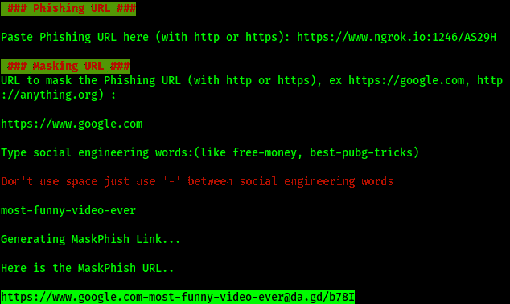

# MaskPhish:为网络钓鱼 URL 提供一个掩码

> 原文：<https://kalilinuxtutorials.com/maskphish/>

MaskPhish 是一个简单的脚本，用于在一个看起来正常的网址(google.com 或 facebook.com)下隐藏钓鱼网址。

**安装(在 Kali Linux，Termux & Ubuntu 上测试):**

**git 克隆 https://github . com/jaykali/maskphish
maskphish CD
bash maskphish . sh**

**详细文章:**

[https://www . kali Linux . in/2020/07/how-to-hide-phishing-link . html](https://www.kalilinux.in/2020/07/how-to-hide-phishing-link.html)

**开始讨论假面具**

想和我们讨论一下面具人吗？(点击这里)[[https://github.com/jaykali/maskphish/discussions](https://github.com/jaykali/maskphish/discussions)。

**截图**

[**Download**](https://github.com/jaykali/maskphish)