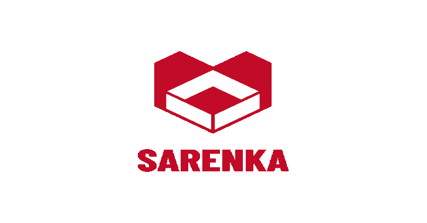

# Sarenka:来自 Shodan、Censys 等服务的 OSINT 工具数据

> 原文：<https://kalilinuxtutorials.com/sarenka/>

[](https://1.bp.blogspot.com/-68niHfezg_M/X_cl-mgafrI/AAAAAAAAISs/iSYEX1CtfXMIN8mggu89nLICsz54KyvqQCLcBGAsYHQ/s728/SARENKA%25281%2529.png)

SARENKA 是一个开源的情报( **OSINT** )工具，帮助你获取和了解**攻击面**。

主要目标是从搜索引擎收集与互联网连接的设备的信息(**[【https://censys.io/】](https://censys.io/)****[【https://www.shodan.io/】](https://www.shodan.io/)**)。它收集了关于常见漏洞和暴露( **CVE** )、常见弱点枚举( **CWE** )的数据，还拥有 CVE 映射到 CWE 的数据库。

它返回关于本地机器的数据——本地安装的软件(来自 Windows 注册表)，本地网络信息(python 库，流行的 cmd 命令)。

现在应用程序也有简单的工具，如哈希计算器，香农熵计算器和非常简单的端口扫描器。更多的加密数学工具和侦察脚本正在计划中。

**看**

*   [https://www.facebook.com/ncybersec/posts/1671427243027993](https://www.facebook.com/ncybersec/posts/1671427243027993)
*   [https://www.instagram.com/p/CI8tXMNg3yI/](https://www.instagram.com/p/CI8tXMNg3yI/)
*   [https://security online . info/sa renka-获取并理解-攻击-表面/](https://securityonline.info/sarenka-obtaining-and-understanding-attack-surface/)
*   [https://ha xf 4 rall . com/2020/12/30/sa renka-获取并理解-攻击-表面/](https://haxf4rall.com/2020/12/30/sarenka-obtaining-and-understanding-attack-surface/)
*   [http://hackdig.com/12/hack-245463.htm](http://hackdig.com/12/hack-245463.htm)
*   [http://www . find glocal . com/BR/Ananindeua/1436460569931544/Computer-Network-% 26-Technology](http://www.findglocal.com/BR/Ananindeua/1436460569931544/Computer-Network-%26-Technology)
*   [https://www.facebook.com/DDHS.TW/](https://www.facebook.com/DDHS.TW/)
*   [https://laptrinhx . com/saren ka-osint-tool-data-from-services-like-shod an-censys-etc-in-one-place-3347349303/](https://laptrinhx.com/sarenka-osint-tool-data-from-services-like-shodan-censys-etc-in-one-place-3347349303/)

*   **CWE 和 CVE 之间的关系——萨伦卡数据馈送器**
    *   生成这个文件需要很长的时间，例如:702 . 4864648638637

*   **所有带描述的 CWE id**

[https://raw . githubusercontent . com/pawlaczyk/saren ka _ tools/master/cwe _ all . JSON](https://raw.githubusercontent.com/pawlaczyk/sarenka_tools/master/cwe_all.json)

*   **所有带描述的 CVE id**

在发展中

*   **通过 CWE Id 获取所有 CVE Id**

在发展中

**安装**

*   **入门**

Sarenka 是用于 Windows 的本地 web 应用程序。

*   **配置**

Rirst release 从两个搜索引擎收集数据。示例 sa renka/back end/connectors/credentials . JSON

```
{   
    "censys": {
        "base_url": "https://censys.io/",
        "API_ID": "<my_user>",
        "Secret": "<my_api_key>",
        "API_URL": "https://censys.io/api/v1"
    },
    "shodan": {
        "base_url": "https://www.shodan.io/",
        "user": "<my_user>",
        "api_key": "<my_api_key>"
    }
}
```

**特性**

*   通过 ip 从获取数据
*   通过 ip 从获取数据
*   获取 **DNS** 数据
*   得到〔t1〕日期
*   **横幅**抓取
*   通过 **CWE** 找到**份简历**
*   生成 pdf 报告

*   **你也可以:**
    *   基于用户字符串计算**哈希**
    *   基于用户字符串计算**香农熵**
    *   检查**端口**是否打开|关闭(如果可以，请始终使用 nmap 它很慢)
*   **欢迎提出建议**
    *   想要一些特性、其他工具、库功能吗？
    *   有什么想法或问题吗？
    *   不要犹豫，联系。

**数据库**

这是一个棘手的部分，因为我们有 863 个 sqlite3 数据库文件:默认，CWE-无(一些 CVE 没有 CWE_id，例如:CVE-2013-3621)和 861 个 cwe

**技术**

它使用许多开源项目来正常工作:

*   [render forest](https://www.renderforest.com/)–徽标生成器
*   [gawk](http://gnuwin32.sourceforge.net/packages/gawk.htm)–python manage . py migrate–数据库 CWE_ID
*   [巧克力糖](https://chocolatey.org/)
*   [py charm](https://www.jetbrains.com/pycharm/)–社区版
*   [技术](https://github.com/pawlaczyk/sarenka/blob/master/url_address)–描述
*   [技术](https://github.com/pawlaczyk/sarenka/blob/master/url_address)–描述
*   [技术](https://github.com/pawlaczyk/sarenka/blob/master/url_address)–描述
*   [技术](https://github.com/pawlaczyk/sarenka/blob/master/url_address)–描述
*   [技术](https://github.com/pawlaczyk/sarenka/blob/master/url_address)–描述
*   [技术](https://github.com/pawlaczyk/sarenka/blob/master/url_address)–描述
*   [技术](https://github.com/pawlaczyk/sarenka/blob/master/url_address)–描述
*   [技术](https://github.com/pawlaczyk/sarenka/blob/master/url_address)–描述
*   [技术](https://github.com/pawlaczyk/sarenka/blob/master/url_address)–描述
*   [技术](https://github.com/pawlaczyk/sarenka/blob/master/url_address)–描述

当然，SARENKA 本身是开源的，在 GitHub 上有一个[公共存储库](https://github.com/pawlaczyk/sarenka)。

**计划功能**

*   用英语重写文档(2021 年底)
*   trello/ github 而不是吉拉
*   通过测试覆盖 100%的代码
*   打字后端
*   记录所有函数和类
*   码头工人
*   在线演示
*   詹金斯
*   GraphQL
*   硒刮刀
*   更多测试工具
*   谷歌呆子
*   抽象代数计算器
*   数论计算器
*   服务器证书验证程序
*   Linux 上的测试
*   自然语言处理
*   d3js 可视化
*   在命令行中更改纯版本

**CI/CD 工具**

*   [https://circles . com/](https://circleci.com/)
*   [https://github . com/snyk-bot](https://github.com/snyk-bot)

**测试**

*   在 Windows 10 上测试
*   在 Kali Linux kali-rolling 2020.2 上测试