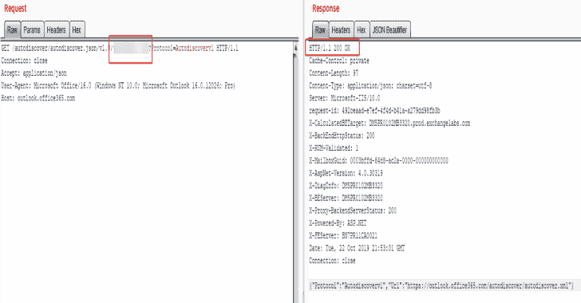
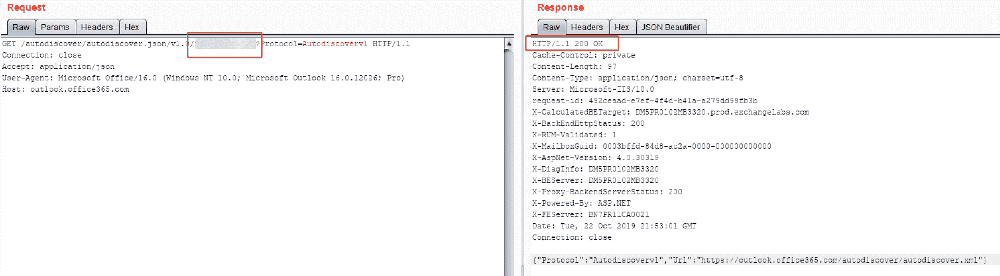

# UhOh365:一个可以查看 Office365 中的电子邮件地址是否有效的脚本

> 原文：<https://kalilinuxtutorials.com/uhoh365/>

**UhOh365** 是一个脚本，可以查看一个电子邮件地址在 Office365 中是否有效。这不执行任何登录尝试，不受限制，对于社会工程评估非常有用，可以发现哪些电子邮件存在，哪些不存在。

微软不认为“邮件枚举”是一个漏洞，所以这是利用了一个“特性”。有几个其他的 public Office365 电子邮件验证脚本，但它们(我见过的)都要求每个用户帐户至少登录一次。这是**可检测的**并且可以被发现为轻度暴力企图(多个帐户的一个“通用”密码)。

该脚本允许通过**零登录尝试**进行电子邮件验证，并且仅使用微软的内置自动发现 API，因此拥有该电子邮件地址的个人/公司是看不见的。此外，这个 API 调用似乎完全不受限制，在我的测试中，我能够在 1 分钟内验证 2000 多个电子邮件地址。

**用途**

该脚本实际上非常简单易用。您创建一个文件，列出您希望看到的有效或无效的电子邮件，并将其作为参数传递给脚本。或者，您可以提供一个仅包含用户名的文件，并使用-s 参数自动为每个条目添加一个后缀:

**用法:**uhoh 365 . py[-h][-v][-t THREADS][-o OUTPUT]文件

**位置参数:**
文件输入文件每行包含一封邮件

**可选参数:**
-h，–help 显示此帮助消息并退出
-v，–详细显示每个结果为有效/无效。默认情况下只显示有效的
-s，–suffix 给文件中的每个输入行添加一个域后缀(例如:contoso.com)
-t THREADS，–THREADS THREADS
要运行的线程数。默认为 20
-o 输出，–OUTPUT 输出
仅用于有效电子邮件的输出文件
-n，–nossl 关闭 ssl 验证。如果
需要
-p PROXY，–PROXY PROXY
指定一个代理来运行它(例如:“http://127.0.0.1:8080”)

**解释**

这其实是一件很容易做到的事情。结果是，对于 o365 中是否存在电子邮件，API 端点返回不同的状态代码。200 状态码表示它存在，302 表示它不存在。

*   **如果电子邮件确实存在:**

*   **如果邮件不存在:**

请注意，该请求不需要任何身份验证或识别参数，并且不会导致对目标帐户的登录尝试。

**信用:**克里斯·金

[**Download**](https://github.com/Raikia/UhOh365)