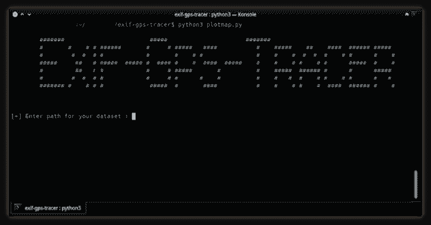

# Exif-Gps-Tracer:一个 Python 脚本，允许你从图像文件中解析地理位置数据

> 原文：<https://kalilinuxtutorials.com/exif-gps-tracer/>

Exif-Gps-Tracer 是一个 python 脚本，它允许您从存储在数据集中的图像文件中解析地理位置数据。它还产生 CSV 文件和 HTML 谷歌地图的输出。

**先决条件**

要流畅地运行这个脚本，(1)你应该有谷歌地图 API (2)你应该在控制台中启用地图 JavaScript API

要获取 API 密钥，请参见本文档…[https://developers . Google . com/maps/documentation/JavaScript/get-API-key](https://developers.google.com/maps/documentation/javascript/get-api-key)

**安装**

**git 克隆 https://github.com/monishmonish/exif-gps-tracer/
CD EXIF-GPS-tracer/
pip 3 install–r requirements . txt
python 3 plot map . py**

输入数据集文件夹的路径，该文件夹包含用于解析 exif 地理位置数据的图像

它会自动将经纬度坐标及其各自的时间戳存储在 CSV 文件中，不包括地理位置中纬度、经度的“无”值

如果图像中没有地理标记，它会通过打印文件名来跳过它们

通过运行这个脚本，打开 HTML 文件，

你可以在谷歌地图上看到经纬度坐标的分散图

**提示**

更分散的区域具有受害者/目标在该区域中的最高概率。

该图完全基于图像数据集的 exif 元数据。

**待办事项**

添加一个圆形热区，显示目标在该区域存在的概率。

[**Download**](https://github.com/monishmonish/exif-gps-tracer)