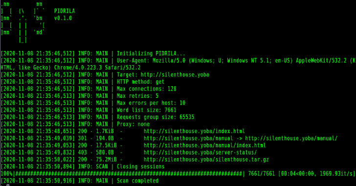

# Pidrila : Python 交互式面向 Deepweb 的快速智能链接分析器

> 原文：<https://kalilinuxtutorials.com/pidrila/>

Pidrila 是一个**P**ython**I**interactive**D**eep web-oriented**R**apid**I**intelligent**L**ink**A**analyzer 是由 BrightSearch 团队为所有有道德的网络跟踪者开发的真正快速异步网络路径扫描器原型。

**安装&使用**

**git 克隆 https://github.com/enemy-submarine/pidrila.git
CD 皮德里拉
python3 皮德里拉. py -u**

**选项**

**用法:** pidrila.py【选项】

**选项:**
-U，–User-Agent TEXT User-Agent
-t，–time out 整数请求超时[默认值:30]
-A，–auth TEXT 基本 HTTP auth，即 login:password
-M，–max-connections-per-host 整数
我们
应该打开多少个同时连接(每台主机)【默认值:16】【T12 –url-list 文件名目标 URL 列表
-u，–URL 文本目标 URL，选项与 url_list 互斥
【必需】
-l，–日志目录日志的目标目录
–HTTP-method[HEAD | get]HTTP 方法:GET 或 HEAD[default:GET]
–帮助显示此消息并退出。

**特性**

*   异步的
*   可以同时扫描无限数量的网站
*   保活支持
*   HTTP 和 SOCKS 代理支持
*   用户代理随机化

**截图**

**用法举例**

*   **扫描单个 clearweb 站点**

**蟒 3。/PID rila . py-u http://silen house . yoba-M 128**

*   **扫描单个洋葱站点**

**蟒 3。/PID rila . py-u http://zqktlwi 4 fecvo 6 ro . onion-M 16-M 16–proxy = socks 5h://127 . 0 . 0 . 1:9050**

*   **使用自定义用户代理进行快速批量扫描**

**python3。/pidrila . py-m 2048-l darkweb _ sites _ list . txt–user-agent " pantusha/2.0(4.2 BSD)"**

[**Download**](https://github.com/enemy-submarine/pidrila)