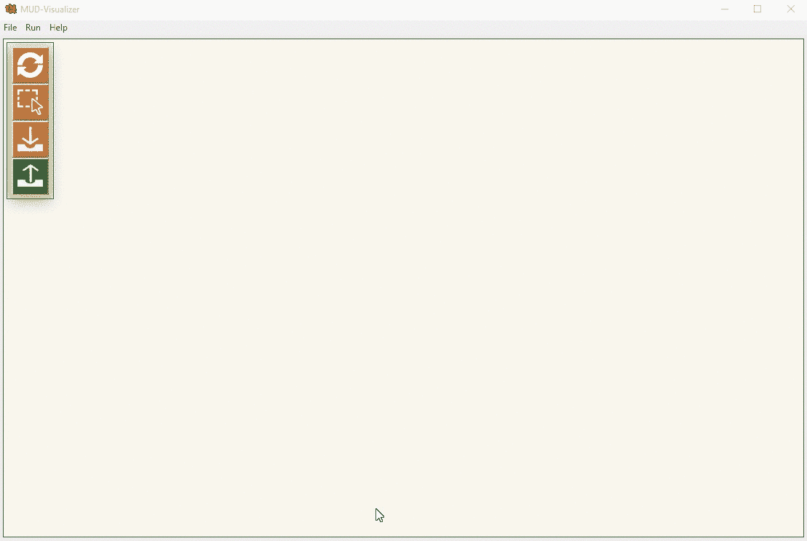

# Mud-Visualizer:一个可视化 Mud 文件的工具

> 原文：<https://kalilinuxtutorials.com/mud-visualizer/>

**Mud-Visualizer** 是一个可以用来可视化 [JSON](https://www.kitploit.com/search/label/JSON) 格式的 Mud 文件的工具。

警告: mud-visualizer 目前是测试版。使用风险自担。

这个工具可以用来可视化 JSON 格式的 MUD 文件。

**动机**

MUD 文件是 JSON 格式的纯文本文件，包含设备的 ACL 规则。一个 MUD 文件可能包含几十或几百条 ACL 规则，这使得手动读取和验证文件变得很困难。mud-visualizer 将帮助您读取和验证(并在不久的将来修改)mud 文件。

**安装**

使用以下命令安装并运行`mud-visualizer`:

**$ git 克隆 https://github.com/iot-onboarding/mud-visualizer
$ CD mud-visualizer
$ NPM 安装
$ npm 启动**

**支持的 MUD 抽象**

目前，`incoming`和`outgoing`流量方向都支持以下 MUD 抽象:

*   `domain-names`
*   `local-networks`
*   `same-manufacturer`
*   `manufacturer`
*   `my-controller`
*   `controller`

**贡献**

欢迎投稿！向`master`分支机构提交您的拉取请求。