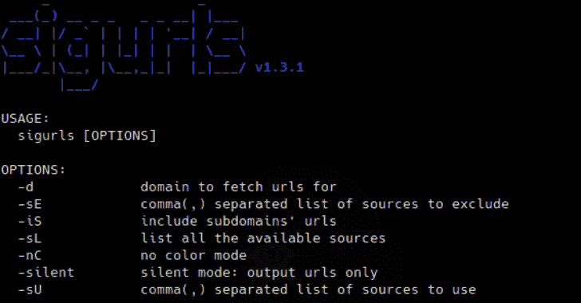

# Sigurls:一个侦察工具&它从 AlienVault 的 OTX 中获取 URL

> 原文：<https://kalilinuxtutorials.com/sigurls/>

[](https://1.bp.blogspot.com/-vfz1Z0OYW80/YACDWMCBjiI/AAAAAAAAIVs/bfvYaq6VnZw3RQkTcjcc7oDILIgTbU6-QCLcBGAsYHQ/s728/Sigurls%25281%2529.png)

Sigurls 是一个侦察工具，它从**外星人的 OTX** 、**普通爬虫**、 **URLScan** 、 **Github** 和 **Wayback 机器**中获取 URL。

**免责声明:**从 github 获取 URL 有点慢。

**用途**

要显示 sigurls 的帮助消息，请使用`-h`标志:

$ sigurls -h
**用法:**
sigurls【选项】
**选项:**
-d 域获取用于
的 URL-sE 逗号(，)分隔的要排除的源列表
-iS 包含子域的 URL
-sL 列出所有可用的源
-nC 无颜色模式
-silent silent 模式:仅输出 URL
-sU 逗号(，)分隔的要使用的源列表

**安装**

*   **来自二进制**

你可以从这个库的[发布](https://github.com/drsigned/sigurls/releases/)页面下载为你的平台预先构建的二进制文件，解压，然后移动到你的`$PATH`页面，你就可以开始了。

*   **来源于**

sigurls 需要 **go1.14+** 才能成功安装。运行以下命令获取 repo

**$ go 111 module = on go get-u-v github.com/drsigned/sigurls/cmd/sigurls**

*   **来自 Github**

**$ git 克隆 https://github.com/drsigned/sigurls.git; CD sigurls/cmd/sigurls/；去建；mv sigurls/usr/local/bin/；sigurls -h**

**安装后**

sigurls 将在[安装](https://github.com/drsigned/sigurls#installation)后工作。然而，要配置 sigurls 来使用某些服务——目前是 github——你需要设置 API 键。API 密钥存储在首次运行时创建的`$HOME/.config/sigurls/conf.yaml`文件中，并使用 YAML 格式。可以为每个服务指定多个 API 键。

**例子**

```
version: 1.3.1
sources:
    - commoncrawl
    - github
    - otx
    - urlscan
    - wayback
keys:
    github:
        - d23a554bbc1aabb208c9acfbd2dd41ce7fc9db39
        - asdsd54bbc1aabb208c9acfbd2dd41ce7fc9db39
```

[**Download**](https://github.com/drsigned/sigurls)