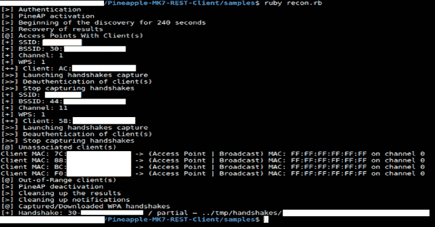

# 菠萝 MK7 REST 客户端:菠萝 Mark 7 API 的 WiFi 黑客工作流程

> 原文：<https://kalilinuxtutorials.com/pineapple-mk7-rest-client/>

**菠萝 MK7 REST 客户端**是领先的流氓接入点和 WiFi pentest 工具包，用于近距离接入操作。它也是一种被动和主动攻击，分析易受攻击和配置不当的设备。

**用途**

*   **查看/编辑/执行样品/文件夹中的文件**

*   **系统认证访问器/方法**

**system = pineapplemk 7::system . new()**

**system . host =(string)" 172 . 16 . 42 . 1 "
system . host()
system . port =(string)" 1471 "
system . port()
system . MAC =(string)" 00:13:37:DD:EE:FF "
system . MAC()
system . password =(string)" P @ 55w 0 rd "
system . log in()**

**host()** ， **port()** 和 **mac()** 访问器返回字符串

**login()** 方法返回布尔值

**模块**

*   **模块复原方法**

**Recon = pineapplemk 7::Modules::Recon**

**recon.startScan((整数)time )
recon.getResults((整数)scanID )
recon.deleteScan((整数)scanID )**

startScan 方法具有 scanID()子方法并返回整数

getResults 方法具有 APResults()、UnassociatedClientResults()和 OutOfRangeClientResults()子方法

APResults()子方法返回对象数组，其中对象具有:

**ssid()
bssid()
加密()
隐藏()
wps()
信道()
信号()
客户端()- >客户端 _mac()、ap_mac()和 AP _ 信道()**

**unassociated client results()submethod 返回对象数组，其中对象具有:**

**client _ MAC()
AP _ MAC()
AP _ channel()**

OutOfRangeClientResults()子方法返回对象数组，其中对象具有:

**client _ MAC()
AP _ MAC()
AP _ channel()**

*   **模块 PineAP 方法**

**pineAP = pineapplemk 7::Modules::pineAP**

**pineap . enable()
pineap . starthandshakes capture((hash/object)AP)
pineap . deauthap((string)bssid，(integer) channel，(array)clients)
pineap . deauthclient((string)bssid，(integer) channel，(string)MAC)
pineap . stopwhandshakes capture()
pineap . gethandshakes()
pineap . filter client((string " allow "或" deny") mode )
pineAP。**

getHandshakes()方法有 Handshakes()子方法返回对象数组，其中对象有:

**type()
bssid()**

getClients()方法返回对象数组，其中对象具有:

**mac()
ip()
主机名()
ssid()
tx _ bytes()
rx _ bytes()**

*   **模块通知方式**

**通知= PineappleMK7::模块::通知**

**notifications.clearAll()**

*   **模块下载方式**

**下载= PineappleMK7::模块::下载**

**download.handshake((字符串)bssid，(字符串)类型，(字符串)目的地)**

[**Download**](https://github.com/TW-D/Pineapple-MK7-REST-Client)