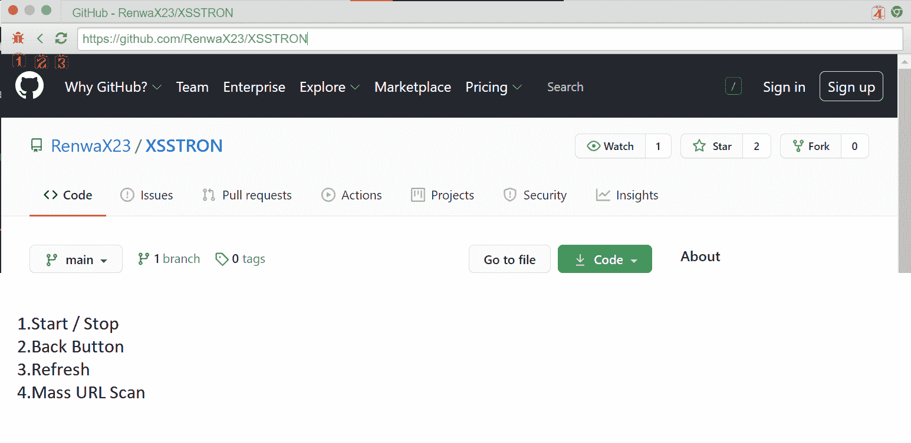
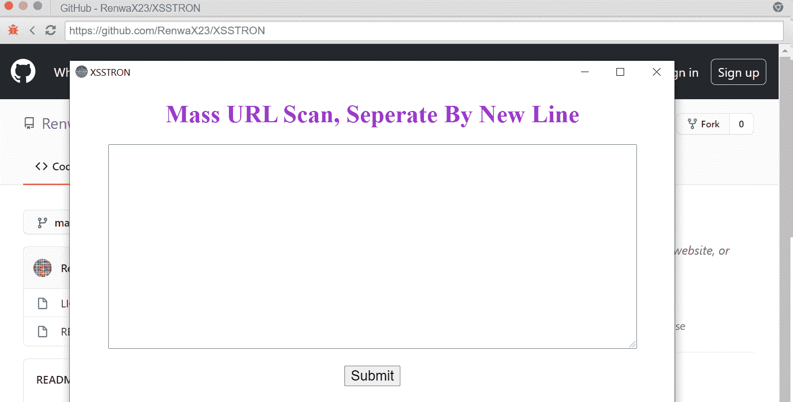
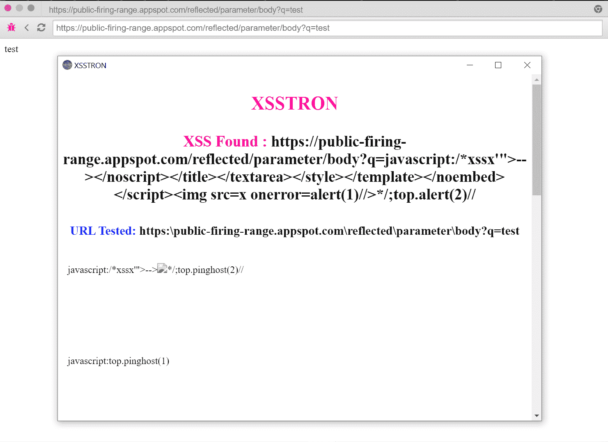
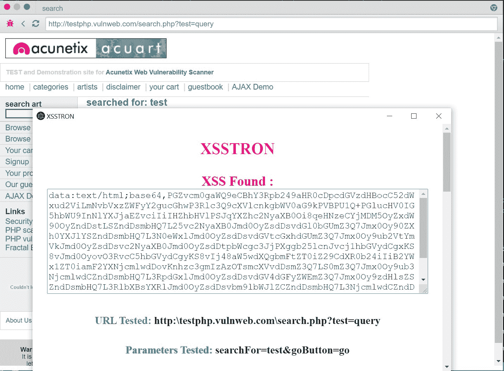

# XSSTRON:电子 JS 浏览器发现 XSS 漏洞

> 原文：<https://kalilinuxtutorials.com/xsstron/>

XSSTRON 是一个强大的 Chromium 浏览器，可以在浏览网页时自动发现 XSS 漏洞，它也可以检测许多支持 POST 请求的案例场景。

**安装**

**安装 Node.js 和 NPM(https://www.npmjs.com/get-npm)或(sudo apt install npm)
下载这个回购文件或(git 克隆 https://github.com/RenwaX23/XSSTRON)
CD xs stron
NPM 安装
npm 启动**

一些使用 Debian/Ubuntu 的用户可能无法运行该工具，因为我认为这是 Electron 本身的问题，你可以继续在 Windows/OSX 和安装在 Windows 上的 Linux 中使用该应用程序。检查已知问题
的用法

就像普通的网络浏览器一样浏览网页，然后它会自动在后台查找 Just 沃恩，并在一个新窗口中用 POC 显示它们。

**获取请求概念证明**

**发布请求概念验证**

**已知问题**

某些 linux 发行版中的一些用户会遇到一些问题

Kali/Debian 用户此修复安装:

**sudo apt 安装 npm
sudo npm 安装-g 电子-unsafe-perm = true-allow-root
CD xs stron
sudo NPM 安装
电子。–无沙盒**

*   在(package.json)中，将其更改为:

**“dev dependencies”:{
“电子”:“^10”
}，**

*   尝试将 npm 和 nodejs 更新到最新版本
*   删除 node_modules 和 package-lock.json 并重新安装
*   在 package.json 中，将电子密度改为(电子 11-bin)
*   使用(npm 安装电子)安装电子，并使用(电子)运行应用程序。)对于每个步骤，请记住删除 node_modules 和 package-lock.json，并使用(npm install)重新安装

**无法序列化参数**是一个已知问题，可能很快就会修复🙂

[**Download**](https://github.com/RenwaX23/XSSTRON)