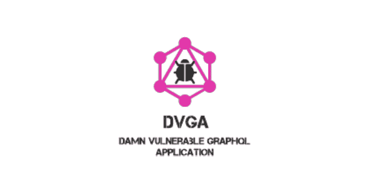
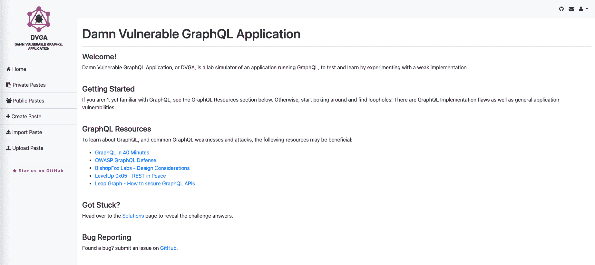
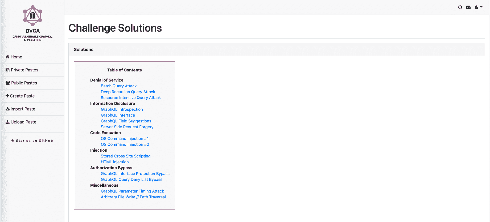
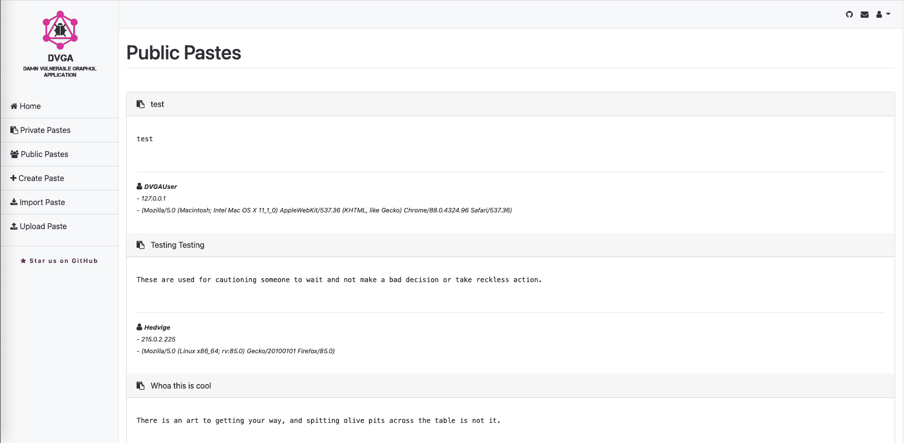
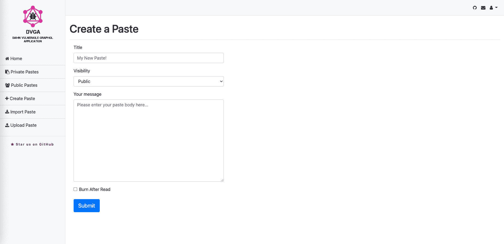

# 该死的易受攻击的 GraphQL 应用程序

> 原文：<https://kalilinuxtutorials.com/damn-vulnerable-graphql-application/>

**该死的易受攻击的 GraphQL 应用**是脸书 GraphQL 技术的一个故意易受攻击的实现，用来学习和练习 GraphQL 安全性。

**关于 DVGA**

该死的易受攻击的 GraphQL 是 GraphQL 的一个故意脆弱和不安全的实现，它提供了一个安全的环境来攻击 GraphQL 应用程序，允许开发人员和 IT 专业人员测试漏洞。

DVGA 有很多缺陷，比如注入、代码执行、绕过、拒绝服务等等。参见[场景](https://github.com/dolevf/Damn-Vulnerable-GraphQL-Application#scenarios)部分的完整列表。

**运行模式**

DVGA 支持初级和专家级游戏模式，这将改变开发难度。

**场景**

*   **拒绝服务**
    *   批量查询攻击
    *   深度递归查询攻击
    *   资源密集型查询攻击
*   **信息披露**
    *   GraphQL 内省
    *   图形化 SQL 介面
    *   GraphQL 字段建议
    *   服务器端请求伪造
*   **代码执行**
    *   操作系统命令注入#1
    *   操作系统命令注入#2
*   **注射**
    *   存储的跨站点脚本
    *   日志欺骗/日志注入
    *   HTML 注入
*   **授权旁路**
    *   GraphQL 接口保护旁路
    *   绕过 GraphQL 查询拒绝列表
*   **杂项**
    *   GraphQL 查询弱密码保护
    *   任意文件写入//路径遍历

**先决条件**

需要以下 Python3 库:

*   Python3
*   瓶
*   烧瓶化学
*   石墨烯
*   石墨烯 SQLAlchemy

依赖关系见 [requirements.txt](https://github.com/dolevf/Damn-Vulnerable-GraphQL-Application/blob/master/requirements.txt) 。

**安装**

**码头工人**

*   **克隆存储库**

`**git clone git@github.com:dolevf/Damn-Vulnerable-GraphQL-Application.git && cd Damn-Vulnerable-GraphQL-Application**`

或者，直接从 Docker Hub 获取图像:`**docker pull dolevf/dvga**`

*   **构建 Docker 映像**

`**docker build -t dvga .**`

*   **从图像中创建一个容器**

`**docker run -t -p 5000:5000 -e WEB_HOST=0.0.0.0 dvga**`

在浏览器中，导航至 [http://localhost:5000](http://localhost:5000)

或者，如果您需要应用程序绑定到特定的端口或接口，使用以下命令:`**docker run -e WEB_HOST=0.0.0.0 -e WEB_PORT=8080 -t -p 8080:8080 dvga**`

**服务器**

*   **导航至/选择**

`**cd /opt/**`

*   **克隆存储库**

`**git clone git@github.com:dolevf/Damn-Vulnerable-GraphQL-Application.git && cd Damn-Vulnerable-GraphQL-Application**`

*   **安装要求**

`**pip3 install -r requirements.txt**`

*   **运行应用程序**

`**python3 app.py**`

在浏览器中，导航到 [http://localhost:5000](http://localhost:5000) 。

**截图**

**免责声明**

DVGA 非常不安全，因此不应该部署在面向互联网的服务器上。默认情况下，应用程序侦听 127.0.0.1，以避免错误配置。DVGA 是故意有缺陷和脆弱的，因此，它没有担保。通过使用 DVGA，您对使用它承担全部责任。

[**Download**](https://github.com/dolevf/Damn-Vulnerable-GraphQL-Application)