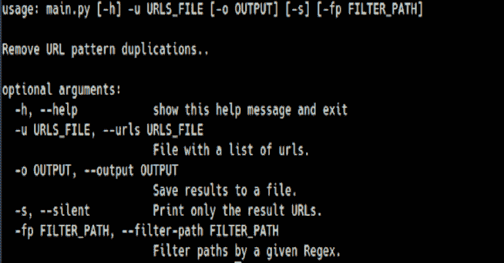

# UDdup:URL 去重工具，用于更好的侦察

> 原文：<https://kalilinuxtutorials.com/uddup/>

UDdup 工具获得一个 URL 列表，并删除 URL 模式意义上的“重复”页面，这些页面可能是重复的并指向同一个 web 模板。

例如:

**https://www.example.com/product/123
https://www.example.com/product/456
https://www.example.com/product/123?is_prod=false https://www.example.com/product/222?is_debug=true**

以上大概都是指向同一个产品“模板”。因此，我们的各种扫描仪只扫描其中的一些网址就足够了。

UDdup 之后的结果应该是:

https://www.example.com/product/123?is_prod=false·https://www.example.com/product/222?is_debug=true

我为什么需要它？

主要是为了更好的(自动化的)侦察过程，更少的噪音(对于测试者和目标)。

**例题**

看一看`**demo.txt**`，它是产生**T1 的原始 URL 文件。**

**安装**

*   **带 pip(推荐)**

**pip 安装 uddup**

*   **手动(从代码)**

克隆存储库。
git 克隆 https://github.com/rotemreiss/uddup.git

安装 Python 需求。CD uddup
pip install-r requirements . txt

**用途**

`**uddup -u demo.txt -o ./demo-result.txt**`

*   **更多使用选项**

`**uddup -h**`

| 简易格式 | 长格式 | 描述 |
| --- | --- | --- |
| -h | 救命 | 显示此帮助消息并退出 |
| -你 | –网址 | 包含 URL 列表的文件 |
| 表示“具有…性质的” | –输出 | 将结果保存到文件 |
| 构成名词复数 | –无声 | 仅打印结果 URL |
| -fp | –滤波器路径 | 按给定的正则表达式过滤路径 |

*   **通过正则表达式过滤路径**

允许过滤自定义路径模式。例如，如果我们想要过滤所有以`/product`开头的路径，我们需要运行:

**单个正则表达式
uddup-u demo . txt-FP " ^product "**

*   **输入:**

**https://www.example.com/
https://www.example.com/privacy-policy
https://www.example.com/product/1
https://www.example2.com/product/2 https://www.example3.com/product/4**

*   **输出:**

**https://www.example.com/
https://www.example.com/privacy-policy**

*   **具有多路径过滤器的高级正则表达式**

uddup-u demo . txt-FP "(^product)|(^category)"