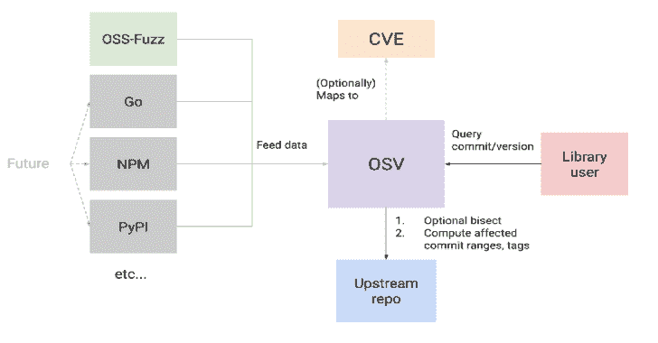

# OSV:开源漏洞

> 原文：<https://kalilinuxtutorials.com/osv/>

[](https://1.bp.blogspot.com/-Mk0xbhHQTVw/YDE-4j3iHFI/AAAAAAAAIaI/DsQUfBgtq3Q1v9lCKSPVx9TRls9iUYQEgCLcBGAsYHQ/s728/OSV%25281%2529.png)

**OSV** 是一个[漏洞数据库](https://osv.dev/list)和开源项目的筛选基础设施，旨在帮助开源维护者和开源消费者。

对于开源维护者来说，OSV 的自动化有助于减轻分流的负担。每个漏洞都经过自动二分和影响分析，以确定精确的受影响提交和版本范围。

对于开源用户，OSV 提供了一个 API，让这些项目的用户查询他们的版本是否受到影响。

*   **当前数据来源:**
    *   [OSS-细毛](https://github.com/google/oss-fuzz)

这是一个正在进行的项目。我们希望与开源社区合作[获得更多数据源](https://github.com/google/osv/issues/44)。

**查看网络用户界面**

OSV web UI 的一个实例部署在 [https://osv.dev](https://osv.dev) 。

**使用 API**

```
  curl -X POST -d \
      '{"commit": "6879efc2c1596d11a6a6ad296f80063b558d5e0f"}' \
      "https://api.osv.dev/v1/query?key=$API_KEY"

  curl -X POST -d \
      '{"version": "1.0.0", "package": {"name": "foo", "ecosystem": "bar"}}' \
      "https://api.osv.dev/v1/query?key=$API_KEY"
```

使用 API 的详细文档可以在[https://osv.dev/docs/](https://osv.dev/docs/)找到。

**架构**

你可以在这里找到 OSV 建筑的概述。

**这个储存库**

这个库包含了在 GCP 上运行 OSV 的所有代码。这包括:

*   API 服务器 **( `gcp/api` )**
*   网页界面 **( `gcp/appengine` )**
*   平分和影响分析人员 **( `docker/worker` )**
*   样品工具 **( `tools` )**

您还需要检查子模块，以便许多本地构建步骤能够工作:

**git 子模块更新–初始化–递归**

欢迎投稿！我们还有一个[邮件列表](https://groups.google.com/g/osv-discuss)和一个[常见问题](https://osv.dev/docs/#tag/faq)。

[**Download**](https://github.com/google/osv)