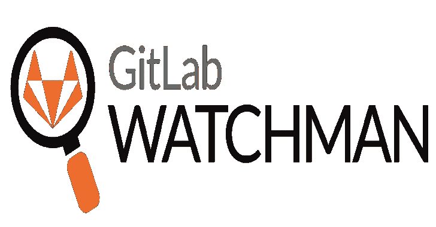

# GitLab Watchman:监控 GitLab 中公开共享的敏感数据

> 原文：<https://kalilinuxtutorials.com/gitlab-watchman/>

[](https://1.bp.blogspot.com/-5I1QKkM1yxU/YDJohpYKYlI/AAAAAAAAIaU/Gl7C-jnnknk2impMfRfsGHL7T5YZp_BWQCLcBGAsYHQ/s728/GitLab%2BWatchman%25281%2529.png)

**GitLab Watchman** 是一个使用 GitLab API 来审计 GitLab 内部暴露的敏感数据和凭证的应用程序。

**特性**

它在 GitLab 中搜索内部共享的项目，并查看:

*   密码
*   承诺
*   维基页面
*   问题
*   合并请求
*   里程碑

对于以下数据:

*   GCP 密钥和服务帐户文件
*   AWS 键
*   Azure 密钥和服务帐户文件
*   Google API 密钥
*   松弛 API 令牌和 webhooks
*   私钥(SSH、PGP、任何其他各种私钥)
*   公开令牌(不记名令牌、访问令牌、client_secret 等。)
*   S3 配置文件
*   Heroku、PayPal 等服务的代币
*   明文密码
*   更多

**基于时间的搜索**

您可以运行 GitLab Watchman 来查找追溯到以下时间的结果:

*   24 小时
*   7 天
*   30 天
*   全部时间的

这意味着在一次深度扫描后，您可以安排 GitLab Watchman 定期运行，并且只返回您选择的时间范围内的结果。

**规则**

GitLab Watchman 使用自定义的 YAML 规则来检测 GitLab 中的匹配。

它们遵循以下格式:

**文件名:
启用:#【真|假】
元:**
-姓名:
-作者:
-日期:
-描述:#搜索应该找到的#
-严重性:#评分满分 100#
**范围:#搜索什么， 以下任意组合#**
-blob
-commits
-milests
-wiki _ blob
-issues
-merge _ requests
**测试用例:**
–**match _ cases:**
-#应匹配正则表达式的测试用例#
–**fail _ cases:**
-#不应匹配正则表达式的测试用例

Python 测试确保规则格式正确，正则表达式模式在`tests`目录中有效

关于规则的更多信息，以及如何添加自己的规则，在文件`docs/rules.md`中。

**测井**

GitLab Watchman 提供了以下日志选项:

*   日志文件
*   标准输出
*   TCP 流

结果以 JSON 格式输出，非常适合输入 SIEM 或其他日志分析平台。

对于文件和 TCP 流日志记录，需要通过`.conf`文件或环境变量传递配置选项。关于如何设置的说明，参见文件`docs/logging.md`。

如果没有给出日志选项，GitLab Watchman 默认为 Stdout 日志。

**要求**

*   gitlab 版本

GitLab Watchman 使用 v4 API，并使用 GitLab 企业版版本:

*   13.0 及以上–是
*   gitlab . com–是
*   12.0–12.10–可能还没有测试过，但是如果使用 API 的 v4，那么它可以工作

*   **GitLab 牌照&弹性搜索**

要搜索范围:

*   一滴
*   维基 _ 博客
*   承诺

GitLab 实例必须配置了 [Elasticsearch](https://docs.gitlab.com/ee/integration/elasticsearch.html) ，并且运行企业版，至少要有 GitLab Starter 或 Bronze 许可证。

*   **GitLab 个人访问令牌**

要运行 GitLab Watchman，您需要一个 GitLab 个人访问令牌。

您可以通过设置->访问令牌->添加个人访问令牌在 GitLab GUI 中创建个人访问令牌

令牌需要以下作用域的权限:

**api**

**注意**:个人访问令牌代表创建它们的用户，因此我建议你使用服务帐户创建令牌，否则应用程序将可以访问你的私人存储库。

*   **GitLab URL**

您还需要提供 GitLab 实例的 URL。

*   **提供令牌&网址**

GitLab Watchman 将首先尝试从环境变量 **`GITLAB_WATCHMAN_TOKEN`和`GITLAB_WATCHMAN_URL`** 中获取 GitLab 令牌和 URL，如果失败，它们将被从。conf 文件(见下文)。

**。会议文件**

配置选项可以在名为`watchman.conf`的文件中传递，该文件必须存储在您的主目录中。该文件应该遵循 YAML 格式，并且应该如下所示:

**gitlab _ watchman:
token:ABC 123
URL:https://gitlab.example.com
日志:
文件 _ 日志:
路径:
json_tcp:
主机:
端口**

GitLab Watchman 将在运行时查找这个文件，并使用这里的配置选项。如果您不使用高级日志记录功能，请将其留空。

如果您的有问题。conf 文件，运行它通过 YAML 林特尔。

一个示例文件在`docs/example.conf`中

**注意**如果您使用任何其他 Watchman 应用程序，并且已经有一个`watchman.conf`文件，只需将 GitLab Watchman 的配置数据附加到现有文件中。

**安装**

*   **通过 pip 安装**

`**pip install gitlab-watchman**`

或通过来源

**用途**

GitLab Watchman 将作为全局命令安装，使用如下:

```
usage: gitlab-watchman [-h] --timeframe {d,w,m,a} --output
                   {file,stdout,stream} [--version] [--all] [--blobs]
                   [--commits] [--wiki-blobs] [--issues] [--merge-requests]
                   [--milestones] [--comments]

Monitoring GitLab for sensitive data shared publicly

optional arguments:
  -h, --help            show this help message and exit
  --version             show program's version number and exit
  --all                 Find everything
  --blobs               Search code blobs
  --commits             Search commits
  --wiki-blobs          Search wiki blobs
  --issues              Search issues
  --merge-requests      Search merge requests
  --milestones          Search milestones
  --comments            Search comments

required arguments:
  --timeframe {d,w,m,a}
                        How far back to search: d = 24 hours w = 7 days, m =
                        30 days, a = all time
  --output {file,stdout,stream}
                        Where to send results 
```

您可以运行 GitLab Watchman 来查找所有内容，并输出到默认的 Stdout:

`**gitlab-watchman --timeframe a --all**`

或者可以将参数组合在一起进行更精细的搜索。这将查找过去 30 天的提交和里程碑，并将结果输出到 TCP 流:

`gitlab-watchman --timeframe m --commits --milestones --output stream`

**其他守夜人应用**

您可能对 Watchman 系列中的其他一些应用程序感兴趣:

*   [守夜人](https://github.com/PaperMtn/slack-watchman)
*   [GitHub Watchman](https://github.com/PaperMtn/github-watchman)

[**Download**](https://github.com/PaperMtn/gitlab-watchman)