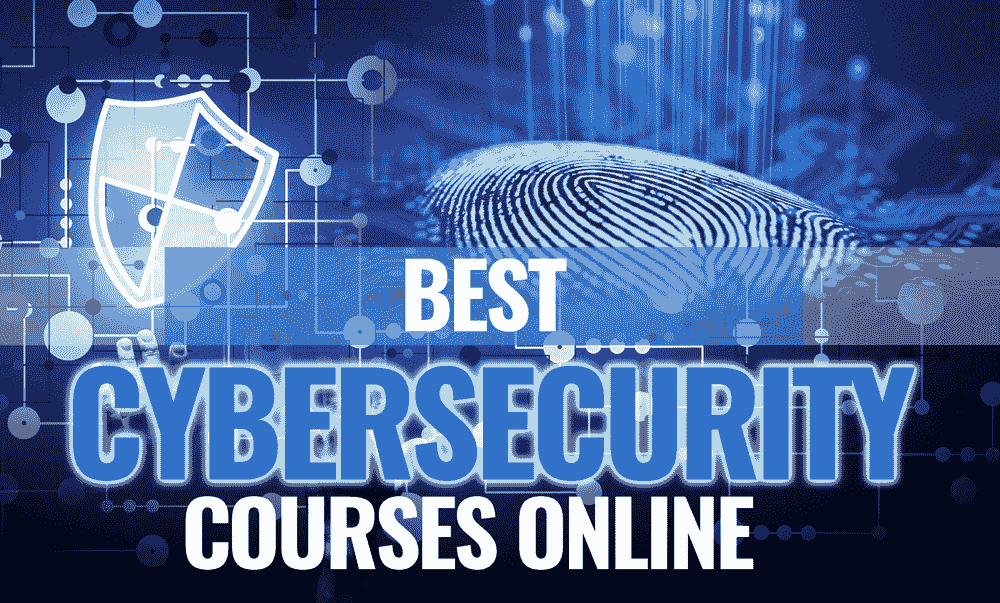

# 5 门最佳在线网络安全课程

> 原文：<https://kalilinuxtutorials.com/5-best-online-cyber-security-courses/>

多年来，技术不断进步和发展，越来越多的企业转向在线平台。然而，随着这种发展，网络犯罪率比以往任何时候都要高。现在，个人和企业越来越需要加强网络安全措施，保护自己免受这些犯罪的侵害。

无论你是一名试图保护自己网站的文章作者还是一名创业者，开始这场对抗网络犯罪的战争的一个好方法就是参加网络安全的在线课程。

在这篇文章中，我们将回顾五个最好的网络安全在线课程——从免费的到付费的。因此，请继续阅读，了解更多信息。

## Cybrary IT 介绍信息技术和网络安全

如果你是网络安全的初学者，Cybrary IT 为你提供的这个课程是最适合你的。它仅运行了 4 小时 21 分钟，并侧重于信息技术和网络安全的四个主要模块，即:

*   网络工程
*   系统管理
*   事件响应和取证
*   攻击性安全和渗透测试

在经验丰富的网络安全专家的监督下，这一用户友好的课程引人入胜，并将使您走上正确的知识之路。

它的短时间框架将确保你不会感到无聊或失去重点。更重要的是，它是完全免费的，因此，如果你试图以较低的预算学习网络安全的基本原则，它是一个很好的选择。

## 完整的网络安全课程

本课程由 Udemy 主办，是您可以接触到的最全面的网络安全学习项目之一。讲师 Nathan House 是一位经验丰富的网络安全专家，在互联网安全领域拥有超过 25 年的经验。

这一详细的、结构良好的课程涵盖了你需要知道的一切，从基础知识到关于网络安全和网络威胁的高级主题。学生们还将学习加密、数据传输和盗窃。因此，它最适合希望成为网络安全、匿名和隐私专家的学习者。

## 网络安全 2021 绝对初学者指南

从本课程的标题，你已经可以猜到，对于对网络安全几乎一无所知的初学者来说，这是一个惊人的选择。如果你愿意，可以称之为“傻瓜的网络安全”,因为这个课程简化了你需要知道的关于网络安全的一切。

通过本课程，您可以了解一些其他程序可能会跳过的基本信息，例如:

*   什么是恶意软件？
*   什么是防火墙？
*   恶意软件是如何工作的？

它还涵盖了您可能从未听说过的深入的网络安全概念。这门课程的简单性和全面性可能解释了为什么它是目前互联网上最受欢迎的网络安全学习项目之一。

## 网络安全–从零到英雄

尽管这门课程被包装成初学者友好的课程，但它更适合已经对该主题有一点背景知识的网络安全专家。由 Udemy 上的 Yash Kulkarni 和 Chinmay Kulkarni 主持，它涵盖了程序员需要知道的关于网络安全的一切。

在本课程中，您将全面了解网络安全中的不同角色，如事件响应团队、渗透测试人员、CISM、CISO 等。

您还将学习所有常见的互联网安全术语。本课程最棒的地方在于，它的结构简单，引人入胜，确保你享受学习过程的每一点。

## Coursera 上的网络安全专业

如果你熟悉 Coursera 的课程，那么你应该已经猜到这将会是一门好课程。该网络安全专业课程由马里兰大学提供，涵盖了安全系统的所有基本概念。

它包含以下子课程:

*   密码系统
*   可用安全性
*   软件安全性
*   网络安全顶点项目

在本课程中，学生将通过现实生活中的例子学习这些概念，以使它们更加适用。最终，你将能够形成以安全为导向的思维模式，并对网络安全和网络威胁有更好的理解。

如果你只是为了好玩而学习网络安全，你可以去参加免费的在线课程，这些课程不一定会在课程结束时提供证书。然而，如果你想在事业上有所发展，你肯定需要所有你能获得的证书。

祝你好运！

## 最后的想法

如果你想保护自己免受网络威胁，首先要做的就是了解网络安全。无论你是在运营一个需要保护的论文作者免费网站，还是一名试图在网络安全领域发展的开发人员，这些课程都将帮助你实现目标。只需选择适合自己喜好或知识水平的然后报名即可。