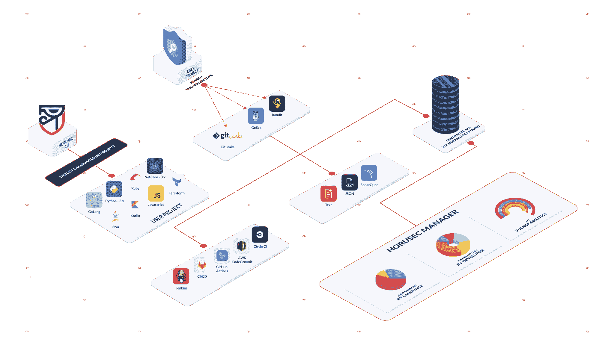
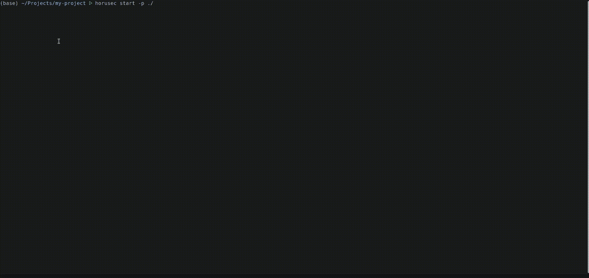

# Horusec:一个改进漏洞识别的开源工具

> 原文：<https://kalilinuxtutorials.com/horusec/>

Horusec 是一个开源工具，它执行静态代码分析，以识别开发过程中的安全缺陷。目前用于分析的语言有:C#、Java、Kotlin、Python、Ruby、Golang、Terraform、Javascript、Typescript、Kubernetes、PHP、C、HTML、JSON、Dart。

该工具可以在项目的所有文件以及 Git 历史中搜索关键漏洞和安全缺陷。Horusec 可以由开发人员通过 CLI 使用，也可以由 DevSecOps 团队在 CI /CD mats 上使用。参见我们的[文档](https://horusec.io/docs)中我们执行分析的工具和语言的完整列表。

【2021 年项目路线图

我们开始这个项目是为了在我们公司内部进行聚合，但是随着搜索越来越多，我们选择应用良好的实践，并开放给每个人来合作这个不可思议的项目。

为了实现我们的目标，我们在一些交付阶段进行了分离:

*   **阶段 0:** 将对所有 horusec-cli 特性的支持纳入 [horusec-vscode](https://github.com/ZupIT/horusec-vscode-plugin) (Q1)
*   **第 1 阶段:**支持忒伊亚(VsCode Web) (Q1)
*   **阶段 2:** 支持分析中的扑动、飞镖、猛击、炮弹、药剂、clou jure e Scala(Q1)
*   第 3 阶段:管理漏洞发现的新服务(Q2)
*   **阶段 4:** 对所有支持语言的依赖性分析(Q3)
*   **第五阶段:** SAST 与 MVP 语义分析(Q4)
*   **第六阶段:** DAST 与 MVP 符号分析(Q4)

**入门**

**安装**

要查看如何安装的更多细节，请转到[此处](https://github.com/ZupIT/horusec/blob/master/horusec-cli#installing)

*   **检查安装**

**horusec 版本**

**用途**

使用 horusec-cli 并检查您的漏洞

**horusec 启动**

或发送授权令牌，在 horusec 管理面板中分析查看内容。

**horusec start-a = "<YOUR _ TOKEN _ AUTHORIZATION>"**

要获得授权令牌，您可以在我们的面板上分析性地看到您的漏洞，请查看更多详细信息[此处](https://github.com/ZupIT/horusec/blob/master/horusec-cli#authorization)

**WARN:** 当 horusec 开始分析时，它会创建一个名为`.horusec`的文件夹。该文件夹是不更改代码的基础。所以我们建议您将行`.horusec`添加到您的`.gitignore`文件中，这样这个文件夹就不需要发送到您的 git 服务器了！

使用 horusec-cli 的要求

*   码头工人
*   git(如果您在整个项目的 git 历史中使用搜索，这是必需的)

**本地使用**

使用 horusec 在本地机器上克隆 horusec 并运行

**制作安装**

并运行 [HORUSEC-CLI](https://github.com/ZupIT/horusec/blob/master/horusec-cli#horusec-cli) 开始分析

*   **默认开发账户**

对于 horusec 的使用完整功能，您可以看到输入使用 horusec 为您的使用生成的默认用户。

**警告:**我们会对帐户创建进行 dns 验证，因此请记住使用有效的电子邮件。对于测试账户，我们接受…@example.com 的 T2 作为有效的域名系统。

**邮箱:dev@example.com
密码:Devpass0***

*   **本地使用完整 horusec 的要求**
    *   码头工人
    *   饭桶
    *   坞站-拨号/头盔
    *   golang
    *   兔子 q
    *   postgres
    *   电子邮件帐户(可选)

**Horusec 经理**

*   按公司划分存储库
*   管理有权访问您公司的用户(用户必须在 horusec 上预先注册，才能被邀请加入现有公司)
*   管理公司中可用于分析的存储库
*   管理有权访问公司存储库的用户
*   管理您对特定存储库的访问令牌(需要识别此分析属于哪个存储库并保存到我们的系统)
*   直观地查看您公司和/或其存储库中的所有现有漏洞

[**Download**](https://github.com/ZupIT/horusec)