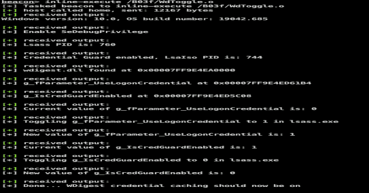

# WdToggle:直接系统调用以启用 WDigest 凭据缓存

> 原文：<https://kalilinuxtutorials.com/wdtoggle/>

[](https://1.bp.blogspot.com/-bvCjZZyeJo8/YD_lDnen17I/AAAAAAAAIbs/0IPlIn47SOMQOmu8ViowBd5SAto3nhkJwCLcBGAsYHQ/s728/WdToggle%25281%2529.png)

**WdToggle** 是一个概念验证 Cobalt Strike Beacon 对象文件，它使用[直接系统调用](https://outflank.nl/blog/2019/06/19/red-team-tactics-combining-direct-system-calls-and-srdi-to-bypass-av-edr/)来启用 **WDigest** 凭证缓存并绕过**凭证保护**(如果启用)。

这个仓库是做什么用的？

*   演示使用内联汇编的直接系统调用的用法，以提供一种更安全的与 LSASS 进程交互的方式。
*   通过在 LSASS 进程(wdigest.dll 模块)中将`g_fParameter_UseLogonCredential`全局参数切换为 1，启用 **WDigest** 凭证缓存。
*   通过在 LSASS 进程(wdigest.dll 模块)内将`g_IsCredGuardEnabled`变量切换到 0 来绕过**凭证保护**(如果启用)。
*   使用一个[信标对象文件](https://www.cobaltstrike.com/help-beacon-object-files)在信标进程中执行这段代码。

我该如何设置？

我们不会提供编译的二进制文件。你必须自己做这件事:

*   克隆此存储库。
*   确保安装了 Mingw-w64 编译器。以 Mac OSX 为例，我们可以使用 ports 集合来安装 Mingw-w64 ( `sudo port install mingw-w64`)。
*   运行`make`命令来编译信标对象文件。
*   在 Cobaltstrike 信标上下文中运行`inline-execute`命令，并提供对象`WdToggle.o`文件的路径。
*   运行 Cobaltstrike `logonpasswords`命令(Mimikatz ),注意新用户登录或用户**解锁**他们的桌面会话时会再次启用明文密码。

**限制**

*   这个内存补丁不是持续重启的，所以重启后你必须重新运行代码。
*   全局变量`wdigest!g_fParameter_UseLogonCredential`和`wdigest!g_IsCredGuardEnabled`的内存偏移量可能会在 Windows 版本和修订版之间发生变化。我们为不同的版本提供了一些偏移量，但是这些在未来的版本中可能会改变。您可以添加自己的版本偏移量，这些偏移量可以使用 Windows 调试器工具找到。

```
C:\Program Files (x86)\Windows Kits\10\Debuggers\x64>cdb.exe -z C:\Windows\System32\wdigest.dll

0:000>x wdigest!g_fParameter_UseLogonCredential
00000001`800361b4 wdigest!g_fParameter_UseLogonCredential = <no type information>
0:000> x wdigest!g_IsCredGuardEnabled
00000001`80035c08 wdigest!g_IsCredGuardEnabled = <no type information>
0:000> 
```

**检测**

为了检测通过 LSASS 内存访问的凭证盗窃，我们可以使用类似于 [Sysmon](https://docs.microsoft.com/en-us/sysinternals/downloads/sysmon) 的工具。Sysmon 可以配置为记录打开 lsass.exe 进程句柄的进程。应用此配置后，我们可以收集访问 LSASS 进程的可疑进程的遥测数据，并帮助检测可能的凭据转储活动。当然，还有更多检测凭据盗窃的选项，例如使用像 Windows Defender ATP 这样的高级检测平台。但是如果你没有使用这些平台的预算和奢侈，那么 Sysmon 是一个免费的工具，可以帮助你填补这个空白。

**学分**

*   这个工具中使用的汇编代码是基于来自 [@Jackson_T](https://twitter.com/Jackson_T) 的 [SysWhispers](https://github.com/jthuraisamy/SysWhispers) 工具的汇编输出。
*   亚当·切斯特 [@_xpn_](https://twitter.com/_xpn_)
*   来自[队九头蛇](https://teamhydra.blog)的 N4kedTurtle

[**Download**](https://github.com/outflanknl/WdToggle)