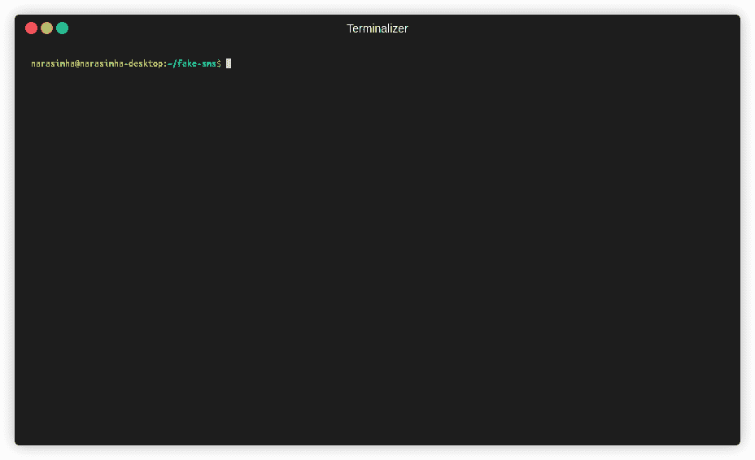
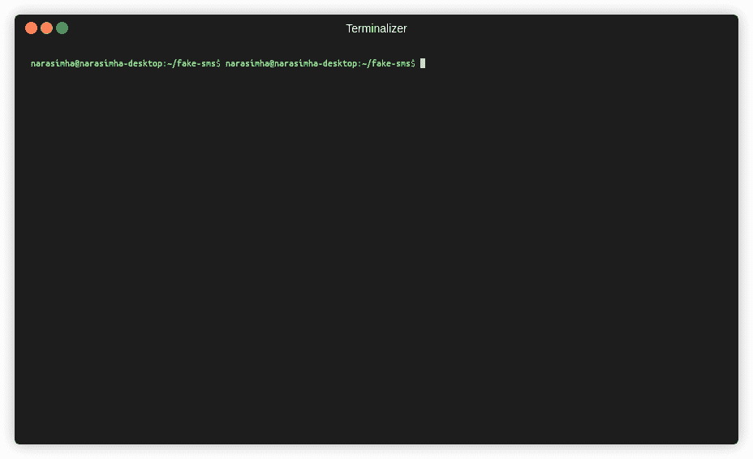

# 虚假短信:通过使用代理跳过电话验证

> 原文：<https://kalilinuxtutorials.com/fake-sms/>

**假短信**是一个简单的命令行工具，使用它，你可以通过使用一个临时电话号码作为代理，跳过基于电话号码的短信验证。

**注-1:** 这只是一个实验工具，不要在任何银行交易中使用。严格来说，不鼓励不道德地使用该工具。"

**注意-2:** 该工具使用欧洲服务提供商 upmasked，数据将存储在他们的服务器上，请确保您同意欧盟数据治理法律和 GDPR。我建议你不要在任何暴露你身份的个人交易中使用这个。

**特性**

*   用 Go-1.15 编写(启用模块支持)
*   提供更易于使用的交互式 CLI。
*   提供一个本地文件为基础的数据库，以保存和管理一个名单，假电话号码，以帮助您记住和重复使用。
*   [upmask](https://upmasked.com)的非官方客户端

**要求**

*   Go 编程语言-1.15 以上

**待建:**

构建过程很简单，就像构建任何其他 Go 模块一样。请遵循以下步骤:

**导出 GOBIN=$PWD/bin
去安装**

这将构建二进制文件并将其放在`**bin/**`中。您也可以考虑使用预构建的二进制文件，它可以在`**bin/**`下获得

**使用步骤:**

*   在本地数据库中注册号码:您可以通过选择如下所示的一个可用号码来注册号码。

*   获取任何注册号码的信息:您可以选择步骤 1 中保存的号码，并以列表形式查看其信息。该工具还会将转储保存为格式为`$` **`{PWD}/selected-phone-number.json`的 json。如下图:**

*   或者，您可以选择删除或列出记住的号码。

**致谢**

纯 shell 脚本中也有类似的工具。看看这个。

**投稿**

该工具非常简单，我不认为有任何主要功能缺失。但是我欢迎来自社区的任何类型的建议、改进或错误修复。请开一期讨论或者直接做个 PR！！

[**Download**](https://github.com/Narasimha1997/fake-sms)