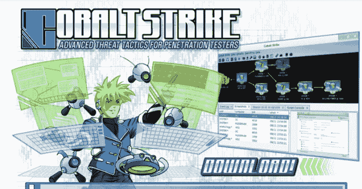

# Pybeacon:用 Python 处理钴击信标的脚本集合

> 原文：<https://kalilinuxtutorials.com/pybeacon/>

**PyBeacon** 是处理 Cobalt Strike 加密流量的脚本集合。它可以加密/解密信标元数据，以及解析对称加密任务。

**脚本包括**

有一个包含加密/解码方法的小库，但是包含了一些示例脚本。

*   **stager-decode . py–**该工具将简单地解码来自 stager URL 的信标 DLL(您可以使用它来提取公钥)。
*   **register . py–**该工具处理 RSA 加密的元数据，可以在目标 Teamserver 上注册一个新的(假的)信标。
*   **task tool . py–**该工具处理与 teamserver 之间的 AES 加密任务。使用它向团队服务器发送回调，或者从团队服务器向信标解码任务。
*   ~~**CS-3-5-rce . py—**这是一个用于利用 CS < 3.5-hf1 的漏洞利用的实现，该漏洞利用在野外被用于黑客攻击钴击服务器。它的工作原理是在 IP 地址字段中注册一个目录遍历信标。随后，它注册一个下载回调，使“下载”被上传到目标文件系统的任何地方。ITW 漏洞利用利用克隆人来实现 RCE。~~

**待办事项**

*   向任务解码逻辑添加更多的任务类型
*   为信标任务增加解码。目前使用了一些“通用”的逻辑，但它并没有真正的帮助

[**Download**](https://github.com/nccgroup/pybeacon)